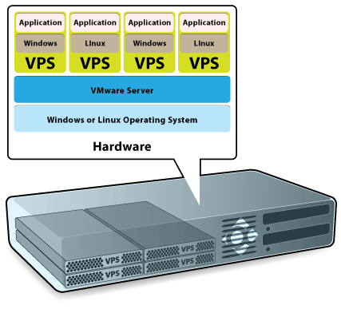
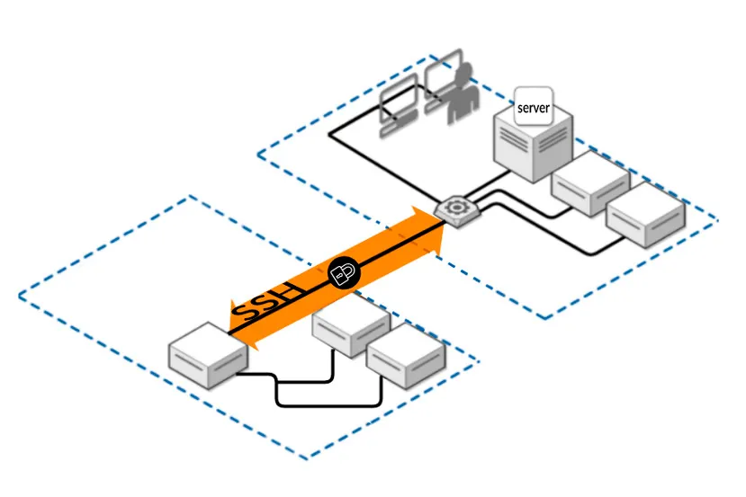
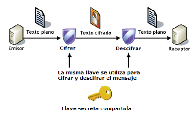
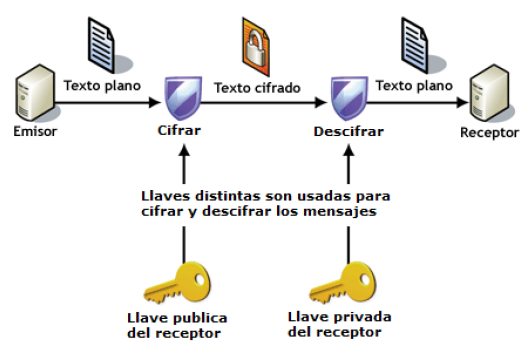

<!--
NOTA PARA EL PROFESOR (no se muestra al alumnado):
- Página reescrita a partir de debian_teoria.md del repo original.
- Imágenes reutilizadas: img/vps.gif, img/ssh.webp, img/simetrico.png, img/asimetrico.png (todas existen ya en docs/img).
- Duración estimada: 4-5 h de teoría. La práctica asociada es T1-practica-maquina-virtual.md.
-->

# Tema 1 - Introducción: el escenario del despliegue

!!! abstract "Qué vas a aprender en este tema"
    - Dónde vive realmente una aplicación web cuando deja tu ordenador.
    - Qué es un VPS y en qué se diferencia de un hosting compartido, de la nube y de un PaaS.
    - Por qué en este módulo trabajaremos sobre una máquina virtual y no sobre tu portátil.
    - Cómo conectarse de forma remota y segura a un servidor mediante SSH.
    - Qué son el cifrado simétrico y el asimétrico, y por qué SSH usa los dos.

---

## 1. El problema: tu aplicación funciona… en tu ordenador

Durante el primer curso has desarrollado aplicaciones web y las has probado en tu propia máquina: abrías el navegador, escribías `localhost` y ahí estaba. Eso está muy bien para desarrollar, pero tiene un problema evidente: **solo funciona para ti**. Si apagas el portátil, la aplicación desaparece.

Desplegar una aplicación web significa justamente lo contrario: ponerla en una máquina que está **siempre encendida, siempre conectada y accesible desde cualquier sitio**, configurada de forma que responda a las peticiones de usuarios que no conoces y que no van a entrar en tu casa a reiniciarla.

Ese es el objeto de este módulo. Y lo primero es decidir *dónde* ponemos esa máquina.

## 2. Las opciones: dónde se despliega hoy una aplicación web

| Opción | Qué te dan | Control que tienes | Cuándo se usa |
|---|---|---|---|
| **Hosting compartido** | Un espacio en un servidor que comparten cientos de webs | Muy poco: subes archivos y poco más | Webs sencillas, WordPress personal |
| **VPS** (*Virtual Private Server*) | Una máquina virtual entera, con tu sistema operativo y acceso de administrador | Total | Proyectos pequeños y medianos, el punto de partida clásico |
| **Servidor dedicado** | Una máquina física entera para ti | Total, incluido el hardware | Cargas grandes o requisitos legales de aislamiento |
| **Nube / IaaS** (AWS, Azure, GCP) | Máquinas virtuales bajo demanda, más una enorme colección de servicios | Total sobre la máquina, pagas por uso | Cuando necesitas crecer o encoger rápido |
| **PaaS** (Netlify, Vercel, Render…) | Solo subes el código; la máquina no la ves | Ninguno sobre la máquina | Aplicaciones web modernas, despliegue rápido |
| **Contenedores** (Docker) | Empaquetas la aplicación con todo lo que necesita | Total sobre el contenedor | Hoy, casi todo (lo verás en el Tema 6) |

!!! info "Ojo al orden"
    Estas opciones no son una escalera en la que lo de arriba es "peor" y lo de abajo "mejor". Son herramientas distintas. Pero hay un orden para **aprenderlas**: si no entiendes qué hace un servidor web por dentro, un PaaS es una caja negra que a veces falla y no sabes por qué. Por eso empezamos por el VPS.

## 3. ¿Qué es un VPS?

Un servidor no es más que un ordenador donde tu proveedor de alojamiento guarda los archivos y las bases de datos de tu sitio web. Cada vez que alguien visita la web, su navegador envía una petición a ese servidor, que le devuelve los archivos necesarios a través de Internet.

Un **VPS** te proporciona un servidor en la nube que **simula un servidor físico**, aunque en realidad la máquina se comparte entre varios usuarios. Usando tecnología de virtualización, el proveedor instala una capa virtual sobre el sistema operativo del servidor físico. Esa capa divide el servidor en particiones y permite que cada usuario instale su propio sistema operativo y su propio software.

Por lo tanto, un servidor privado virtual es **virtual** y **privado** a la vez:

- **Virtual**, porque no es una máquina física: es una máquina que existe dentro de otra.
- **Privado**, porque está separado del resto de usuarios a nivel de sistema operativo y tú tienes control absoluto sobre él.

La tecnología es, en el fondo, la misma que usas cuando instalas VirtualBox en tu ordenador para ejecutar Linux sin dejar de tener Windows.

**Lo que ganas con un VPS:**

- Recursos garantizados (memoria, disco, núcleos de CPU) que no compartes con nadie.
- Acceso de **root**, es decir, de administrador: puedes instalar lo que quieras.
- Más seguridad y estabilidad que un hosting compartido.
- Mucho más barato que alquilar un servidor físico completo.

El VPS lo eligen típicamente proyectos con un tráfico medio, que se ha quedado grande para un hosting compartido pero que todavía no necesita un servidor dedicado.

## 4. Por qué trabajaremos con una máquina virtual

En este módulo apenas trabajaremos en local. **Simularemos un escenario real**: que tenemos contratado un VPS al que debemos conectarnos de forma remota para trabajar en él.

La simulación la hacemos con una máquina virtual (Debian) instalada en tu propio ordenador. Y la regla del juego, a partir de aquí, es esta:

!!! warning "Regla del módulo"
    Una vez instalada la máquina virtual, **no volvemos a tocar su ventana**. Trabajaremos siempre conectándonos a ella por SSH desde una terminal, exactamente igual que si estuviera a 2.000 km en el centro de datos de un proveedor.

Esto no es un capricho. En un servidor real **no hay pantalla ni teclado**: solo tienes una terminal remota. Si te acostumbras a arreglar las cosas abriendo la ventana de VirtualBox, el día que trabajes con un servidor de verdad no sabrás por dónde empezar.

## 5. Conexión remota: SSH

Para conectarse a una máquina de forma remota y segura, la opción estándar es **SSH**.

SSH (*Secure Shell*) es un protocolo de red criptográfico para operar servicios de red de forma segura **a través de una red que no es segura** (Internet). Su uso típico es la línea de comandos remota y la ejecución de comandos a distancia, pero casi cualquier servicio de red puede protegerse con SSH.

Funciona con arquitectura **cliente-servidor**: una aplicación cliente SSH se conecta a un servidor SSH. El puerto estándar es el **TCP 22**.

Aplicaciones habituales de SSH:

- Administrar servidores a los que no se puede acceder físicamente.
- Transferir archivos de forma segura (SFTP, que verás en el Tema 2).
- Hacer copias de seguridad remotas.
- Conectar dos ordenadores con cifrado de extremo a extremo.

Antes de SSH se usaba **Telnet**, que hacía lo mismo pero enviando todo —incluida tu contraseña— en texto plano por la red. Hoy está completamente descartado para administrar servidores.

## 6. El fondo del asunto: cifrado simétrico y asimétrico

Para entender cómo SSH te protege hay que entender dos formas de cifrar información.

### Cifrado simétrico (o de clave privada)

Usa **la misma clave** para cifrar y para descifrar. Por eso la clave debe ser secreta y conocida únicamente por el emisor y el receptor.

**Ventaja:** es muy rápido. Cifrar y descifrar consume tiempo, y si el algoritmo es complejo puede ser mucho tiempo; los algoritmos simétricos son ligeros.

**Inconvenientes:**

- Si alguien no autorizado consigue la clave, puede leer toda la comunicación.
- ¿Cómo hacen emisor y receptor para conocer la clave la primera vez? No se puede enviar por el canal inseguro, así que hace falta otro canal seguro. **Este es el problema difícil.**

*Ejemplos cotidianos:* el PIN de la tarjeta del banco, un archivo comprimido con contraseña.

### Cifrado asimétrico (o de clave pública)

Cada usuario tiene **un par de claves**: una pública y una privada. Lo que se cifra con la clave pública solo puede descifrarse con su clave privada correspondiente, y al revés.

- La **clave pública** puede verla cualquiera. No hace falta transmitirla por un canal seguro.
- La **clave privada** solo la conoce su dueño, y no sale nunca de su máquina.

**Funcionamiento:**

1. El emisor cifra el mensaje con la clave **pública** del receptor.
2. El receptor lo recibe y es el único capaz de descifrarlo, porque es el único que tiene la clave **privada** asociada.

**Ventaja:** resuelve el problema del intercambio de claves.

**Inconvenientes:**

- Es más lento que el cifrado simétrico.
- Hay que proteger muy bien la clave privada y tenerla siempre disponible.
- Hay que asegurarse de que una clave pública es de quien dice ser, y no de un impostor.

### Cifrado híbrido: lo que hace SSH en realidad

SSH combina los dos. Usa el **cifrado asimétrico al principio**, solo para ponerse de acuerdo de forma segura sobre una clave de sesión; y a partir de ahí usa esa clave con **cifrado simétrico**, que es rápido, para todo el tráfico de la conexión.

Es decir: lo lento se usa una vez, para resolver el problema difícil; lo rápido se usa siempre.

## 7. Autenticarse en SSH: contraseña o par de claves

Hay dos formas habituales de demostrarle al servidor que eres tú:

=== "Con contraseña"

    El cliente envía la contraseña cifrada dentro del canal seguro. Funciona, pero la seguridad depende por completo de lo buena que sea la contraseña. Y un servidor expuesto a Internet recibe **miles** de intentos automáticos de adivinarla al día. No es una exageración: lo comprobarás tú mismo cuando mires los registros.

=== "Con par de claves (recomendado)"

    Tú generas un par de claves. Dejas tu clave **pública** en el servidor y guardas la **privada** en tu ordenador. Al conectarte, el servidor te plantea un reto que solo puede resolver quien tenga la clave privada. Nadie puede adivinar una clave de este tipo por fuerza bruta.

!!! note "Cómo lo haremos en clase"
    Para la primera conexión y para comprobar que hay conectividad usaremos **contraseña**.

    Inmediatamente después configuraremos un **par de claves**, por comodidad (no tener que teclear la contraseña cada vez) y sobre todo por seguridad. Y al final desactivaremos el acceso por contraseña, que es exactamente lo que se hace en un servidor real.

---

## Para repasar

!!! question "Cuestión 1"
    ¿Por qué se dice que un VPS es "privado" si la máquina física se comparte entre varios clientes?

!!! question "Cuestión 2"
    Si el cifrado asimétrico resuelve el problema del intercambio de claves, ¿por qué SSH no lo usa para toda la conexión?

!!! question "Cuestión 3"
    Tu clave privada está en tu portátil y tu clave pública en el servidor. Te roban el portátil. ¿Qué haces?

!!! question "Cuestión 4"
    Explica con tus palabras por qué en este módulo no vamos a administrar la máquina virtual desde su propia ventana.

## Referencias

- [¿Qué es un VPS? Todo lo que necesitas saber sobre servidores virtuales](https://www.hostinger.es/tutoriales/que-es-un-vps)
- [Documentación de OpenSSH](https://www.openssh.com/manual.html)
- [Debian — The Universal Operating System](https://www.debian.org/)
