<!--
NOTA PARA EL PROFESOR (no se muestra al alumnado):

Reescrita a partir de debian.md del repo original. Cambios respecto al original:
  - Debian 11.4 -> Debian 13 (Trixie). El enlace de descarga ya no apunta a una ISO concreta,
    sino a la carpeta "current", para que no vuelva a caducar.
  - Añadida la vía moderna de dar sudo (dejar la contraseña de root vacía en la instalación).
  - Claves ed25519 en lugar de RSA 4096.
  - Cliente Windows tratado como caso principal (OpenSSH ya viene integrado; ssh-copy-id NO existe).
  - Añadido el endurecimiento del servidor SSH y la instantánea de VirtualBox.
  - AVISO Debian 13: sshd usa activación por socket. "systemctl reload ssh" FALLA
    ("Cannot bind any address"). Hay que usar "restart". Está explicado en el paso 8.
  - Añadidos objetivos, criterios de evaluación, cuestiones y checklist de entrega.

CAPTURAS A REHACER (las actuales son de Debian 11/12; el flujo es idéntico pero cambia el aspecto):
  debian3 (menú del instalador), debian4, debian5, debian6, debian7 (tasksel), debian12 (GRUB en disco).
  Se pueden dejar para este curso y sustituirlas al hacer la instalación en clase.
-->

# Práctica 1.1 - Instalación y configuración de nuestra máquina virtual

!!! abstract "Objetivos"
    Al terminar esta práctica deberás ser capaz de:

    1. Instalar un sistema operativo servidor (Debian) en una máquina virtual, sin entorno gráfico.
    2. Configurar su red para que sea accesible desde tu equipo.
    3. Otorgar permisos de administración a un usuario sin trabajar como *root*.
    4. Conectarte al servidor por SSH, primero con contraseña y después con un par de claves.
    5. Endurecer la configuración del servidor SSH para que solo se pueda acceder con clave.

!!! info "Material necesario"
    - Un ordenador con al menos 8 GB de RAM y 30 GB de disco libres.
    - [VirtualBox](https://www.virtualbox.org/wiki/Downloads) (versión 7.2 o superior). También sirve VMware Workstation, UTM o KVM: los pasos son equivalentes.
    - La imagen *netinst* de Debian (paso 1).

---

## 1. Descargar Debian

Como servidor utilizaremos la distribución **Debian**. Descargaremos la imagen *netinst*, que la propia [página de Debian](https://www.debian.org/CD/netinst/index.es.html) describe así:

!!! quote
    Un CD de "instalación por red" o "netinst" es un único CD que posibilita que instale el sistema completo. Este único CD contiene sólo la mínima cantidad de software para instalar el sistema base y obtener el resto de paquetes a través de Internet.

Es decir: una imagen pequeña (unos 700 MB) que descarga lo demás durante la instalación. Perfecta para un servidor, donde queremos instalar lo mínimo imprescindible.

Descárgala desde aquí, eligiendo el archivo `debian-XX.X.X-amd64-netinst.iso`:

**[https://cdimage.debian.org/debian-cd/current/amd64/iso-cd/](https://cdimage.debian.org/debian-cd/current/amd64/iso-cd/)**

!!! info "Info"
    Trabajaremos con **Debian 13 (Trixie)**, la versión estable actual. Desde Debian 12 las imágenes oficiales ya incluyen el *firmware* no libre, así que no necesitas buscar ninguna imagen especial para que funcione el hardware.

    Instalar máquinas virtuales es algo que se supone aprendido de cursos anteriores, así que aquí se dan las pautas generales y se hace hincapié solo en lo que importa para este módulo.

## 2. Crear la máquina virtual

Crea una máquina virtual nueva indicando su nombre, su ubicación y el tipo de sistema operativo (Linux / Debian 64-bit):

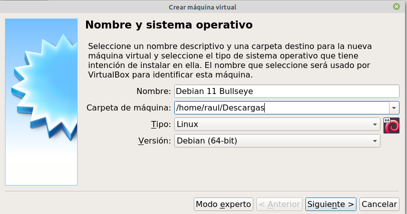

Monta como unidad de CD la ISO *netinst* que acabas de descargar:

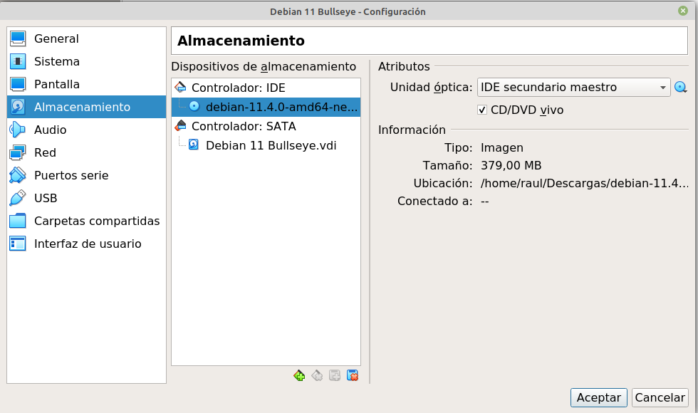

!!! warning "Desactiva la instalación desatendida"
    Si VirtualBox te ofrece la "instalación automática/desatendida" al detectar la ISO, **desmárcala**. Queremos instalar a mano para ver y entender cada decisión.

**Recursos recomendados:**

| Recurso | Mínimo | Recomendado |
|---|---|---|
| RAM | 1 GB | **2 GB** |
| Procesadores | 1 | **2** |
| Disco | 10 GB | **20 GB** |

Sin entorno gráfico la máquina funciona perfectamente con poco, pero a lo largo del módulo instalarás servidores web, Docker y bases de datos: no te quedes corto.

### Configuración de red: adaptador puente

Este paso es **el más importante de toda la práctica**. En el único adaptador de red de la máquina virtual, selecciona el modo **adaptador puente** (*bridged*):

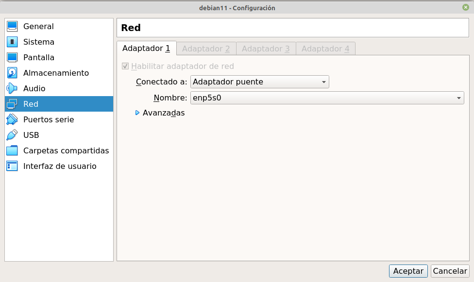

Con el adaptador puente, la máquina virtual obtiene una IP del **mismo rango que tu red local** (la de casa o la del instituto), como si fuera un ordenador más enchufado al router. Eso es justo lo que necesitamos: que sea accesible desde tu equipo igual que lo sería un servidor remoto.

!!! danger "Por qué no vale NAT"
    El modo NAT (el que VirtualBox pone por defecto) mete la máquina en una red privada propia. Desde ella podrás salir a Internet, pero **tú no podrás entrar**, que es exactamente lo contrario de lo que necesita un servidor. Si más adelante no puedes conectarte por SSH, lo primero que debes comprobar es esto.

## 3. Instalar Debian

Puedes instalar tanto en modo gráfico como en modo texto. Se recomienda el gráfico:

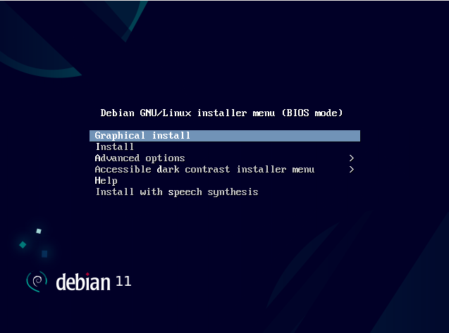

Los pasos que importan:

**Nombre de la máquina (*hostname*).** Ponle un nombre corto, porque aparecerá en el *prompt* de la terminal (`usuario@nombredemaquina`):

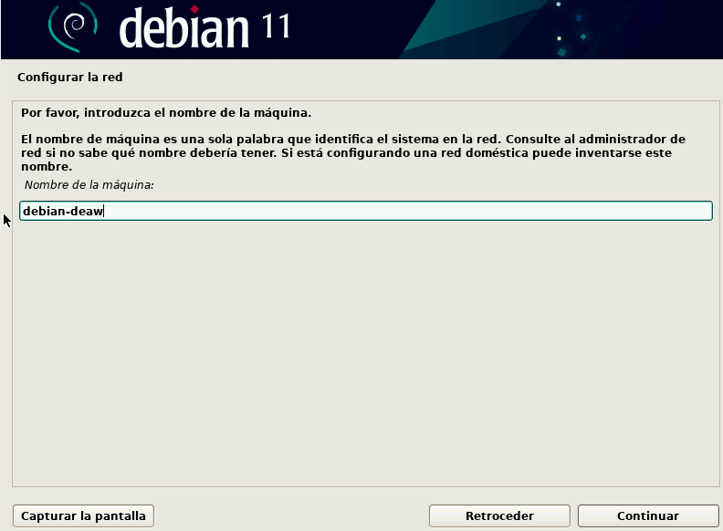

**Contraseñas y usuario.** Te pedirá una contraseña de superusuario (*root*), tu nombre de usuario y su contraseña:

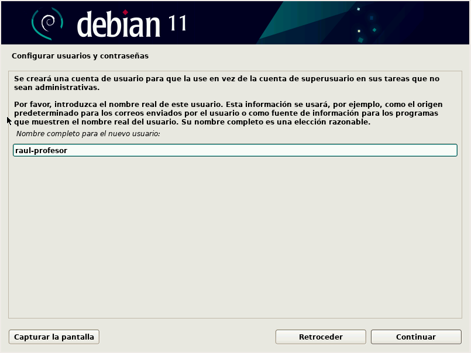

!!! tip "Truco: consigue sudo gratis"
    Si dejas **vacía** la contraseña de *root*, el instalador desactiva la cuenta de *root* y añade automáticamente tu usuario al grupo `sudo`. Es lo que hacen hoy la mayoría de distribuciones y te ahorra el paso 5 entero.

    Aun así, **haz el paso 5 igualmente**: necesitas saber hacerlo a mano, porque en un servidor que no has instalado tú no tendrás esa opción.

**Particionado.** Para simplificar, dile que utilice todo el disco:

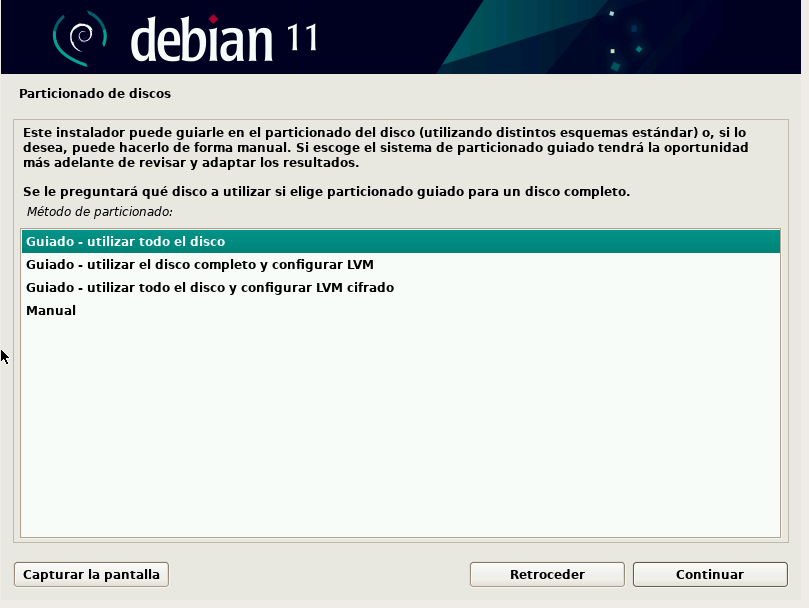

**Selección de software (*tasksel*).** Aquí está la otra decisión crítica. Deja marcado **únicamente**:

- **Servidor SSH**
- **Utilidades estándar del sistema**

Y **desmarca el entorno de escritorio**:

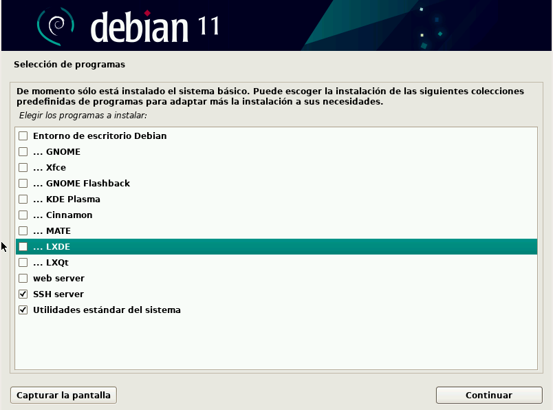

!!! warning "Sin entorno gráfico"
    Un servidor no lleva escritorio: consume memoria, aumenta la superficie de ataque y no lo va a mirar nadie. Si por alguna razón necesitas uno, LXDE es el que menos recursos consume:

    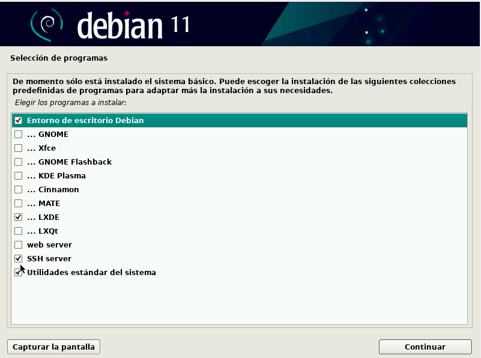

**Gestor de arranque GRUB.** Dile que sí lo instale, y selecciona el único disco que tienes (normalmente `/dev/sda`). **Pincha en el nombre del disco**, no en "entrar el dispositivo manualmente", o no se instalará:

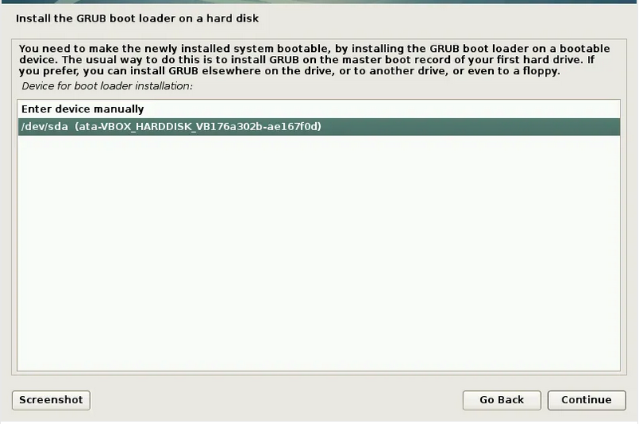

Al terminar pedirá reiniciar. Tras el reinicio aparecerá una terminal pidiendo *login*, y ahí ya puedes entrar con tu usuario y contraseña.

## 4. Averiguar la IP de la máquina

Desde la ventana de la máquina virtual, ejecuta:

```sh
ip a
```

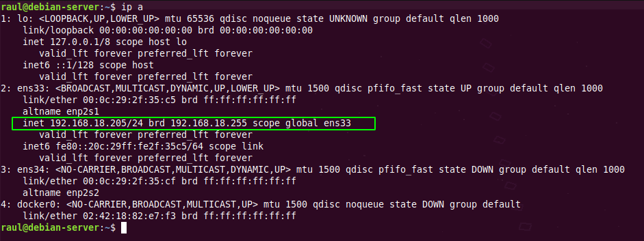

Busca la interfaz que **no** sea `lo` (el *loopback*) y anota su dirección `inet`. Debe estar dentro del rango de tu red local (algo como `192.168.1.x` o `10.0.x.x`). Como la máquina solo tiene una interfaz de red, no hay lugar a confusión.

!!! question "Comprueba antes de seguir"
    Desde tu ordenador, haz `ping` a esa IP. Si no responde, revisa el adaptador puente antes de continuar.

## 5. Dar permisos de sudo a nuestro usuario

Tras la instalación tienes un usuario *raso*. A lo largo del módulo harás incontables tareas de administración, y cambiar a *root* cada vez es incómodo y peligroso.

Con `sudo`, cualquier comando precedido de esa palabra se ejecuta como *root*, y todo lo demás se ejecuta con tus permisos normales. Así te proteges de liarla con un comando que no tocaba.

=== "Método clásico: visudo"

    Cambia al usuario *root*:

    ```sh
    su root
    ```

    Y ejecuta `visudo`, la herramienta que edita el fichero de permisos de forma segura (comprueba la sintaxis antes de guardar, para que no te quedes fuera):

    ```sh
    /usr/sbin/visudo
    ```

    Deja la sección así, con tu propio nombre de usuario:

    ```
    # User privilege specification
    root            ALL=(ALL:ALL) ALL
    nombreusuario   ALL=(ALL:ALL) ALL
    ```

    Guarda con `Ctrl+X` y confirma.

=== "Método corto: añadir al grupo sudo"

    ```sh
    su root
    usermod -aG sudo nombreusuario
    exit
    ```

    Debian ya trae en `/etc/sudoers` una línea que concede permisos a todo el grupo `sudo`, así que con añadir tu usuario al grupo es suficiente.

En ambos casos debes **cerrar la sesión y volver a entrar** para que el cambio surta efecto. Después, valida que funciona:

```sh
sudo -v
```

Si **no** tienes permisos, responderá:

```
Sorry, user [usuario] may not run sudo on [maquina].
```

Y si los tienes, no devolverá nada. Si quieres algo más explícito:

```sh
timeout 2 sudo id && echo Access granted || echo Access denied
```

## 6. Primera conexión por SSH (con contraseña)

A partir de aquí, **cierra la ventana de la máquina virtual** y trabaja siempre desde tu terminal.

=== "Windows"

    Windows 10 y 11 ya traen el cliente OpenSSH integrado. Abre **PowerShell** o el **Terminal de Windows** y escribe:

    ```powershell
    ssh nombreusuario@IP_DE_LA_MAQUINA
    ```

    No necesitas instalar PuTTY ni nada parecido.

=== "Linux / macOS"

    ```sh
    ssh nombreusuario@IP_DE_LA_MAQUINA
    ```

La primera vez te avisará de que no conoce la huella del servidor y te preguntará si confías en él. Escribe `yes`. A partir de entonces la huella queda guardada en tu fichero `known_hosts`.

!!! info "¿Qué es esa huella?"
    Es el *fingerprint* de la clave pública del servidor. Sirve para detectar que alguien se esté haciendo pasar por tu servidor. Si algún día te aparece un aviso grande de que la huella **ha cambiado** sin que tú hayas reinstalado nada, no lo ignores.

## 7. Autenticación con par de claves

Ahora haremos lo que se hace en un servidor real: entrar sin contraseña, con un par de claves.

**En tu ordenador** (no en la máquina virtual), genera el par de claves:

```sh
ssh-keygen -t ed25519 -C "tu_correo_o_un_comentario"
```

!!! info "Por qué ed25519 y no RSA"
    `ed25519` es el algoritmo recomendado hoy: claves mucho más cortas, más rápidas y al menos igual de seguras que un RSA de 4096 bits. Verás mucha documentación antigua que usa `ssh-keygen -b 4096`; funciona, pero ya no es la primera opción.

Acepta la ubicación por defecto. Te pedirá una *passphrase* para proteger la clave privada: dado que queremos agilizar la conexión, **déjala vacía** pulsando Enter.

Se habrán creado dos archivos en tu carpeta `.ssh`:

| Archivo | Qué es | ¿Se comparte? |
|---|---|---|
| `id_ed25519` | Clave **privada** | **Nunca.** No sale de tu equipo |
| `id_ed25519.pub` | Clave **pública** | Sí, es la que copiamos al servidor |

Ahora hay que copiar la clave **pública** al servidor:

=== "Linux / macOS"

    ```sh
    ssh-copy-id usuario@IP_DE_LA_MAQUINA
    ```

    Es una conexión SSH normal que, además, copia la clave en el sitio adecuado.

=== "Windows"

    En Windows **no existe `ssh-copy-id`**. Hazlo con este comando en PowerShell (todo en una línea):

    ```powershell
    type $env:USERPROFILE\.ssh\id_ed25519.pub | ssh usuario@IP_DE_LA_MAQUINA "mkdir -p ~/.ssh && cat >> ~/.ssh/authorized_keys"
    ```

Para evitar problemas de permisos, ejecuta **en la Debian**:

```sh
chmod 700 ~/.ssh
chmod 600 ~/.ssh/authorized_keys
```

!!! warning "Los permisos no son opcionales"
    SSH **ignora** el fichero `authorized_keys` si tiene permisos demasiado abiertos, y lo hace en silencio: te seguirá pidiendo la contraseña sin decirte por qué. Es el fallo número uno de esta práctica.

Cierra la sesión y vuelve a conectarte. Debe entrar **sin pedirte contraseña**.

## 8. Endurecer el servidor SSH

Si ya entras con clave, la contraseña sobra: es una puerta abierta que solo sirve para que la intenten forzar. Vamos a cerrarla.

!!! danger "Antes de tocar nada"
    **Comprueba que la conexión con clave funciona.** Si desactivas la contraseña sin tener la clave bien puesta, te quedas fuera de tu propio servidor (en la VM podrías entrar por la ventana; en un VPS real, no).

Edita el fichero de configuración del servidor:

```sh
sudo nano /etc/ssh/sshd_config
```

Y deja estas tres directivas así:

```aconf
PermitRootLogin no
PasswordAuthentication no
PubkeyAuthentication yes
```

Aplica los cambios:

```sh
sudo systemctl restart ssh
```

!!! danger "Trampa de Debian 13"
    En Debian 13 el servidor SSH se activa **por socket** (`ssh.socket`). Eso significa que el clásico `systemctl reload ssh` **falla** con el error `fatal: Cannot bind any address` y puede tumbarte el servicio.

    Usa siempre **`restart`**, no `reload`. Tranquilo: reiniciar el servicio **no corta** las sesiones SSH que ya estén abiertas.

Comprueba desde **otra terminal** (sin cerrar la que tienes abierta, por si acaso) que sigues entrando con la clave y que, si intentas forzar la contraseña, te rechaza:

```sh
ssh -o PreferredAuthentications=password usuario@IP_DE_LA_MAQUINA
```

Debe responder `Permission denied (publickey)`.

## 9. Haz una instantánea

Con la máquina apagada, crea una **instantánea** (*snapshot*) en VirtualBox y llámala `base-limpia`.

A lo largo del módulo vas a instalar, configurar y romper muchas cosas. Poder volver a un punto conocido en treinta segundos, en vez de reinstalar Debian entera, te va a salvar más de una tarde.

---

## Cuestiones finales

!!! question "Cuestión 1"
    ¿Qué diferencia hay entre el modo de red **NAT** y el **adaptador puente**? ¿Por qué el segundo es imprescindible en esta práctica?

!!! question "Cuestión 2"
    ¿Por qué `visudo` es preferible a editar `/etc/sudoers` directamente con `nano`?

!!! question "Cuestión 3"
    Has copiado tu clave pública al servidor. ¿Qué ocurriría si, por error, hubieras copiado la privada? ¿Y qué debes hacer si eso pasa?

!!! question "Cuestión 4"
    Tu máquina virtual ha cambiado de IP al reiniciar el router. ¿Por qué ocurre y qué se hace en un servidor real para que no pase?

!!! question "Cuestión 5"
    Explica, con lo visto en la teoría, qué cifrado (simétrico o asimétrico) interviene en cada momento cuando te conectas por SSH con un par de claves.

## Checklist de entrega

Antes de entregar, comprueba que puedes demostrar cada punto:

- ☐ La máquina virtual arranca **sin entorno gráfico** y muestra el *login* en terminal.
- ☐ Tiene una IP del rango de la red local (captura de `ip a`).
- ☐ Tu usuario ejecuta `sudo` correctamente (captura de `sudo -v` o de `sudo id`).
- ☐ Te conectas por SSH desde tu equipo **sin que te pida contraseña**.
- ☐ El acceso por contraseña y el acceso de *root* están desactivados (captura del intento rechazado).
- ☐ Existe la instantánea `base-limpia`.
- ☐ Documento con las respuestas a las cinco cuestiones finales.

## Criterios de evaluación

| Criterio | Peso |
|---|---|
| La máquina virtual está instalada y configurada según lo pedido (sin escritorio, red en puente, recursos adecuados) | 25 % |
| El usuario tiene permisos de administración correctamente configurados | 15 % |
| La conexión por SSH con contraseña funciona y está documentada | 15 % |
| La autenticación por par de claves funciona | 25 % |
| El servidor SSH está endurecido y se justifica cada directiva modificada | 10 % |
| Las cuestiones finales están respondidas con corrección y con criterio propio | 10 % |

## Referencias

- [Debian — Instalación por red (netinst)](https://www.debian.org/CD/netinst/index.es.html)
- [Guía de instalación de Debian](https://www.debian.org/releases/stable/installmanual)
- [Manual de OpenSSH](https://www.openssh.com/manual.html)
- [¿Qué es un VPS? Todo lo que necesitas saber sobre servidores virtuales](https://www.hostinger.es/tutoriales/que-es-un-vps)
