<!--
NOTA PARA EL PROFESOR (no se muestra al alumnado):

Reescrita a partir de debian.md del repo original. Cambios respecto al original:
  - Debian 11.4 -> Debian 13 (Trixie). El enlace de descarga ya no apunta a una ISO concreta,
    sino a la carpeta "current", para que no vuelva a caducar.
  - Contraseña de root vacía en la instalación: root queda bloqueado y el usuario entra en el grupo sudo.
  - Claves ed25519 en lugar de RSA 4096.
  - Cliente Windows tratado como caso principal (OpenSSH ya viene integrado; ssh-copy-id NO existe).
  - Añadido el endurecimiento del servidor SSH y la instantánea de VirtualBox.
  - AVISO Debian 13: sshd usa activación por socket. "systemctl reload ssh" FALLA
    ("Cannot bind any address"). Hay que usar "restart". Está explicado en el paso 8.
  - Añadidos objetivos, criterios de evaluación, cuestiones y checklist de entrega.
  - Hostname obligatorio "debian-apellido": firma cada salida de comando y delata las copias.
  - Sección "Entrega": PDF de evidencias (40 %) + demostración en clase (60 %).
    Las evidencias se piden en TEXTO, no en capturas, para poder compararlas entre entregas.

RED: NAT + Host-only (antes era adaptador puente).
  - El puente depende de la red física: falla con wifi, portales cautivos y filtrado MAC, y la IP
    cambia entre casa y el aula. NAT + Host-only funciona igual en cualquier sitio.
  - Todos los alumnos usan la MISMA IP (192.168.56.10): la red Host-only es local a cada PC, no chocan.
  - Si en el futuro hace falta acceso desde otros equipos del aula, se añade un puente en el Adapter 3.

INSTALADOR EN INGLÉS: el sistema se instala en inglés (mensajes y logs coinciden con la documentación).
  España no sale en la lista corta: other -> Europe -> Spain; locale en_US.UTF-8; teclado Spanish.

MÁQUINA DE RESPALDO (.ova): usuario "alumno", contraseña "daw1234", hostname "daw-debian",
  enp0s8 ya configurada con 192.168.56.10. Exportarla ANTES de los pasos 7-8 (claves y endurecimiento).
  Al importar: "Generate new MAC addresses for all network adapters".

CAPTURAS: todas rehechas con Debian 13.7 + VirtualBox 7.2 (debian1, debian3-7, debian11-12, debian14-23).
  debian10 (LXDE) y debian2 (fusionada en debian1) ya no se usan: se pueden borrar.

VALIDADA DE PRINCIPIO A FIN el 27/09/2026 en el portátil (Debian 13.7.0, VirtualBox 7.2).
  El .ova de respaldo está exportado (739 MB) en C:\Users\darkd\Documents\DAW-debian.ova.
  PENDIENTE: subirlo a Drive/aula virtual y poner el enlace en el recuadro "Máquina de respaldo" (paso 3).
-->

# Práctica 1.1 - Instalación y configuración de nuestra máquina virtual

!!! abstract "Objetivos"
    Al terminar esta práctica deberás ser capaz de:

    1. Instalar un sistema operativo servidor (Debian) en una máquina virtual, sin entorno gráfico.
    2. Configurar su red para que sea accesible desde tu equipo.
    3. Administrar el sistema con `sudo` desde un usuario normal, sin trabajar como *root*.
    4. Conectarte al servidor por SSH, primero con contraseña y después con un par de claves.
    5. Endurecer la configuración del servidor SSH para que solo se pueda acceder con clave.

!!! info "Material necesario"
    - Un ordenador con al menos 8 GB de RAM y 30 GB de disco libres.
    - [VirtualBox](https://www.virtualbox.org/wiki/Downloads) (versión 7.2 o superior). También sirve VMware Workstation, UTM o KVM: los pasos son equivalentes.
    - La imagen *netinst* de Debian (paso 1).

---

## 1. Descargar Debian

Como servidor utilizaremos la distribución **Debian**. Descargaremos la imagen *netinst*, que la propia [página de Debian](https://www.debian.org/CD/netinst/index.es.html) describe así:

!!! quote
    Un CD de "instalación por red" o "netinst" es un único CD que posibilita que instale el sistema completo. Este único CD contiene sólo la mínima cantidad de software para instalar el sistema base y obtener el resto de paquetes a través de Internet.

Es decir: una imagen pequeña (unos 700 MB) que descarga lo demás durante la instalación. Perfecta para un servidor, donde queremos instalar lo mínimo imprescindible.

Descárgala desde aquí, eligiendo el archivo `debian-XX.X.X-amd64-netinst.iso`:

**[https://cdimage.debian.org/debian-cd/current/amd64/iso-cd/](https://cdimage.debian.org/debian-cd/current/amd64/iso-cd/)**

!!! info "Info"
    Trabajaremos con **Debian 13 (Trixie)**, la versión estable actual. Desde Debian 12 las imágenes oficiales ya incluyen el *firmware* no libre, así que no necesitas buscar ninguna imagen especial para que funcione el hardware.

    Instalar máquinas virtuales es algo que se supone aprendido de cursos anteriores, así que aquí se dan las pautas generales y se hace hincapié solo en lo que importa para este módulo.

## 2. Crear la máquina virtual

En VirtualBox pulsa **New**. Desde la versión 7.2 todo se configura en una sola ventana con cuatro secciones desplegables.

**Virtual machine name and operating system.** Ponle un nombre identificable y selecciona como **ISO Image** el fichero *netinst* que acabas de descargar. Así queda montado como unidad de CD de la máquina, y VirtualBox detecta solo el tipo de sistema (**Linux / Debian / Debian 13 Trixie (64-bit)**):

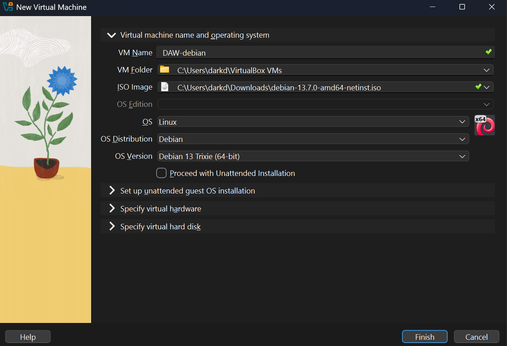

!!! warning "Desactiva la instalación desatendida"
    Con la ISO ya seleccionada, VirtualBox te ofrece la casilla **Proceed with Unattended Installation**. **Déjala desmarcada**: si la marcas, VirtualBox instala Debian por su cuenta y no verás el instalador. Queremos instalar a mano para ver y entender cada decisión. La sección **Set up unattended guest OS installation** no se toca.

**Specify virtual hardware** y **Specify virtual hard disk:**

| Recurso | Mínimo | Recomendado |
|---|---|---|
| RAM (*Base Memory*) | 1 GB | **2048 MB** |
| Procesadores (*Number of CPUs*) | 1 | **2** |
| Disco (*Create a New Virtual Hard Disk*) | 10 GB | **20 GB** |

- **Use EFI:** desmarcado.
- Disco de tipo **VDI**, sin marcar *Pre-allocate Full Size*: así el fichero crece según se usa y no ocupa los 20 GB de golpe.

Sin entorno gráfico la máquina funciona perfectamente con poco, pero a lo largo del módulo instalarás servidores web, Docker y bases de datos: no te quedes corto.

Pulsa **Finish**, pero **no arranques todavía la máquina**.

### Configuración de red: NAT + Host-only

Este paso es **el más importante de toda la práctica**. Selecciona la máquina, entra en **Settings → Network** y configura **dos adaptadores**:

**Adapter 1 → NAT.** Es el que viene por defecto; déjalo así. Le da a la máquina **salida a Internet**, que el instalador *netinst* necesita para descargar los paquetes.

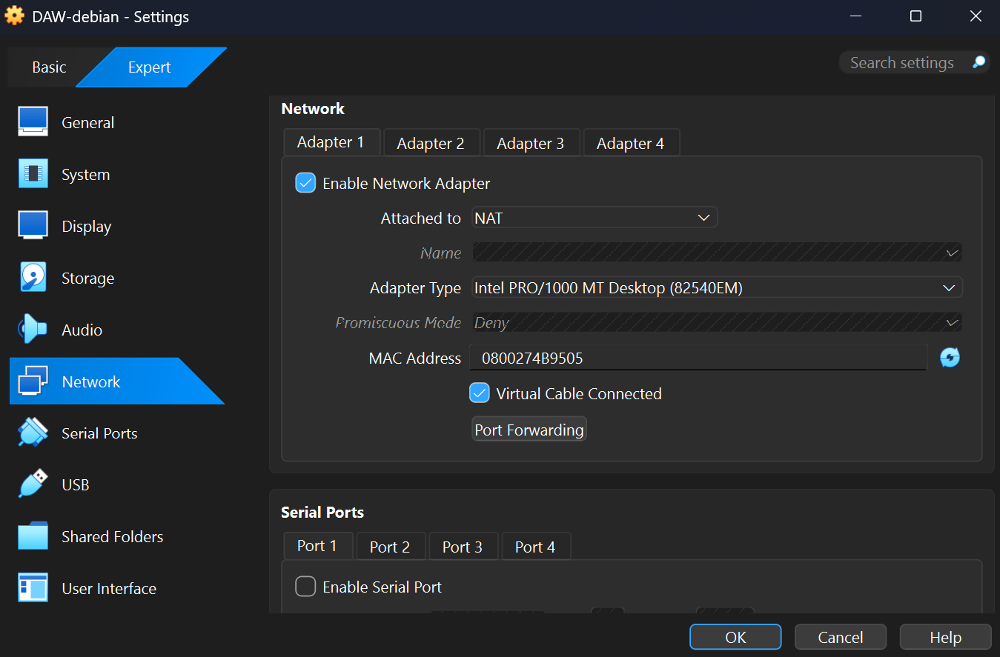

**Adapter 2 → Host-only Adapter.** Marca **Enable Network Adapter**, en **Attached to** elige **Host-only Adapter** y en **Name** `VirtualBox Host-Only Ethernet Adapter`. Crea una red privada entre tu ordenador y la máquina virtual, y es por donde **entrarás al servidor** (SSH, web…).

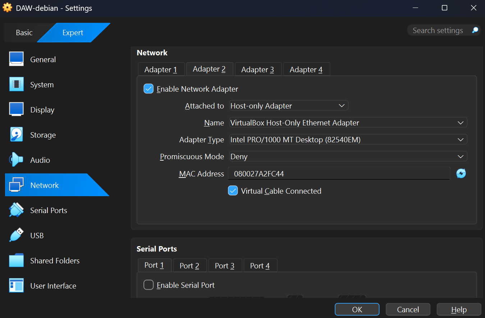

Si en **Name** no aparece ninguna red, créala antes en la ventana principal de VirtualBox: **File → Tools → Network Manager → Host-only Networks → Create**.

!!! danger "Por qué no basta con NAT"
    El modo NAT mete la máquina en una red privada propia. Desde ella podrás salir a Internet, pero **tú no podrás entrar**, que es exactamente lo contrario de lo que necesita un servidor. Por eso añadimos el adaptador Host-only. Si más adelante no puedes conectarte por SSH, lo primero que debes comprobar es esto.

!!! info "¿Y el adaptador puente?"
    El adaptador puente (*bridged*) mete la máquina directamente en la red del aula o de tu casa, como un ordenador más. Funciona con un solo adaptador, pero depende de la red física: suele fallar con wifi o con redes que filtran equipos, la IP cambia cada vez que cambias de red y deja tu servidor a medio configurar expuesto a toda la red del centro. Con NAT + Host-only la máquina funciona igual en cualquier sitio y tiene siempre la misma IP.

**Comprueba la red Host-only de tu ordenador.** En Windows, abre PowerShell y ejecuta `ipconfig`. Busca el adaptador *VirtualBox Host-Only Network* (a veces aparece como *Ethernet 2* o similar): su IP debe ser **`192.168.56.1`**. Es lo normal. Si fuera otra (por ejemplo `192.168.57.1`), en el paso 4 tendrás que usar la IP terminada en `.10` de **tu** red (`192.168.57.10`).

## 3. Instalar Debian

Selecciona la máquina y pulsa **Start**. Arrancará desde la ISO y verás el menú del instalador. Elige **Graphical install**:

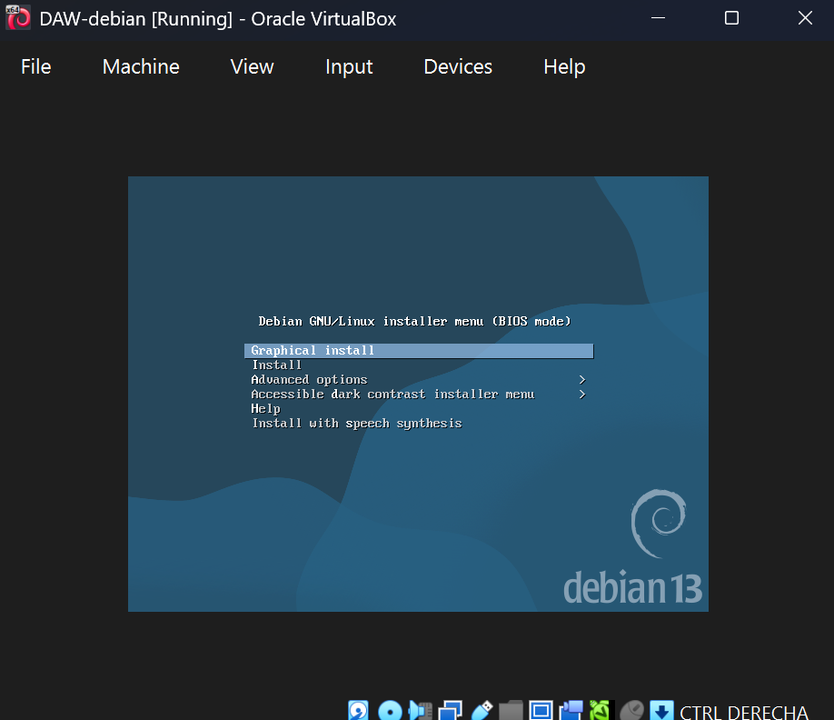

!!! tip "Usa el teclado"
    Al principio el ratón puede no responder bien dentro de la máquina. En el instalador el teclado es más fiable: **flechas** para moverte, **escribir las primeras letras** para saltar en una lista, **barra espaciadora** para marcar casillas, **Tab** para cambiar de campo y **Enter** para continuar.

    Si el ratón queda atrapado dentro de la ventana, pulsa **Ctrl derecho** (la tecla *Host* de VirtualBox) para liberarlo.

Los pasos que importan:

**Idioma, ubicación y teclado.** Instalaremos el sistema **en inglés**: los mensajes de error y los *logs* saldrán igual que en la documentación y en los foros donde buscarás soluciones.

- **Select a language:** **English**.
- **Select your location:** España no aparece en la lista corta, porque solo incluye países de habla inglesa. Elige **other → Europe → Spain**. Así se configura la zona horaria de España.

    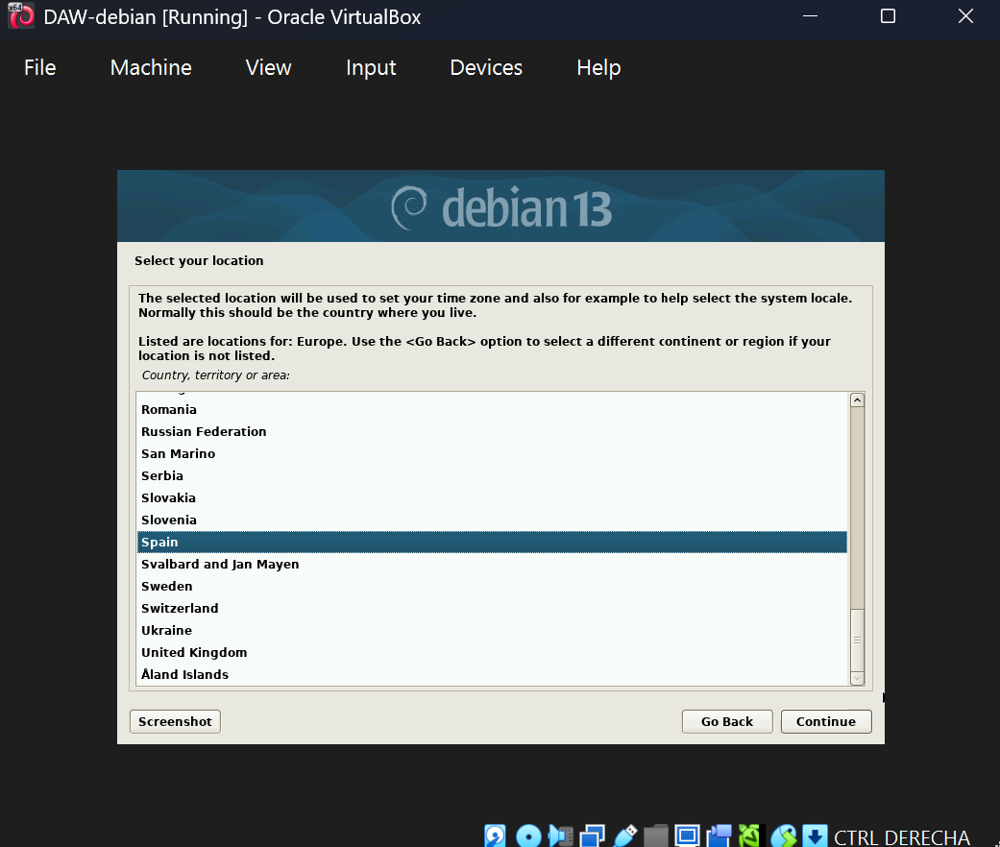

- **Configure locales:** **United States - en_US.UTF-8**.
- **Configure the keyboard:** **Spanish**. ⚠️ Si dejas *American English*, los símbolos (`/`, `-`, `|`, `@`…) no estarán donde esperas.

**Interfaz de red principal.** Como la máquina tiene dos adaptadores, el instalador pregunta cuál usar. Elige **`enp0s3`**, que es el Adapter 1 (NAT) y el que tiene Internet. `enp0s8` es el Host-only y lo configuraremos después de instalar.

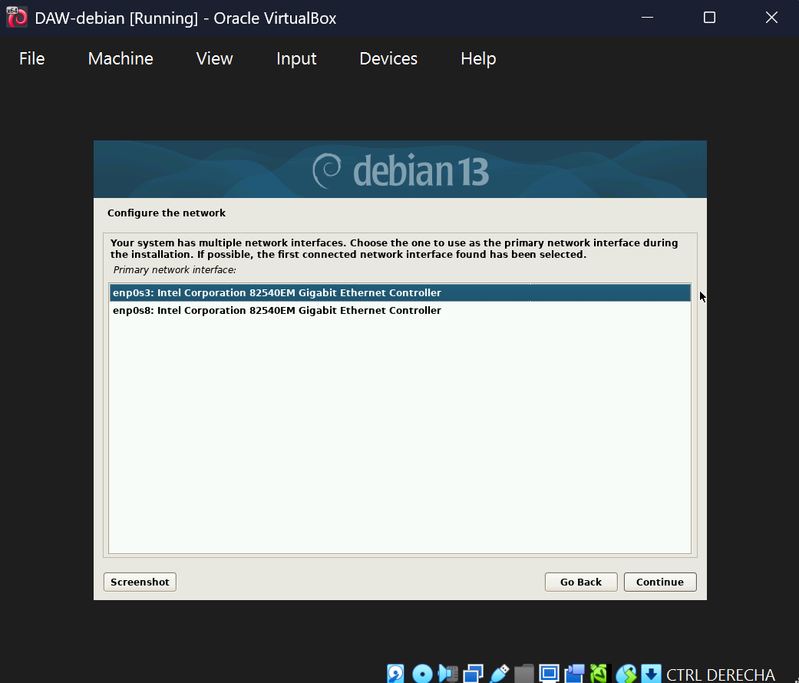

**Nombre de la máquina (*hostname*).** Aquí no eliges libremente: el nombre de tu máquina debe ser

```
debian-tuapellido
```

en minúsculas, sin acentos, sin espacios y sin la ñ (por ejemplo, `debian-garcia`). Si tienes dos apellidos, usa solo el primero. En la captura aparece `daw-debian`: tú escribe el tuyo.

!!! warning "Esto no es un capricho"
    El *hostname* aparece en el *prompt* de cada comando que ejecutes (`usuario@debian-tuapellido`), así que **firma automáticamente toda tu entrega**. Una práctica entregada con el nombre de otra persona en el prompt es una práctica copiada, y se corrige sola.

    Si te equivocas al instalar, se arregla después con `sudo hostnamectl set-hostname debian-tuapellido` y reiniciando.

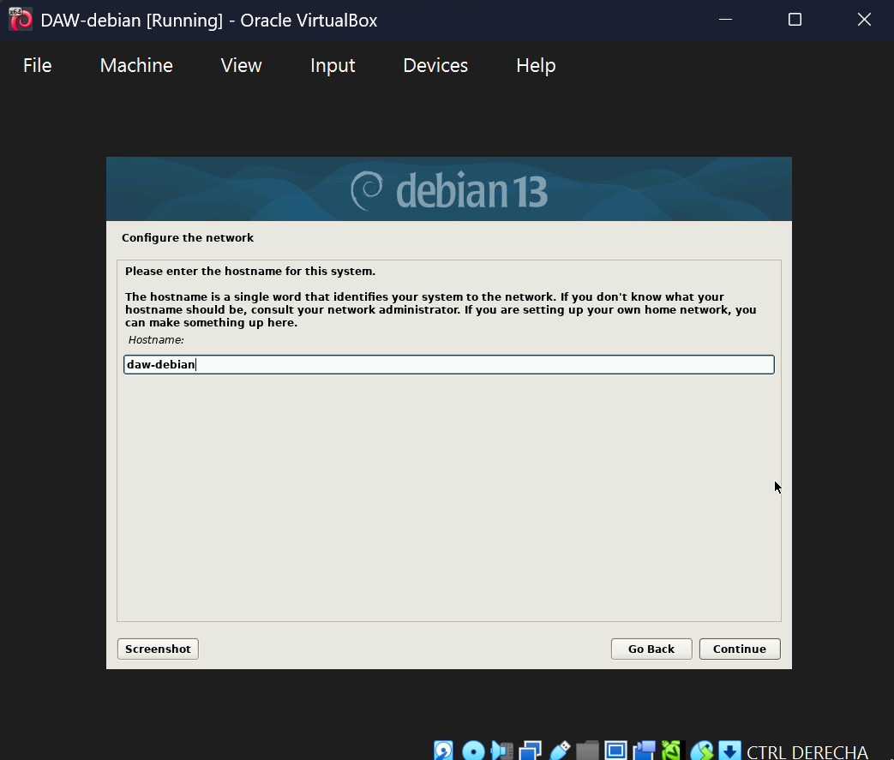

**Domain name:** déjalo en blanco.

**Contraseña de *root*: déjala vacía** (los dos campos).

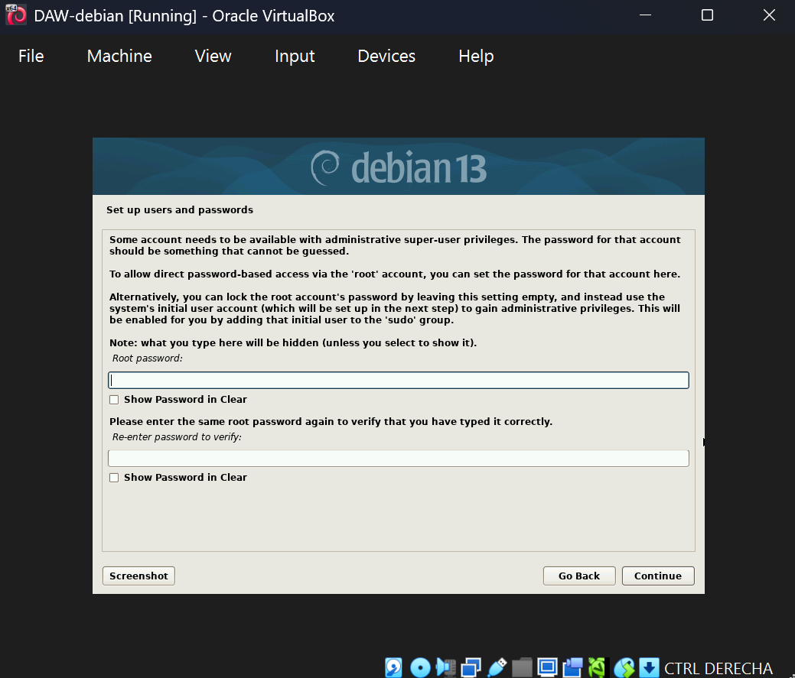

Como indica el propio instalador, si no pones contraseña a *root* la cuenta queda bloqueada y el usuario que crees a continuación se añade automáticamente al grupo `sudo`. Es lo que se hace hoy en la mayoría de servidores (Ubuntu Server, las máquinas de AWS o Azure…): se trabaja con un usuario normal y se usa `sudo` solo para las tareas de administración. Lo verás en el paso 6.

**Usuario.** Después te pedirá:

- **Full name for the new user:** tu nombre completo.
- **Username for your account:** en minúsculas y sin espacios ni tildes (por ejemplo, `ana`).
- **Password:** escríbela dos veces y **apúntala**, porque es la que te pedirá `sudo`. Marca **Show Password in Clear** para comprobar que la escribes bien: es fácil equivocarse con la distribución del teclado.

**Reloj.** **Madrid** (o *Canary Islands* si corresponde).

**Particionado.** Para simplificar, dile que utilice todo el disco:

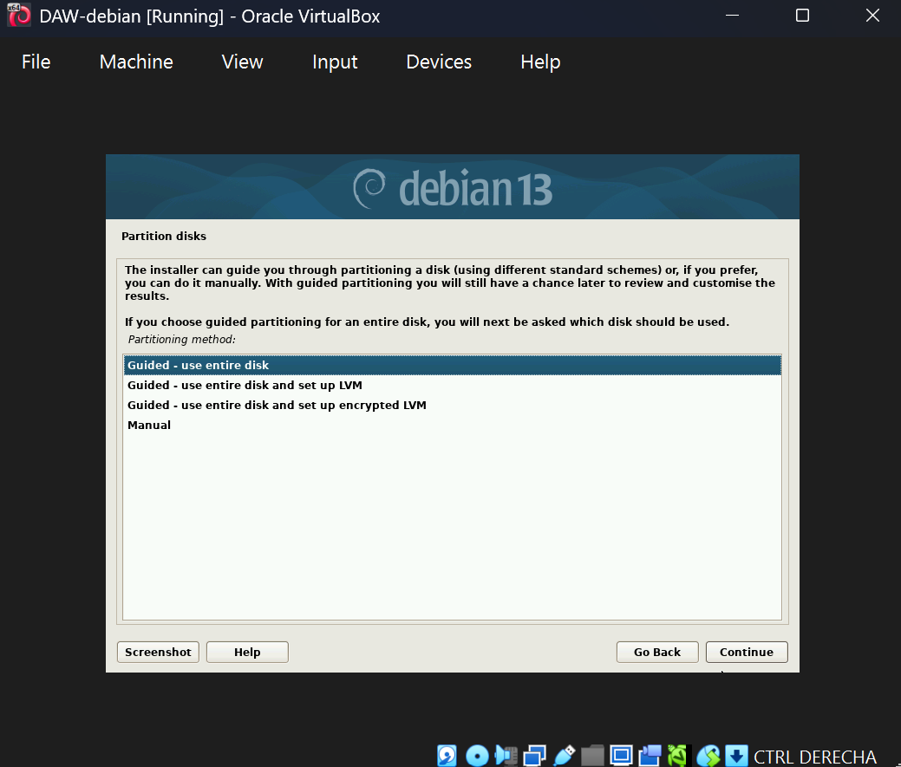

1. **Partitioning method:** **Guided - use entire disk**.
2. **Select disk to partition:** el único que hay, `sda`. Aparece como 21.5 GB y no como 20 GB porque VirtualBox mide en GiB y el instalador en GB.
3. **Partitioning scheme:** **All files in one partition (recommended for new users)**.
4. En el resumen verás una partición `ext4` montada en `/` y otra de `swap`. Elige **Finish partitioning and write changes to disk**.
5. **Write the changes to disks?:** marca **Yes**. ⚠️ Por defecto está en *No*; si continúas así, vuelve atrás y parece que no avanza.

Solo se borra el disco virtual de la máquina, no el de tu ordenador.

**Gestor de paquetes.**

- **Scan extra installation media?:** **No**.
- **Debian archive mirror country:** **Spain**.
- **Debian archive mirror:** **deb.debian.org**. Es una red de servidores que te redirige automáticamente al más cercano.
- **HTTP proxy information:** en blanco.
- **Participate in the package usage survey?:** **No**.

**Selección de software (*tasksel*).** Aquí está la otra decisión crítica. Deja marcado **únicamente**:

- **SSH server**
- **standard system utilities**

Y **desmarca todo lo demás**, en especial **Debian desktop environment** y cualquier escritorio (GNOME, Xfce, LXDE…). Revisa la lista entera: si queda marcado un escritorio concreto, se instala aunque hayas desmarcado *Debian desktop environment*.

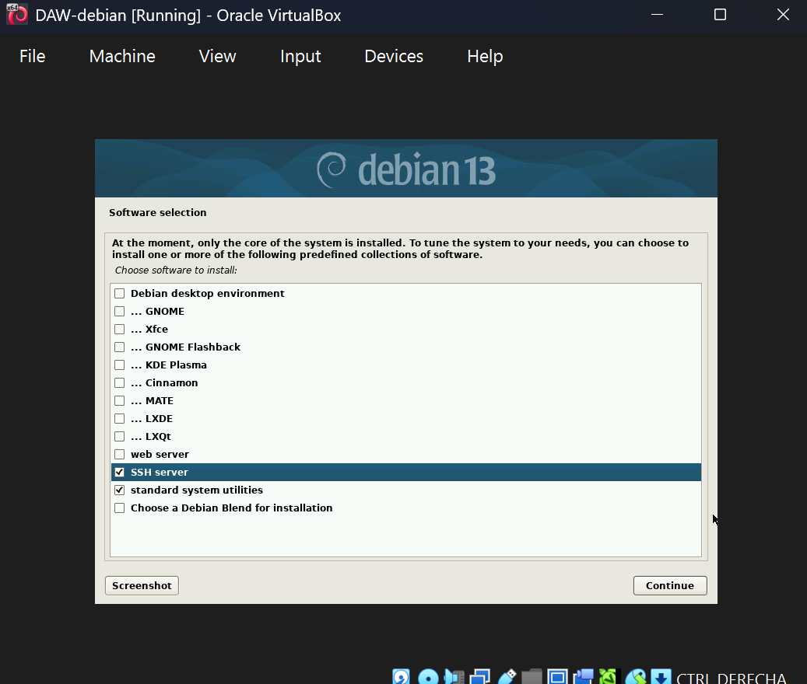

!!! warning "Sin entorno gráfico"
    Un servidor no lleva escritorio: consume memoria, aumenta la superficie de ataque y no lo va a mirar nadie. Las webs que despliegues las probarás desde el navegador de tu ordenador, gracias al adaptador Host-only.

    Tampoco marques **web server**: instalaremos el servidor web a mano en una práctica posterior.

**Gestor de arranque GRUB.** Dile que sí lo instale (**Yes**), y selecciona el único disco que tienes, `/dev/sda`. **Pincha en el nombre del disco**, no en *Enter device manually*, o no se instalará:

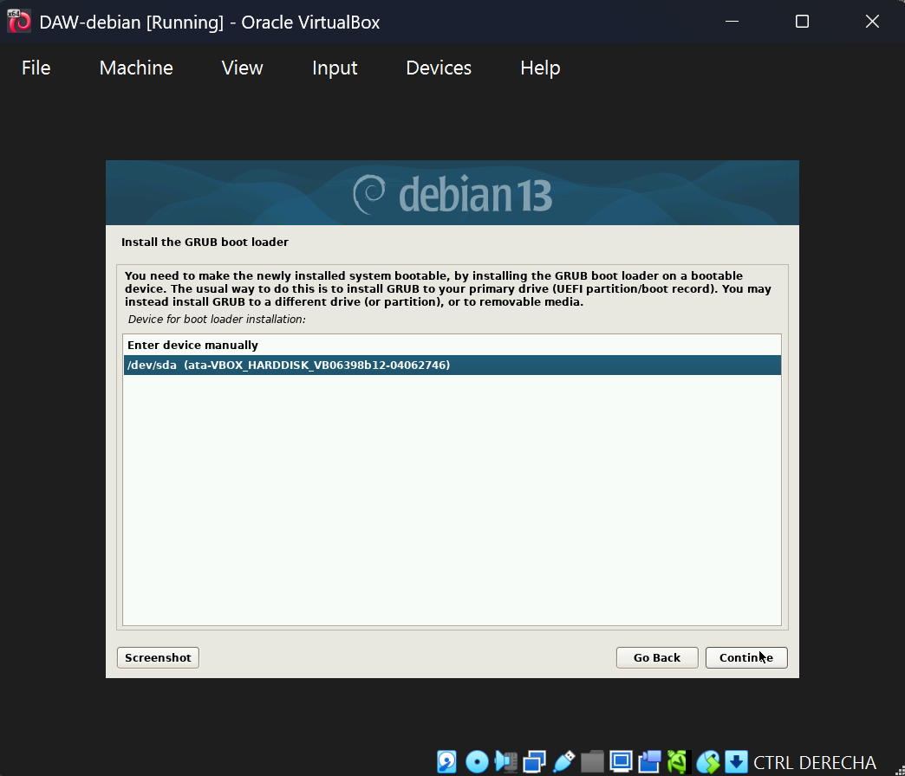

Al terminar aparecerá **Installation complete**: pulsa **Continue** y la máquina se reiniciará. Tras el reinicio aparecerá una terminal pidiendo *login*, y ahí ya puedes entrar con tu usuario y contraseña (al escribir la contraseña no se ve nada; es normal).

!!! tip "Si vuelve a aparecer el instalador"
    Normalmente el instalador expulsa la ISO al terminar. Si al reiniciar vuelves a ver el menú de instalación, quita la ISO desde **Devices → Optical Drives → Remove disk from virtual drive** y reinicia.

!!! info "Máquina de respaldo"
    Si tu instalación falla y no hay tiempo para repetirla, el profesor te facilitará una máquina ya instalada (`DAW-debian.ova`). Impórtala con **File → Import Appliance** y, en **MAC Address Policy**, elige **Generate new MAC addresses for all network adapters**.

    - Usuario: `alumno` · Contraseña: `daw1234`
    - Nada más entrar, **cambia la contraseña** con `passwd` y **el *hostname*** con `sudo hostnamectl set-hostname debian-tuapellido`.
    - **Regenera las claves del servidor SSH.** Todas las copias de la máquina de respaldo tienen las mismas, así que todas tendrían la misma huella (lo entenderás en el paso 5):

        ```sh
        sudo rm /etc/ssh/ssh_host_*
        sudo dpkg-reconfigure openssh-server
        sudo systemctl restart ssh
        ```

    - La red Host-only ya viene configurada: puedes saltarte el paso 4.

## 4. Configurar la red Host-only

Desde la ventana de la máquina virtual, comprueba el estado de las interfaces de red:

```sh
ip -br a
```

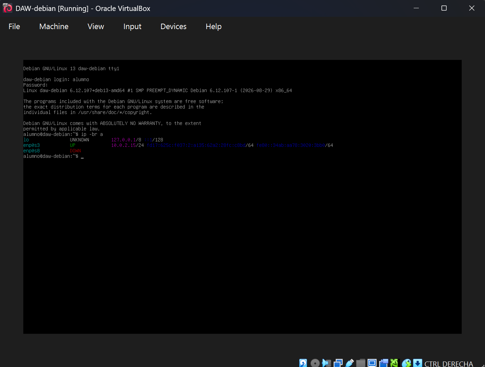

| Interfaz | Qué es | Estado |
|---|---|---|
| `lo` | *Loopback*: la máquina hablando consigo misma | `127.0.0.1` |
| `enp0s3` | Adapter 1 (NAT): salida a Internet | `UP` con `10.0.2.15` |
| `enp0s8` | Adapter 2 (Host-only): acceso desde tu ordenador | **`DOWN`, sin IP** |

El instalador solo configuró la interfaz principal. Vamos a dar a `enp0s8` una **IP fija**: `192.168.56.10`.

!!! info "¿Y si todos usamos la misma IP?"
    No hay problema. La red Host-only es privada y **local a cada ordenador**: solo existe entre tu Windows y tus máquinas virtuales, y no sale a la red del aula. Treinta máquinas con `192.168.56.10` en treinta ordenadores distintos no chocan, igual que todos los routers domésticos usan `192.168.1.1`.

    Si más adelante tienes **varias** máquinas virtuales en tu ordenador, cada una necesitará una IP distinta dentro de esa red (`.10`, `.11`, `.12`…).

Edita el fichero de configuración de red:

```sh
sudo nano /etc/network/interfaces
```

Te pedirá tu contraseña: es la primera vez que usas `sudo`. Al **final** del fichero, añade:

```
# Red Host-only: acceso desde el anfitrión
allow-hotplug enp0s8
iface enp0s8 inet static
    address 192.168.56.10/24
```

No lleva `gateway`: la salida a Internet ya la da `enp0s3` (NAT).

Guarda y sal de `nano` con **Ctrl+O**, **Enter** y **Ctrl+X**. Después levanta la interfaz y comprueba que tiene su IP:

```sh
sudo ifup enp0s8
ip -br a
```

`enp0s8` debe aparecer como `UP` con `192.168.56.10/24`:

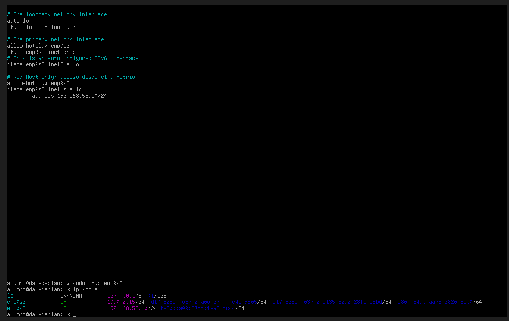

!!! question "Comprueba antes de seguir"
    Desde tu ordenador, abre PowerShell y haz `ping 192.168.56.10`. Si no responde, revisa el Adapter 2 de VirtualBox y el fichero `/etc/network/interfaces` antes de continuar.

## 5. Primera conexión por SSH (con contraseña)

Con la red configurada ya no necesitas la ventana de VirtualBox: a partir de aquí trabajarás **siempre desde tu terminal**, igual que con un servidor real, al que nunca tienes delante. Además, en la terminal puedes copiar y pegar comandos, cosa que en la ventana de la máquina virtual no se puede.

Para arrancar la máquina, haz clic derecho sobre ella en VirtualBox y elige una de estas opciones en **Start**:

| Opción | Qué hace |
|---|---|
| **Start with GUI** | Arranque normal, con ventana |
| **Start without GUI** | Sin ventana: la máquina funciona en segundo plano |
| **Start with detachable GUI** | Con ventana, pero **al cerrarla la máquina sigue encendida** |

Se recomienda **Start with detachable GUI**: ves el arranque y el *login* por si algo falla, y cuando ya te conectes por SSH cierras la ventana (eligiendo **Continue running in the background**).

Con la máquina encendida, conéctate:

=== "Windows"

    Windows 10 y 11 ya traen el cliente OpenSSH integrado. Abre **PowerShell** o el **Terminal de Windows** y escribe:

    ```powershell
    ssh nombreusuario@192.168.56.10
    ```

    No necesitas instalar PuTTY ni nada parecido.

=== "Linux / macOS"

    ```sh
    ssh nombreusuario@192.168.56.10
    ```

La primera vez te avisará de que no conoce el servidor y te mostrará su **huella** (*fingerprint*):

```
The authenticity of host '192.168.56.10 (192.168.56.10)' can't be established.
ED25519 key fingerprint is SHA256:xxxxxxxxxxxxxxxxxxxxxxxxxxxxxxxxxxxxxxxxxxx.
Are you sure you want to continue connecting (yes/no/[fingerprint])?
```

**No escribas `yes` todavía.** La huella es el resumen de la clave pública del servidor, algo así como su DNI. Si alguien se hubiera interpuesto entre tú y el servidor (un ataque de *hombre en el medio*), la huella que ves sería la **suya**, y al escribir `yes` le estarías entregando tu contraseña. Antes de confiar, compruébala.

En la **ventana de la máquina virtual** (por eso conviene arrancarla con ventana), ejecuta:

```sh
ssh-keygen -lf /etc/ssh/ssh_host_ed25519_key.pub
```

Te mostrará la huella real de tu servidor:

```
256 SHA256:xxxxxxxxxxxxxxxxxxxxxxxxxxxxxxxxxxxxxxxxxxx root@debian-tuapellido (ED25519)
```

Compara la cadena `SHA256:…` con la que te muestra PowerShell. Arriba, la huella vista desde dentro del servidor; abajo, la que recibe tu ordenador. Son idénticas:

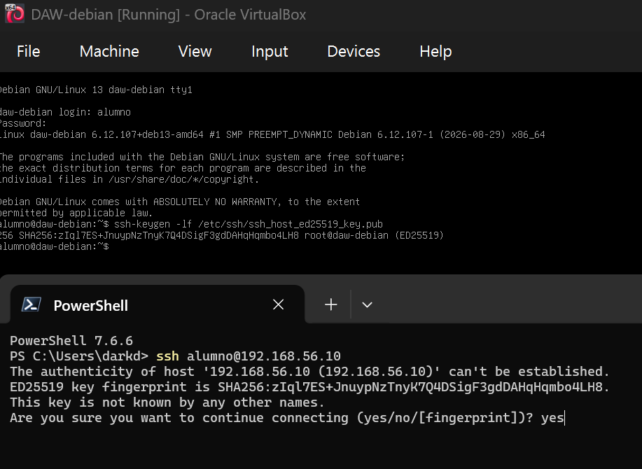

Si coinciden, escribe `yes`. A partir de entonces la huella queda guardada en tu fichero `known_hosts` (en Windows, `C:\Users\tuusuario\.ssh\known_hosts`) y no te lo volverá a preguntar.

!!! tip "Que lo compare SSH por ti"
    Fíjate en la pregunta: `(yes/no/[fingerprint])`. En lugar de `yes` puedes **pegar la huella** que has obtenido en el servidor (`SHA256:…`), y SSH la comparará por ti: si no coincide, rechazará la conexión. Es más fiable que comparar a ojo 43 caracteres.

!!! info "En un servidor real"
    En un VPS no tienes "ventana" a la que asomarte. El proveedor te muestra la huella en su panel web o en la consola de emergencia, y ahí es donde la compruebas. Casi nadie lo hace, y precisamente por eso este ataque funciona.

!!! danger "WARNING: REMOTE HOST IDENTIFICATION HAS CHANGED!"
    Si algún día, al conectarte, SSH se niega con este aviso enorme, es que la huella del servidor **ya no es la que tenías guardada**. Puede ser un ataque, o puede tener una explicación inocente: has reinstalado la máquina, o has importado otra con la misma IP. **Solo si sabes el motivo**, borra la huella antigua y vuelve a conectarte (y a comprobar la nueva):

    ```powershell
    ssh-keygen -R 192.168.56.10
    ```

!!! tip "También desde Visual Studio Code"
    Con la extensión **Remote - SSH** de Microsoft puedes conectarte al servidor desde VS Code (**F1 → Remote-SSH: Connect to Host… → `usuario@192.168.56.10`**, plataforma **Linux**). Tendrás su terminal integrada y podrás editar los ficheros de configuración del servidor con el editor de VS Code. Te resultará muy cómodo en las prácticas siguientes.

A partir de ahora, **todos los comandos de la Debian los ejecutas desde esta sesión SSH**.

## 6. Administrar con sudo

Con `sudo`, cualquier comando precedido de esa palabra se ejecuta como *root*, y todo lo demás se ejecuta con tus permisos normales. Así te proteges de liarla con un comando que no tocaba. A lo largo del módulo harás incontables tareas de administración, y trabajar como *root* todo el rato es incómodo y peligroso.

Como dejaste vacía la contraseña de *root*, tu usuario ya tiene permisos. Compruébalo:

```sh
groups
```

En la lista debe aparecer `sudo`. Valida que funciona:

```sh
sudo -v
```

Si **no** tienes permisos, responderá:

```
Sorry, user [usuario] may not run sudo on [maquina].
```

Y si los tienes, no devolverá nada. Si quieres algo más explícito:

```sh
timeout 2 sudo id && echo Access granted || echo Access denied
```

### Dar permisos de sudo a otro usuario

En un servidor que no has instalado tú, lo normal es tener que dar permisos a un usuario a mano. Practícalo creando un segundo usuario llamado `deploy`, el típico usuario de despliegue:

```sh
sudo adduser deploy
```

Te pedirá una contraseña para `deploy` (dos veces) y después unos datos opcionales (*Full Name*, *Room Number*…): pulsa **Enter** en todos para dejarlos vacíos y confirma con **Y**.

=== "Método corto: añadir al grupo sudo"

    ```sh
    sudo usermod -aG sudo deploy
    ```

    Debian ya trae en `/etc/sudoers` una línea que concede permisos a todo el grupo `sudo`, así que con añadir el usuario al grupo es suficiente.

=== "Método clásico: visudo"

    Ejecuta `visudo`, la herramienta que edita el fichero de permisos de forma segura (comprueba la sintaxis antes de guardar, para que no te quedes fuera):

    ```sh
    sudo visudo
    ```

    Deja la sección así:

    ```
    # User privilege specification
    root    ALL=(ALL:ALL) ALL
    deploy  ALL=(ALL:ALL) ALL
    ```

    Guarda con `Ctrl+X` y confirma.

Comprueba que funciona cambiando a ese usuario. El prompt pasará a ser `deploy@debian-tuapellido`, y tanto `su` como `sudo` te pedirán la contraseña **de `deploy`**:

```sh
su - deploy
sudo -v
exit
```

!!! warning "No pegues de golpe comandos que piden contraseña"
    Si pegas estas tres líneas a la vez, las que van detrás de `su` no se ejecutan cuando esperas: pueden tomarse como la contraseña (y falla con `su: Authentication failure`) o quedarse en espera y ejecutarse más tarde, en otra sesión. Por ejemplo, el `exit` pegado puede acabar cerrándote la conexión SSH. Cuando un comando pide contraseña, ejecútalo **solo** y espera a que te la pida.

!!! info "Los grupos se leen al iniciar sesión"
    Si añades a un grupo a un usuario que ya tiene una sesión abierta, el cambio no se nota hasta que **cierra la sesión y vuelve a entrar**.

## 7. Autenticación con par de claves

Ahora haremos lo que se hace en un servidor real: entrar sin contraseña, con un par de claves.

**En tu ordenador** (no en la máquina virtual), genera el par de claves:

```sh
ssh-keygen -t ed25519 -C "tu_correo_o_un_comentario"
```

!!! info "Por qué ed25519 y no RSA"
    `ed25519` es el algoritmo recomendado hoy: claves mucho más cortas, más rápidas y al menos igual de seguras que un RSA de 4096 bits. Verás mucha documentación antigua que usa `ssh-keygen -b 4096`; funciona, pero ya no es la primera opción.

!!! danger "Si ya tienes una clave, no la sobrescribas"
    Si en tu ordenador ya existe `id_ed25519` (por ejemplo, porque la usas para GitHub), `ssh-keygen` te preguntará `Overwrite (y/n)?`. Responde **`n`**: si la sobrescribes, perderás el acceso a todo lo que usaba la antigua. No necesitas otra; sáltate la generación y usa la que ya tienes.

    Para saber si ya tienes una, en PowerShell: `ls $env:USERPROFILE\.ssh`

Acepta la ubicación por defecto. Te pedirá una *passphrase* para proteger la clave privada: dado que queremos agilizar la conexión, **déjala vacía** pulsando Enter.

Se habrán creado dos archivos en tu carpeta `.ssh`:

| Archivo | Qué es | ¿Se comparte? |
|---|---|---|
| `id_ed25519` | Clave **privada** | **Nunca.** No sale de tu equipo |
| `id_ed25519.pub` | Clave **pública** | Sí, es la que copiamos al servidor |

Ahora hay que copiar la clave **pública** al servidor:

=== "Linux / macOS"

    ```sh
    ssh-copy-id usuario@192.168.56.10
    ```

    Es una conexión SSH normal que, además, copia la clave en el sitio adecuado.

=== "Windows"

    En Windows **no existe `ssh-copy-id`**. Hazlo con este comando en PowerShell (todo en una línea):

    ```powershell
    type $env:USERPROFILE\.ssh\id_ed25519.pub | ssh usuario@192.168.56.10 "mkdir -p ~/.ssh && cat >> ~/.ssh/authorized_keys"
    ```

Para evitar problemas de permisos, ejecuta **en la Debian**:

```sh
chmod 700 ~/.ssh
chmod 600 ~/.ssh/authorized_keys
```

!!! warning "Los permisos no son opcionales"
    SSH **ignora** el fichero `authorized_keys` si tiene permisos demasiado abiertos, y lo hace en silencio: te seguirá pidiendo la contraseña sin decirte por qué. Es el fallo número uno de esta práctica.

Cierra la sesión y vuelve a conectarte. Debe entrar **sin pedirte contraseña**. Fíjate en la diferencia: al copiar la clave pide la contraseña por última vez; en la última conexión, ya no:

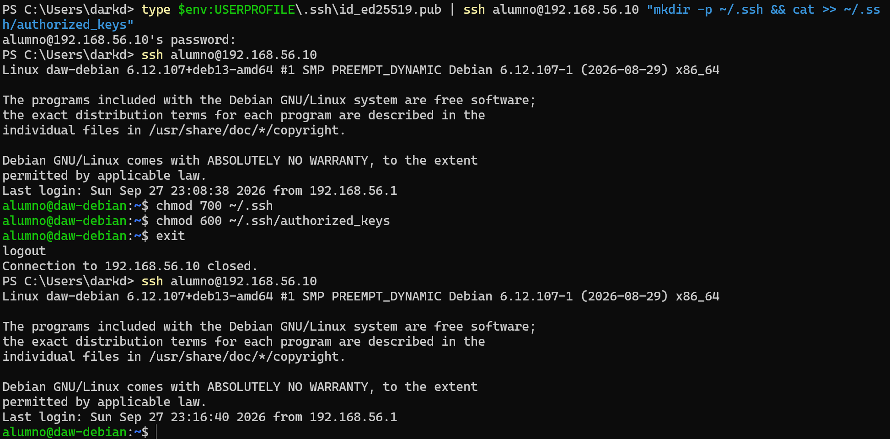

## 8. Endurecer el servidor SSH

Si ya entras con clave, la contraseña sobra: es una puerta abierta que solo sirve para que la intenten forzar. Vamos a cerrarla.

!!! danger "Antes de tocar nada"
    **Comprueba que la conexión con clave funciona.** Si desactivas la contraseña sin tener la clave bien puesta, te quedas fuera de tu propio servidor (en la VM podrías entrar por la ventana; en un VPS real, no).

Edita el fichero de configuración del servidor:

```sh
sudo nano /etc/ssh/sshd_config
```

Busca estas tres directivas (con **Ctrl+F** puedes buscar en `nano`). Por defecto están comentadas con `#`, lo que significa que se aplica su valor por defecto. Quita el `#` y déjalas así:

```aconf
PermitRootLogin no
PasswordAuthentication no
PubkeyAuthentication yes
```

Las líneas activas se ven en blanco y las comentadas en azul:

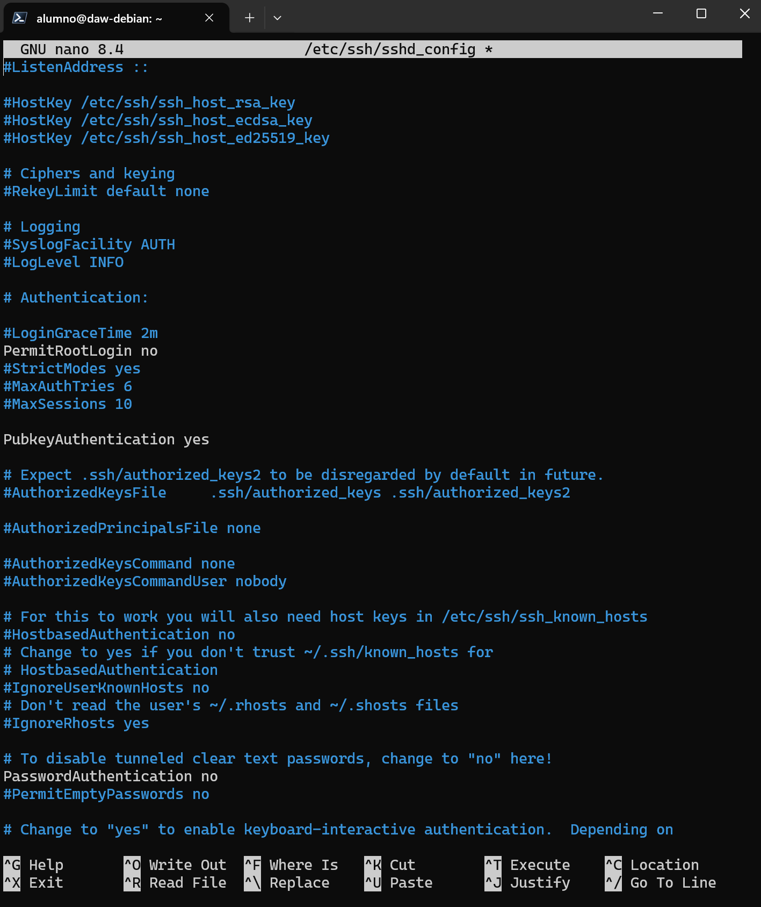

Antes de aplicar nada, comprueba que el fichero no tiene errores. Si hay alguno, el servicio no arrancaría:

```sh
sudo sshd -t
```

Si no devuelve nada, está bien. Aplica los cambios:

```sh
sudo systemctl restart ssh
```

!!! danger "Trampa de Debian 13"
    En Debian 13 el servidor SSH se activa **por socket** (`ssh.socket`). Eso significa que el clásico `systemctl reload ssh` **falla** con el error `fatal: Cannot bind any address` y puede tumbarte el servicio.

    Usa siempre **`restart`**, no `reload`. Tranquilo: reiniciar el servicio **no corta** las sesiones SSH que ya estén abiertas.

Comprueba la configuración que el servidor está aplicando **de verdad**:

```sh
sudo sshd -T | grep -Ei 'permitrootlogin|passwordauthentication|pubkeyauthentication'
```

Debe mostrar `permitrootlogin no`, `passwordauthentication no` y `pubkeyauthentication yes`. Si alguna no coincide con lo que has escrito, puede que otro fichero de `/etc/ssh/sshd_config.d/` la esté sobrescribiendo.

Comprueba desde **otra terminal** (sin cerrar la que tienes abierta, por si acaso) que sigues entrando con la clave y que, si intentas forzar la contraseña, te rechaza:

```sh
ssh -o PreferredAuthentications=password usuario@192.168.56.10
```

Debe responder `Permission denied (publickey)`: el servidor solo acepta claves.

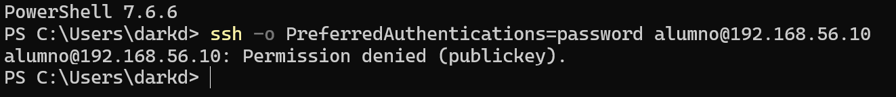

## 9. Haz una instantánea

Apaga la máquina desde tu sesión SSH:

```sh
sudo poweroff
```

En VirtualBox, selecciona la máquina, abre la pestaña **Snapshots**, pulsa **Take** y llama a la instantánea `base-limpia`:

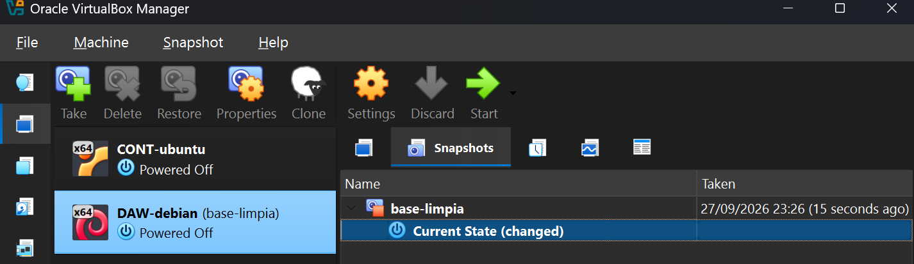

Para volver a ese punto en el futuro: selecciona la instantánea y pulsa **Restore**.

A lo largo del módulo vas a instalar, configurar y romper muchas cosas. Poder volver a un punto conocido en treinta segundos, en vez de reinstalar Debian entera, te va a salvar más de una tarde.

---

## Cuestiones finales

!!! question "Cuestión 1"
    Tu máquina tiene dos adaptadores de red: **NAT** y **Host-only**. ¿Para qué sirve cada uno? ¿Qué pasaría si solo tuviera el NAT? ¿Y si solo tuviera el Host-only?

!!! question "Cuestión 2"
    ¿Por qué `visudo` es preferible a editar `/etc/sudoers` directamente con `nano`?

!!! question "Cuestión 3"
    Has copiado tu clave pública al servidor. ¿Qué ocurriría si, por error, hubieras copiado la privada? ¿Y qué debes hacer si eso pasa?

!!! question "Cuestión 4"
    A `enp0s8` le hemos puesto una IP fija en lugar de dejar que la asigne un servidor DHCP. ¿Qué ventajas tiene eso en un servidor? ¿Por qué todos los compañeros podéis usar la misma IP sin que haya conflictos?

!!! question "Cuestión 5"
    Explica, con lo visto en la teoría, qué cifrado (simétrico o asimétrico) interviene en cada momento cuando te conectas por SSH con un par de claves.

## Entrega

El resultado de esta práctica es una máquina virtual, y una máquina no se puede entregar.
Lo que entregas son **las pruebas de que esa máquina existe y está bien configurada**.

La entrega tiene dos partes, y las dos son obligatorias.

### Parte 1 — Documento de evidencias (40 %)

Un único **PDF** llamado `P1.1-Apellido-Nombre.pdf` que contenga, en este orden:

1. **Portada** con tu nombre, el grupo y el *hostname* de tu máquina.
2. **Las evidencias** de la tabla de abajo.
3. **Las respuestas a las cinco cuestiones finales**, con tus palabras.

!!! danger "Texto, no capturas"
    La salida de los comandos se entrega **copiada como texto**, dentro de un bloque o con
    tipografía de ancho fijo. **No** valen fotos ni capturas de la terminal.

    Solo hay dos excepciones, porque ahí sí hace falta ver la pantalla: la configuración de los
    adaptadores de red en VirtualBox y la instantánea creada.

Evidencias que debe contener el documento:

| # | Qué hay que demostrar | Comando cuya salida se pega |
|---|---|---|
| 1 | La máquina es tuya y el *hostname* es el correcto | `hostnamectl` |
| 2 | Tu usuario y sus grupos | `id` |
| 3 | El sistema arranca sin entorno gráfico | `systemctl get-default` (debe responder `multi-user.target`) |
| 4 | Las dos interfaces de red tienen IP (`enp0s3` por NAT y `enp0s8` con `192.168.56.10`) | `ip a` |
| 5 | El servidor SSH está activo | `systemctl status ssh` |
| 6 | Tu usuario y el usuario `deploy` tienen permisos de administración | `sudo id` y `groups deploy` |
| 7 | Entras con par de claves | `ssh -v usuario@192.168.56.10` — señala la línea `Authenticated using "publickey"` |
| 8 | El acceso por contraseña está cerrado | `ssh -o PreferredAuthentications=password usuario@192.168.56.10` — debe responder `Permission denied (publickey)` |
| 9 | Configuración de red de la máquina | **Captura** de VirtualBox con el Adapter 1 (NAT) y otra con el Adapter 2 (Host-only) |
| 10 | Instantánea creada | **Captura** de la instantánea `base-limpia` |

Cada evidencia debe ir acompañada de **una frase tuya** explicando qué demuestra.
Una tanda de comandos pegados sin explicar no puntúa.

### Parte 2 — Demostración en clase (60 %)

En dos minutos, en tu puesto:

1. Te conectas por SSH desde tu equipo a tu máquina virtual.
2. Ejecutas el comando que se te pida en ese momento.
3. Explicas en voz alta **una** de las decisiones que tomaste (por qué dos adaptadores de red, por qué sin escritorio, por qué desactivamos la contraseña…).

Esta parte no se puede preparar de memoria ni copiar: o la máquina funciona, o no funciona.

!!! info "Cómo se califica"
    La demostración pesa más que el documento porque es lo que de verdad acredita el
    resultado de aprendizaje. **Una demostración que no funciona no se compensa con un
    documento impecable**: en ese caso la práctica queda pendiente hasta que la máquina
    funcione, y se vuelve a demostrar.

### Criterios de evaluación

| Parte | Criterio | Peso |
|---|---|---|
| Documento | Las diez evidencias están completas, en texto y cada una con su frase explicativa | 25 % |
| Documento | Las cinco cuestiones finales están respondidas con corrección y criterio propio | 15 % |
| Demostración | Te conectas por SSH con clave desde tu equipo, y el acceso por contraseña está cerrado | 20 % |
| Demostración | Ejecutas el comando que se te pide y la salida es la esperada | 20 % |
| Demostración | Explicas una de tus decisiones con tus palabras y respondes a las preguntas sobre ella | 20 % |

Si en la demostración aparece una máquina que no es la tuya (el *hostname*, la huella del servidor o la clave de otra persona), la demostración entera cuenta como no superada.

### Antes de entregar, comprueba que…

- ☐ El *hostname* es `debian-tuapellido` y aparece en todas las salidas.
- ☐ La máquina arranca **sin entorno gráfico** y muestra el *login* en terminal.
- ☐ `enp0s8` tiene la IP `192.168.56.10` y responde al `ping` desde tu ordenador.
- ☐ Tu usuario y el usuario `deploy` ejecutan `sudo` correctamente.
- ☐ Te conectas por SSH **sin que te pida contraseña**.
- ☐ El acceso por contraseña y el de *root* están desactivados.
- ☐ Existe la instantánea `base-limpia`.
- ☐ Las diez evidencias están en el PDF, en texto y comentadas.
- ☐ Las cinco cuestiones están respondidas.
- ☐ El archivo se llama `P1.1-Apellido-Nombre.pdf`.

## Referencias

- [Debian — Instalación por red (netinst)](https://www.debian.org/CD/netinst/index.es.html)
- [Guía de instalación de Debian](https://www.debian.org/releases/stable/installmanual)
- [Manual de OpenSSH](https://www.openssh.com/manual.html)
- [¿Qué es un VPS? Todo lo que necesitas saber sobre servidores virtuales](https://www.hostinger.es/tutoriales/que-es-un-vps)
