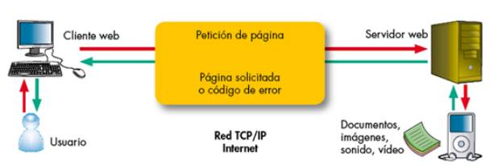
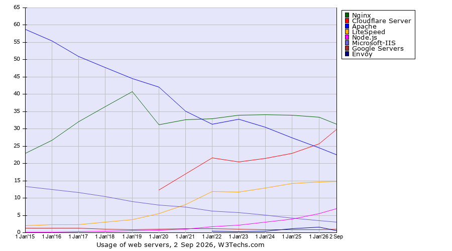

<!--
NOTA PARA EL PROFESOR (no se muestra al alumnado):
- Página reescrita a partir de ArqWeb.md del repo original (~5.200 palabras). Recortada y centrada en
  lo que se usa en las prácticas 2.x. Fuera: JAMstack, Edge Computing, estadísticas de adopción de
  HTTP/3 (eran poco fiables), historia larga del CERN. JAMstack/CDN/PaaS quedan en un desplegable final.
- Corregido respecto al original:
  * El handshake TLS: el original (y la imagen https2.png) dice que el cliente "genera una clave simétrica
    y la cifra con la pública del servidor". Eso es el intercambio RSA de TLS 1.2, ELIMINADO en TLS 1.3
    por no tener secreto hacia adelante. Ahora se explica con Diffie-Hellman efímero + firma, igual que
    SSH en el Tema 1 (apartado 6), para que el alumnado vea que es el mismo patrón.
  * El diagrama "TLS 1.2" del original era impreciso. Se sustituye por el de TLS 1.3, que es lo que negocia
    hoy cualquier navegador con el Nginx de Debian 13 (ssl_protocols TLSv1.2 TLSv1.3).
  * Cuotas de mercado: datos de W3Techs a 2 de septiembre de 2026 (imagen T2-w3techs-tendencia.png, del
    repo original, y cifras de su gráfico por ranking): Nginx 31,3 %, Cloudflare 29,9 %, Apache 22,5 %.
- Añadido: virtual hosts y cabecera Host (base de la P2.1), anatomía de la configuración de Nginx en
  Debian, ciclo editar -> nginx -t -> reload, permisos de www-data, FTP/FTPS/SFTP.
- Las salidas de terminal son REALES, capturadas el 04/10/2026 en la VM de validación de la P2.1
  (Debian 13.7, nginx 1.26.3) desde el Windows anfitrión.
- ORGANIZACIÓN POR BLOQUES (05/10/2026): teoría y prácticas intercaladas. Orden de apartados:
  1 servidor web, 2 arquitectura, 3 HTTP | 4 virtual hosts, 5 Apache/Nginx, 6 Nginx por dentro, 7 FTP/SFTP
  -> P2.1 | 8 HTTPS -> P2.2 | P2.3-2.5. El recuadro SNI pasó de virtual hosts a HTTPS (se explica tras TLS).
  Las diapositivas siguen el mismo orden, con una diapositiva "Ahora toca" en cada práctica.
- Prácticas 2.2 (HTTPS), 2.3 (autenticación), 2.4 (proxy inverso) y 2.5 (balanceo): pendientes de
  adaptar (parten de old.P1.2 a old.P1.5). Cuando existan, enlazarlas en la tabla de bloques y en los
  recuadros "Ahora toca".
- Corregido 05/10/2026: la frase "un servicio es un programa que escucha en un puerto" no estaba en el
  Tema 1 (ahora enlaza con el puerto 22 de SSH); los métodos de las API REST son GET, POST, PUT, PATCH y
  DELETE; aclarado por qué HTTP/2 y HTTP/3 van cifrados; example.com no resolvía en la red del centro y
  se sustituye por github.com en los ejemplos.
-->

# Tema 2 - Arquitectura web: implantación y administración de servidores web

!!! abstract "Qué vas a aprender en este tema"
    - Qué es exactamente un servidor web y qué lugar ocupa en la arquitectura de una aplicación.
    - Cómo es por dentro una conversación HTTP: peticiones, respuestas, códigos de estado, cabeceras y tipos MIME.
    - Cómo un solo servidor puede alojar muchas webs distintas (*virtual hosts*).
    - En qué se diferencian Apache y Nginx, y cómo está organizado Nginx en Debian.
    - Cómo se suben ficheros a un servidor: FTP, FTPS y SFTP.
    - Qué añade HTTPS y cómo funciona TLS, conectándolo con lo que ya sabes de SSH.

## Cómo se organiza este tema

La teoría y las prácticas van intercaladas, en cuatro bloques. Cada bloque termina con unas cuestiones de repaso y un recuadro **Ahora toca** que indica la práctica que se hace en ese momento.

| Bloque | Teoría | Al terminar | Horas orientativas |
|---|---|---|---|
| 1. La web por dentro | Apartados 1, 2 y 3 | Actividad en clase con `curl` y el navegador | 2 h de teoría + 1 h de actividad |
| 2. Montar un servidor web | Apartados 4, 5, 6 y 7 | [Práctica 2.1](T2-practica-nginx.md): Nginx, sitios virtuales y SFTP | 2,5 h de teoría + 5 h de práctica |
| 3. Cifrar | Apartado 8 | Práctica 2.2: HTTPS y redirección | 1,5 h de teoría + 3 h de práctica |
| 4. Proteger y escalar | Repaso de los apartados 1 y 3.3 | Prácticas 2.3, 2.4 y 2.5 | 10 h de práctica |

Las horas son una referencia para unas 25 h de tema: cada grupo lleva su ritmo.

---

## 1. Qué es un servidor web

"Servidor web" tiene dos significados, y conviene separarlos desde el principio:

- **La máquina**: el ordenador (físico o virtual) que aloja las webs. Tu máquina virtual Debian es una.
- **El programa**: el software que se queda escuchando en un puerto de esa máquina, recibe peticiones HTTP y devuelve respuestas. Nginx y Apache son servidores web en este sentido.

En este tema hablamos casi siempre del segundo. En el Tema 1 viste que el servidor SSH es un programa que se queda escuchando en el **puerto 22**, esperando conexiones. Un servidor web es lo mismo con otro protocolo: escucha normalmente en el **puerto 80** (HTTP) y en el **443** (HTTPS).



El funcionamiento básico es siempre el mismo: el navegador (el **cliente**) pide un recurso, y el servidor le devuelve ese recurso o un código de error. El navegador interpreta lo que recibe y, casi siempre, descubre que necesita más cosas (hojas de estilo, imágenes, scripts), así que hace más peticiones. Cargar una sola página puede suponer decenas de ellas.

### Contenido estático y contenido dinámico

| | Contenido estático | Contenido dinámico |
|---|---|---|
| Qué es | Ficheros que ya existen en el disco: HTML, CSS, imágenes, JavaScript | Una respuesta que se **genera** en el momento de la petición |
| Quién lo produce | El servidor web lee el fichero y lo envía tal cual | Un programa (PHP, Java, Node.js, Python…) ejecuta código, a menudo consulta una base de datos y construye la respuesta |
| Ejemplo | La portada de una web corporativa | Tu carrito de la compra, el muro de una red social |
| Coste | Muy bajo | Mayor: hay que ejecutar código en cada petición |

Un servidor web es excelente sirviendo contenido estático. Para el dinámico se apoya en un **servidor de aplicaciones**, que es el protagonista del Tema 3. En la práctica, lo habitual es combinarlos: el servidor web delante, recibiendo todas las peticiones, y el de aplicaciones detrás.

### Lo que hace un servidor web, además de servir ficheros

| Función | En qué consiste | Dónde lo verás |
|---|---|---|
| **Sitios virtuales** | Alojar muchas webs distintas en la misma máquina | Práctica 2.1 |
| **Registro (*logs*)** | Anotar cada petición y cada error | Práctica 2.1 |
| **HTTPS** | Cifrar la comunicación con el cliente | Práctica 2.2 |
| **Redirecciones** | Mandar al cliente a otra URL (por ejemplo, de HTTP a HTTPS) | Práctica 2.2 |
| **Autenticación** | Pedir usuario y contraseña para una zona de la web | Práctica 2.3 |
| **Proxy inverso** | Recibir la petición y reenviarla a otro servidor que está detrás | Práctica 2.4 y Tema 3 |
| **Balanceo de carga** | Repartir las peticiones entre varios servidores | Práctica 2.5 |
| **Caché y compresión** | Guardar respuestas ya generadas y comprimir lo que se envía | — |

## 2. La arquitectura de una aplicación web

Una aplicación web real rara vez es "un servidor". Es una cadena de piezas, cada una con su función:

```
 Navegador ──► DNS ──► Servidor web ──► Servidor de aplicaciones ──► Base de datos
 (cliente)    (Tema 4)  (Nginx, Apache)   (Tomcat, Node.js…, Tema 3)   (MySQL, PostgreSQL…)
```

Las combinaciones clásicas tienen nombre propio. **LAMP** es *Linux + Apache + MySQL + PHP*; **LEMP** es lo mismo con Nginx (que se pronuncia *engine-x*, de ahí la E). A lo largo del módulo montarás cada una de estas capas por separado, y en el Tema 6 aprenderás a empaquetarlas en contenedores.

### Qué pasa cuando escribes una URL

1. **Resolución del nombre.** El navegador necesita la IP del servidor. Se la pregunta al DNS (Tema 4) o, como harás en la práctica, la encuentra en el fichero `hosts` de tu equipo.
2. **Conexión.** Abre una conexión TCP con esa IP en el puerto 80 o 443. Si es HTTPS, además negocia el cifrado TLS (apartado 8).
3. **Petición.** Envía una petición HTTP: qué recurso quiere, de qué sitio y con qué características.
4. **Elección del sitio.** El servidor web mira a qué sitio va dirigida la petición (apartado 4) y busca el recurso.
5. **Respuesta.** Devuelve un código de estado, unas cabeceras y, normalmente, el contenido.
6. **Más peticiones.** El navegador interpreta el HTML y pide lo que le falta: CSS, imágenes, scripts…

## 3. El protocolo HTTP

HTTP (*Hypertext Transfer Protocol*) es el idioma en el que hablan navegador y servidor. Lo creó Tim Berners-Lee en el CERN, entre 1989 y 1991, junto con el HTML y el primer navegador. Es un protocolo de **texto**, de **petición-respuesta** y **sin estado**, y lo bueno de que sea texto es que puedes leerlo tal cual.

### 3.1 Una petición y su respuesta, en crudo

Esta es una petición real a uno de los sitios que montarás en la práctica 2.1, hecha con `curl -v` desde PowerShell. Las líneas que empiezan por `>` son lo que **envía** el cliente; las que empiezan por `<`, lo que **responde** el servidor:

```
> GET / HTTP/1.1
> Host: web2.garcia.test
> User-Agent: curl/8.21.0
> Accept: */*
>
< HTTP/1.1 200 OK
< Server: nginx
< Date: Sun, 04 Oct 2026 17:49:29 GMT
< Content-Type: text/html
< Content-Length: 8654
< Last-Modified: Sun, 06 Mar 2022 21:21:37 GMT
< Connection: keep-alive
< ETag: "622525e1-21ce"
< Accept-Ranges: bytes
<
```

**La petición** tiene tres partes:

- **Línea de petición**: el método (`GET`), la ruta del recurso (`/`) y la versión del protocolo (`HTTP/1.1`).
- **Cabeceras**: pares `Nombre: valor` con información adicional. La más importante es `Host`, que dice **a qué sitio** va dirigida la petición.
- **Cuerpo** (opcional): datos que se envían al servidor, por ejemplo los de un formulario. Un `GET` no lleva.

**La respuesta**, también tres:

- **Línea de estado**: versión, código de estado (`200`) y su texto (`OK`).
- **Cabeceras**: qué tipo de contenido es (`Content-Type`), cuánto ocupa (`Content-Length`), cuándo se modificó…
- **Cuerpo**: el recurso en sí, en este caso 8.654 bytes de HTML (`curl -v` no lo muestra porque lo hemos descartado).

!!! tip "Pruébalo tú"
    Windows trae `curl` de serie. En PowerShell escribe **`curl.exe`** (con la extensión: en algunas versiones de PowerShell, `curl` a secas es un alias de otro comando que no hace lo mismo):

    ```powershell
    curl.exe -v http://github.com -o NUL
    ```

    También puedes verlo en el navegador: **F12 → pestaña Red (*Network*)**, recarga la página y pincha en cualquier petición.

### 3.2 Métodos

El método indica qué quiere hacer el cliente con el recurso:

| Método | Para qué sirve |
|---|---|
| **GET** | Obtener un recurso. Es lo que hace el navegador al seguir un enlace o escribir una URL |
| **HEAD** | Como GET, pero solo devuelve las cabeceras, sin el cuerpo. Útil para comprobar si algo existe o ha cambiado (`curl -I` usa HEAD) |
| **POST** | Enviar datos para que el servidor los procese: un formulario, un pedido, un comentario nuevo |
| **PUT** | Crear o sustituir por completo el recurso de esa URL |
| **PATCH** | Modificar parcialmente un recurso |
| **DELETE** | Borrar el recurso |
| **OPTIONS** | Preguntar qué métodos admite el servidor para esa URL |

En un servidor web que solo sirve ficheros estáticos, en la práctica solo verás `GET` y `HEAD`. El resto cobra sentido cuando hay una aplicación detrás (las API REST que programas en otros módulos usan GET, POST, PUT, PATCH y DELETE).

### 3.3 Códigos de estado

Son números de tres cifras. La primera indica la familia:

| Familia | Significado | Ejemplos |
|---|---|---|
| **1xx** | Informativo | `101 Switching Protocols` |
| **2xx** | Éxito | `200 OK`, `201 Created`, `204 No Content` |
| **3xx** | Redirección: el recurso está en otro sitio | `301 Moved Permanently`, `302 Found`, `304 Not Modified` |
| **4xx** | Error **del cliente**: ha pedido algo mal o no tiene permiso | `400 Bad Request`, `401 Unauthorized`, `403 Forbidden`, `404 Not Found` |
| **5xx** | Error **del servidor**: la petición era correcta, pero el servidor ha fallado | `500 Internal Server Error`, `502 Bad Gateway`, `503 Service Unavailable` |

Los que te vas a encontrar en este tema, y lo que significan **en tu servidor**:

| Código | Cuándo lo verás |
|---|---|
| `200` | Todo bien |
| `301` | Cuando redirijas HTTP a HTTPS (práctica 2.2) |
| `304` | El navegador ya tenía el recurso en caché y el servidor le confirma que no ha cambiado. Por eso a veces "no se ven tus cambios" |
| `401` | La zona necesita usuario y contraseña (práctica 2.3) |
| `403` | Nginx no tiene permiso para leer el fichero, o una regla lo prohíbe expresamente |
| `404` | El fichero no existe, o la ruta `root` de tu configuración no apunta donde crees |
| `502` | Nginx hace de proxy y el servidor de detrás no responde (práctica 2.4 y Tema 3) |

### 3.4 Cabeceras

Las cabeceras llevan toda la información de la conversación que no es el contenido en sí. Algunas de las más importantes:

| Cabecera | Va en | Para qué |
|---|---|---|
| `Host` | Petición | Nombre del sitio al que va dirigida. **Obligatoria desde HTTP/1.1** |
| `User-Agent` | Petición | Qué programa hace la petición (navegador, `curl`, un robot…) |
| `Accept` | Petición | Qué tipos de contenido acepta el cliente |
| `Cookie` | Petición | Las cookies que el navegador tiene guardadas para ese sitio |
| `Server` | Respuesta | Qué software responde. Debian configura Nginx para que no diga su versión, para no dar pistas a un atacante |
| `Content-Type` | Respuesta | Tipo MIME del contenido (apartado 3.5) |
| `Content-Length` | Respuesta | Tamaño del cuerpo en bytes |
| `Location` | Respuesta | Adónde redirigir, en las respuestas 3xx |
| `Set-Cookie` | Respuesta | Pide al navegador que guarde una cookie |
| `Last-Modified`, `ETag`, `Cache-Control` | Respuesta | Información para la caché del navegador |

### 3.5 Tipos MIME

El servidor no envía "un fichero": envía bytes. Para que el navegador sepa qué hacer con ellos (pintarlos como HTML, aplicarlos como estilos, mostrarlos como imagen…), la respuesta incluye la cabecera `Content-Type` con un **tipo MIME**, que tiene la forma `tipo/subtipo`:

| Tipo MIME | Contenido |
|---|---|
| `text/html` | Página HTML |
| `text/css` | Hoja de estilos |
| `text/javascript` | Script |
| `image/png`, `image/jpeg`, `image/webp`, `image/svg+xml` | Imágenes |
| `application/json` | Datos JSON (típico de las API) |
| `application/pdf` | Documento PDF |
| `application/octet-stream` | "Bytes sin más": el navegador no sabe qué es y lo **descarga** |

¿De dónde saca Nginx el tipo? De la **extensión** del fichero, que busca en la tabla `/etc/nginx/mime.types`. Si la extensión no está en la tabla, usa `application/octet-stream`.

### 3.6 Un protocolo sin estado

HTTP **no recuerda** nada entre una petición y la siguiente: para el servidor, cada petición es la primera. Entonces, ¿cómo sabe una tienda online que sigues siendo tú al pasar de una página a otra? Con las **cookies**: el servidor envía un identificador con `Set-Cookie`, el navegador lo guarda y lo devuelve en cada petición posterior con la cabecera `Cookie`. El estado lo guarda la aplicación; HTTP solo transporta el identificador.

### 3.7 Versiones de HTTP

| Versión | Año | Qué aportó |
|---|---|---|
| HTTP/0.9 | 1991 | Una sola línea: `GET /pagina`. Solo HTML, sin cabeceras ni códigos de estado |
| HTTP/1.0 | 1996 | Cabeceras, códigos de estado, tipos MIME. Una conexión TCP nueva para cada recurso |
| HTTP/1.1 | 1997 | **Conexiones persistentes** (varias peticiones por conexión) y **cabecera `Host` obligatoria**, que permite alojar muchos sitios en una IP |
| HTTP/2 | 2015 | Protocolo **binario**. Muchas peticiones en paralelo por una sola conexión (multiplexación) y cabeceras comprimidas |
| HTTP/3 | 2022 | Cambia TCP por **QUIC**, que va sobre UDP. Siempre cifrado |

El problema que resuelve HTTP/3 se llama **bloqueo de cabeza de línea** (*head-of-line blocking*). HTTP/2 multiplexa muchas peticiones en una conexión TCP, pero TCP entrega los datos estrictamente en orden: si se pierde un solo paquete, todo lo que viene detrás espera a que se retransmita, aunque pertenezca a otra petición. Es como una cola de peaje con un solo carril. QUIC gestiona cada petición como un flujo independiente, de modo que una pérdida solo retrasa su propio flujo. Además, combina la conexión y el cifrado en un solo paso, y sobrevive a un cambio de red (de la wifi a los datos del móvil) sin cortarse.

Hoy los navegadores y los grandes sitios usan sobre todo HTTP/2 y HTTP/3, y lo negocian solos. HTTP/1.1 sigue siendo el idioma común que todos entienden, y es el que verás con `curl` en tus prácticas.

---

## Cierre del bloque 1

!!! question "Cuestión 1"
    Explica la diferencia entre un error `4xx` y un error `5xx`. Pon un ejemplo de cada uno que podría darse en un servidor web.

!!! question "Cuestión 2"
    ¿Qué cabecera HTTP permite que varios sitios compartan servidor, y desde qué versión de HTTP es obligatoria?

!!! example "Ahora toca: actividad en clase (1 h, sin entrega)"
    Antes de instalar nada, mira HTTP en directo desde tu ordenador. En PowerShell:

    1. `curl.exe -v http://github.com -o NUL`. Identifica la línea de petición, la cabecera `Host` y el código de estado. ¿Por qué responde `301` y adónde te manda la cabecera `Location`?
    2. `curl.exe -I https://github.com`. ¿Qué código devuelve ahora? ¿Qué dicen `Content-Type` y `Server`?
    3. `curl.exe -I https://github.com/noexiste-xyz-123`. ¿Qué código devuelve, y de quién es el error, del cliente o del servidor?
    4. En el navegador, abre <https://www.wikipedia.org>, pulsa **F12 → Red** y recarga. ¿Cuántas peticiones ha hecho para una sola página? Busca un fichero `text/css` y una imagen. Vuelve a recargar: ¿aparece algún `304`?

---

## 4. Virtual hosts: muchas webs en un solo servidor

Tu máquina virtual tiene **una** IP, `192.168.56.10`. Y en la práctica 2.1 vas a alojar en ella **dos** webs distintas. ¿Cómo sabe Nginx cuál tiene que devolver?

Por la cabecera **`Host`**. Mira estas dos peticiones: van a la **misma IP** y al **mismo puerto**, y solo cambia esa cabecera:

```
> GET / HTTP/1.1
> Host: web1.garcia.test        ──►  responde la web 1
```
```
> GET / HTTP/1.1
> Host: web2.garcia.test        ──►  responde la web 2
```

A cada uno de esos sitios se le llama **sitio virtual** o ***virtual host*** (en Nginx, *server block*). Es lo que permite que un único servidor de un proveedor de alojamiento sirva cientos de dominios con una sola IP, y fue posible gracias a que HTTP/1.1 hizo obligatoria la cabecera `Host`.

Hay tres formas de distinguir sitios virtuales:

| Por… | Cómo | Cuándo se usa |
|---|---|---|
| **Nombre** | Cabecera `Host` | Casi siempre. Es lo que harás tú |
| **IP** | Cada sitio escucha en una IP distinta de la máquina | Requiere tener varias IP; hoy es raro |
| **Puerto** | Cada sitio escucha en un puerto distinto (`:8080`, `:8081`…) | Servicios internos, pruebas |

!!! info "¿Y si la petición no coincide con ningún sitio?"
    Si alguien accede por la IP, o con un nombre que no has configurado, el servidor responde con su **sitio por defecto** (*default server*). En Debian es la página "Welcome to nginx!", que verás al instalarlo.

## 5. Servidores web: Apache, Nginx y compañía

### Quién sirve la web hoy



*Cuota de uso de servidores web entre 2015 y septiembre de 2026. Fuente: [W3Techs](https://w3techs.com/technologies/overview/web_server).*

A septiembre de 2026, **Nginx** está presente en el 31,3 % de los sitios web, **Cloudflare** en el 29,9 % y **Apache** en el 22,5 %, seguidos de LiteSpeed. Fíjate en dos tendencias: la caída continuada de Apache, que en 2015 dominaba con casi el 60 %, y la subida de Cloudflare.

Cloudflare no es exactamente un servidor web, sino una **CDN** y un proxy que se coloca **delante** del servidor real. Cuando una web usa Cloudflare, lo que ves desde fuera es Cloudflare, y detrás puede haber un Nginx, un Apache o cualquier otra cosa.

### Apache frente a Nginx

**Apache HTTP Server** nació en 1995 y fue durante dos décadas el servidor web por excelencia. **Nginx** lo creó Igor Sysoev en 2004 con un objetivo muy concreto: el **problema C10K**, es decir, atender diez mil conexiones simultáneas en una sola máquina sin hundirla.

La diferencia de fondo está en cómo atienden las conexiones:

- **Apache**, en su modelo clásico, dedica **un proceso o un hilo a cada conexión**. Es sencillo y robusto, pero cada conexión ocupa memoria aunque esté parada, esperando a un cliente lento.
- **Nginx** es **asíncrono y dirigido por eventos**: unos pocos procesos trabajadores, normalmente uno por núcleo de CPU, y cada uno atiende **miles de conexiones** a la vez, saltando a la que tenga algo que hacer en cada momento. Con muchas conexiones gasta mucha menos memoria.

| | Apache | Nginx |
|---|---|---|
| Modelo | Proceso o hilo por conexión (módulos MPM *prefork*, *worker*, *event*) | Asíncrono, por eventos |
| Contenido estático | Bueno | Excelente |
| Contenido dinámico | Puede ejecutar PHP dentro del propio servidor (`mod_php`) | Siempre lo delega en otro programa (PHP-FPM, un servidor de aplicaciones…) |
| Configuración | Central, y además ficheros **`.htaccess`** repartidos por los directorios de la web | Solo central. No existe `.htaccess` |
| Uso típico hoy | Alojamiento compartido (por los `.htaccess`), aplicaciones heredadas | Servidor de estáticos, **proxy inverso** y **balanceador** delante de las aplicaciones |

Los `.htaccess` de Apache permiten que cada cliente de un alojamiento compartido configure su parte de la web sin tocar la configuración general. Es muy cómodo, pero obliga al servidor a buscar y leer esos ficheros en cada petición. Nginx renuncia a esa comodidad a cambio de rendimiento.

Otros servidores que conviene conocer: **Caddy** (obtiene y renueva certificados HTTPS él solo), **LiteSpeed** (compatible con la configuración de Apache, muy usado en alojamiento de WordPress) e **IIS** (el de Microsoft, para entornos Windows).

En este módulo usaremos **Nginx**: es el servidor web más usado, es ligero, su configuración es clara y es la pieza que vas a encontrarte delante de casi cualquier aplicación, haciendo de proxy inverso.

## 6. Nginx por dentro

### Procesos

Al arrancar Nginx en tu Debian verás algo así (salida real de `ps -o user,pid,ppid,cmd -C nginx`):

```
USER         PID    PPID CMD
root        1087       1 nginx: master process /usr/sbin/nginx -g daemon on; master_process on;
www-data    1760    1087 nginx: worker process
www-data    1763    1087 nginx: worker process
```

- El **proceso maestro** se ejecuta como `root`. Lee la configuración, abre los puertos 80 y 443 (en Linux, los puertos por debajo del 1024 solo los puede abrir `root`) y gestiona a los trabajadores.
- Los **procesos trabajadores** (*workers*) atienden las peticiones. Se ejecutan como el usuario sin privilegios **`www-data`**: si alguien encontrara un fallo en Nginx, solo podría hacer lo que puede hacer `www-data`, que es muy poco. Hay uno por núcleo de CPU (esta máquina tiene dos).

### Dónde está cada cosa (en Debian)

| Ruta | Qué contiene |
|---|---|
| `/etc/nginx/nginx.conf` | Configuración **global**. Rara vez se toca |
| `/etc/nginx/sites-available/` | Un fichero de configuración por cada sitio virtual **disponible** |
| `/etc/nginx/sites-enabled/` | **Enlaces simbólicos** a los sitios que están **activos** |
| `/etc/nginx/conf.d/` | Otra forma de añadir configuración: aquí se carga todo lo que acabe en `.conf` |
| `/etc/nginx/snippets/` | Trozos de configuración reutilizables |
| `/etc/nginx/mime.types` | La tabla de extensiones y tipos MIME |
| `/var/www/` | Por convención, aquí van los ficheros de las webs |
| `/var/log/nginx/` | Los registros: `access.log` y `error.log` |

La pareja `sites-available` / `sites-enabled` es una convención de Debian, heredada de Apache. Nginx solo carga lo que hay en `sites-enabled`, así que para **activar** un sitio se crea un enlace simbólico en esa carpeta, y para **desactivarlo** se borra el enlace. El fichero original sigue intacto en `sites-available`, listo para volver a activarlo.

### Cómo se escribe la configuración

La configuración está hecha de **directivas** (`nombre valor;`, **siempre terminadas en punto y coma**) agrupadas en **bloques** entre llaves. Esta es la parte activa del `nginx.conf` de Debian 13 (sin comentarios):

```nginx
user www-data;
worker_processes auto;
pid /run/nginx.pid;
error_log /var/log/nginx/error.log;
include /etc/nginx/modules-enabled/*.conf;

events {
    worker_connections 768;
}

http {
    sendfile on;
    server_tokens off;
    include /etc/nginx/mime.types;
    default_type application/octet-stream;
    ssl_protocols TLSv1.2 TLSv1.3;
    access_log /var/log/nginx/access.log;
    gzip on;
    include /etc/nginx/conf.d/*.conf;
    include /etc/nginx/sites-enabled/*;
}
```

Los bloques se anidan, y cada uno es un **contexto**:

```
main            (lo que está fuera de cualquier bloque: usuario, procesos, registros)
├── events      (cómo se gestionan las conexiones)
└── http        (todo lo relativo a HTTP)
    └── server          (un sitio virtual)
        └── location    (qué hacer con un grupo de URL dentro de ese sitio)
```

Fíjate en la última línea del bloque `http`: **`include /etc/nginx/sites-enabled/*;`**. Ahí es donde se cargan tus sitios. Cada uno es un bloque `server` como este:

```nginx
server {
    listen 80;                              # (1)!
    server_name web1.garcia.test;           # (2)!

    root /var/www/web1.garcia.test/html;    # (3)!
    index index.html;                       # (4)!

    access_log /var/log/nginx/web1.access.log;   # (5)!

    location / {                            # (6)!
        try_files $uri $uri/ =404;          # (7)!
    }
}
```

1. Puerto en el que escucha este sitio.
2. Nombre o nombres del sitio. Nginx lo compara con la cabecera `Host` de cada petición.
3. Carpeta donde están los ficheros de la web. La URL `/css/estilo.css` se convierte en el fichero `/var/www/web1.garcia.test/html/css/estilo.css`.
4. Qué fichero servir cuando se pide una carpeta (por ejemplo, `/`).
5. Registro propio de este sitio, en lugar del general.
6. Bloque que se aplica a las URL que empiezan por `/`, es decir, a todas.
7. Busca un fichero con ese nombre; si no, una carpeta; si tampoco, responde `404`.

### Cómo elige Nginx el sitio

Cuando llega una petición:

1. Se queda con los bloques `server` cuyo `listen` coincide con la IP y el puerto por los que ha entrado la conexión.
2. Entre ellos, busca el que tiene un `server_name` igual a la cabecera `Host`.
3. Si ninguno coincide, usa el marcado como **`default_server`** en su directiva `listen`. Y si ninguno lo está, el **primero** que haya cargado.

### El ciclo de trabajo

Administrar Nginx es siempre el mismo ciclo: **editar, comprobar, aplicar, verificar**.

| Para… | Comando |
|---|---|
| Comprobar que la configuración no tiene errores | `sudo nginx -t` |
| Ver la configuración completa que carga Nginx (todos los `include` juntos) | `sudo nginx -T` |
| Aplicar los cambios sin cortar el servicio | `sudo systemctl reload nginx` |
| Reiniciar por completo | `sudo systemctl restart nginx` |
| Ver si está funcionando | `systemctl status nginx` |
| Ver los mensajes del servicio | `journalctl -u nginx` |
| Seguir el registro de accesos en directo | `sudo tail -f /var/log/nginx/access.log` |

!!! danger "Antes de aplicar, `nginx -t`. Siempre."
    `reload` pide a Nginx que relea la configuración **sin dejar de atender** peticiones. Si la configuración nueva tiene un error, la recarga falla y Nginx **sigue funcionando con la anterior**. En cambio, si haces `restart` con un error, Nginx se para y **no vuelve a arrancar**: tu web queda caída.

    Acostúmbrate a escribirlo siempre así:

    ```sh
    sudo nginx -t && sudo systemctl reload nginx
    ```

    El `&&` hace que la recarga solo se ejecute si la comprobación ha ido bien.

    A diferencia de lo que viste con SSH en Debian 13, Nginx no usa activación por *socket*, así que aquí `reload` funciona correctamente y es lo recomendable.

### Los registros

Cada petición deja una línea en el registro de accesos. Esta es real:

```
192.168.56.1 - - [04/Oct/2026:19:47:48 +0200] "GET /noexiste HTTP/1.1" 404 146 "-" "curl/8.21.0"
```

| Campo | Valor | Significado |
|---|---|---|
| IP del cliente | `192.168.56.1` | Tu Windows, visto desde la red Host-only |
| Usuario | `-` | Solo aparece si hay autenticación (práctica 2.3) |
| Fecha y hora | `[04/Oct/2026:19:47:48 +0200]` | |
| Petición | `"GET /noexiste HTTP/1.1"` | Método, ruta y versión |
| Código de estado | `404` | |
| Tamaño | `146` | Bytes del cuerpo de la respuesta |
| Referer | `"-"` | Desde qué página se llegó a esta, si se sabe |
| User-Agent | `"curl/8.21.0"` | Qué programa hizo la petición |

El **registro de errores** guarda los problemas del servidor: ficheros que no puede leer, configuraciones incorrectas, servidores de detrás que no responden… Cuando una web "no funciona", la respuesta casi siempre está en uno de estos dos ficheros.

### Permisos: lo que necesita `www-data`

Los trabajadores de Nginx se ejecutan como `www-data`, así que **`www-data` tiene que poder leer los ficheros de la web**. En concreto:

- **Lectura (`r`)** sobre cada fichero que se sirve.
- **Ejecución (`x`)** sobre **cada carpeta** del camino, desde `/` hasta el fichero. En una carpeta, el permiso `x` significa "poder entrar en ella".

Si falta cualquiera de los dos, Nginx responde **`403 Forbidden`** y deja en el registro de errores una línea con `Permission denied`. Lo comprobarás en la práctica.

Muchos tutoriales hacen que `www-data` sea el **propietario** de los ficheros de la web. No es buena idea: el servidor solo necesita **leer**, y si alguien consiguiera aprovechar un fallo en la aplicación, con permiso de escritura podría modificar tu web. El dueño debe ser tu usuario (o un usuario de despliegue); `www-data` se queda con permiso de lectura. Es el **principio de mínimo privilegio**.

## 7. Subir ficheros al servidor: FTP, FTPS y SFTP

Para poner una web en un servidor, primero hay que hacer llegar los ficheros hasta él. Durante décadas, la forma estándar ha sido **FTP**.

| Protocolo | Qué es | Puertos | Cifrado | Qué hace falta en el servidor |
|---|---|---|---|---|
| **FTP** | *File Transfer Protocol*, de 1971 | 21 (órdenes) y 20 o un rango alto (datos) | **Ninguno**: usuario, contraseña y ficheros viajan en claro | Un servidor FTP (vsftpd, ProFTPD…) |
| **FTPS** | FTP dentro de TLS | 21 / 990 y rango de datos | Sí | Un servidor FTP con certificado |
| **SFTP** | *SSH File Transfer Protocol*: un subsistema de SSH, **no** es FTP | **22** | Sí, el de SSH | **Nada nuevo**: lo da el servidor SSH que ya tienes |
| **SCP** | Copia de ficheros por SSH | 22 | Sí | Nada nuevo |

A pesar del nombre, **SFTP no tiene nada que ver con FTP**: es un protocolo diferente que funciona dentro de una conexión SSH. Usa el mismo puerto, el mismo usuario y la misma clave que ya utilizas para entrar por terminal, y hereda todo su cifrado.

FTP sin cifrar está completamente desaconsejado: cualquiera que escuche en la red ve tu contraseña. Además, su funcionamiento con dos conexiones (una para las órdenes y otra para los datos, en modo activo o pasivo) da muchos problemas con los cortafuegos. Hoy, si te dan acceso FTP a un alojamiento, lo razonable es usar FTPS o, mejor aún, SFTP.

Clientes habituales: **FileZilla** y **WinSCP** (gráficos), y los comandos **`sftp`** y **`scp`**, que ya vienen con el OpenSSH de Windows, Linux y macOS.

!!! info "Y en el mundo real…"
    Subir ficheros a mano es cada vez menos habitual. Lo normal es que el código viva en un repositorio **Git** (Tema 5) y que el despliegue se haga desde ahí, de forma automática, con un sistema de **integración y despliegue continuo** (Tema 7). En la práctica 2.1 harás un sitio de cada forma: uno clonando un repositorio y otro subiéndolo por SFTP.

---

## Cierre del bloque 2

!!! question "Cuestión 3"
    Un mismo servidor, con una sola IP, aloja `tienda.com` y `blog.com`. ¿Cómo sabe qué web tiene que devolver en cada petición? ¿Qué ocurriría con un navegador que solo hablara HTTP/1.0?

!!! question "Cuestión 4"
    ¿Por qué los procesos trabajadores de Nginx se ejecutan como `www-data` y no como `root`? ¿Y por qué no conviene que `www-data` sea el propietario de los ficheros de la web?

!!! example "Ahora toca: Práctica 2.1 - Servidor web Nginx (unas 5 h)"
    **[Ir a la práctica 2.1](T2-practica-nginx.md).** Instalarás Nginx en tu máquina virtual, montarás dos sitios virtuales con tu apellido (uno clonado de Git y otro subido por SFTP) y diagnosticarás errores con los registros. Usa los apartados 4, 6 y 7.

---

## 8. HTTPS: HTTP sobre TLS

HTTP viaja en **texto plano**. Cualquiera que esté en el camino (la wifi del aula, el router de una cafetería, un proveedor de Internet) puede leer las peticiones, las respuestas, las contraseñas de los formularios y las cookies, y puede incluso **modificarlas**.

**HTTPS** es exactamente el mismo HTTP, pero dentro de un canal cifrado con **TLS** (*Transport Layer Security*, heredero de SSL). Escucha por defecto en el **puerto 443** y aporta tres garantías:

- **Confidencialidad**: nadie en el camino puede leer el contenido.
- **Integridad**: nadie puede modificarlo sin que se detecte.
- **Autenticación**: estás hablando con el servidor auténtico de ese dominio, no con un impostor.

Hoy HTTPS es la norma: los navegadores marcan como **"No es seguro"** cualquier web servida por HTTP. Además, las versiones modernas de HTTP lo exigen. El estándar de HTTP/2 permite usarlo sin cifrar, pero ningún navegador lo implementa así: solo hablan HTTP/2 por HTTPS. Y HTTP/3 va siempre cifrado, porque QUIC lleva TLS 1.3 incorporado.

### Lo que ya sabes de SSH te sirve aquí

TLS resuelve el mismo problema que SSH en el Tema 1, y lo resuelve **con las mismas tres herramientas**:

| | En SSH | En TLS (HTTPS) |
|---|---|---|
| Acordar la clave de sesión | Diffie-Hellman | Diffie-Hellman efímero |
| Demostrar quién es el servidor | Firma con la clave de host | Firma con la clave privada del **certificado** |
| Cifrar los datos | Cifrado simétrico | Cifrado simétrico |

### Cómo es el saludo TLS 1.3

TLS 1.3 (2018) es la versión actual. Su saludo inicial (*handshake*) necesita **un solo viaje de ida y vuelta**:

```
 Cliente                                              Servidor
    │                                                     │
    │── ClientHello ─────────────────────────────────────►│  versiones y algoritmos que admite,
    │     + valor público Diffie-Hellman                  │  y el nombre del sitio (SNI)
    │                                                     │
    │◄──────────────────────────────────── ServerHello ───│  algoritmos elegidos
    │                 + valor público Diffie-Hellman      │  ── desde aquí, todo va cifrado ──
    │                 + certificado                       │
    │                 + firma del intercambio             │  firmado con la clave privada
    │                 + Finished                          │  del certificado
    │                                                     │
    │── Finished ────────────────────────────────────────►│
    │                                                     │
    │◄═══════════ HTTP cifrado con clave simétrica ══════►│
```

1. Con los dos valores públicos, cliente y servidor calculan por su cuenta **el mismo secreto**, del que derivan las claves simétricas de la sesión. Igual que en SSH, la clave **nunca viaja** por la red.
2. El servidor **firma** el intercambio con la clave privada de su certificado. El cliente comprueba la firma con la clave pública que viene en el certificado: así sabe que el servidor posee esa clave privada.
3. A partir de ahí, todo el tráfico HTTP va cifrado con cifrado simétrico, que es el rápido.

!!! warning "Una explicación que leerás a menudo y ya no es cierta"
    Muchos apuntes y diagramas dicen que "el cliente genera una clave simétrica, la cifra con la clave pública del servidor y se la envía". Así funcionaba el intercambio **RSA** de versiones antiguas, y **TLS 1.3 lo eliminó**. El motivo: si algún día alguien robaba la clave privada del servidor, podía descifrar **todo el tráfico grabado en el pasado**. Con Diffie-Hellman efímero, cada sesión usa secretos nuevos que se destruyen al acabar, y robar la clave del servidor no sirve para descifrar sesiones antiguas. A esa propiedad se la llama **secreto hacia adelante** (*forward secrecy*), y en TLS 1.3 es obligatoria.

### Certificados: la diferencia con SSH

En SSH, la primera vez que te conectas **tú** compruebas la huella del servidor y la guardas en `known_hosts`. En la web eso es impensable: nadie va a comprobar a mano la huella de cada sitio que visita.

La solución son los **certificados digitales**. Un certificado es un documento que dice "*esta clave pública pertenece al dominio `ejemplo.com`*", y que va **firmado por una Autoridad de Certificación** (CA). Tu navegador y tu sistema operativo traen de fábrica una lista de CA en las que confían. Si el certificado de un sitio está firmado por una de ellas (directamente o a través de una cadena de certificados intermedios), el navegador lo acepta y muestra el candado.

| Tipo de certificado | Quién lo firma | Qué hace el navegador | Uso |
|---|---|---|---|
| **De una CA reconocida** | Una CA de la lista del navegador (por ejemplo, **Let's Encrypt**, que los emite gratis y de forma automática) | Lo acepta sin avisos | Cualquier web pública |
| **Autofirmado** | El propio servidor | Muestra un aviso de seguridad a pantalla completa | Laboratorios y redes internas |

Un certificado autofirmado cifra **exactamente igual de bien** que uno de una CA. Lo que no puede es demostrar tu identidad a un desconocido, porque nadie de confianza respalda que esa clave sea tuya. Para obtener uno de Let's Encrypt hace falta un dominio real, accesible desde Internet, así que en la práctica 2.2 usarás uno autofirmado.

!!! info "Virtual hosts con HTTPS: SNI"
    Con HTTPS hay un problema: el servidor tiene que presentar el certificado del sitio **antes** de recibir la petición HTTP y, por tanto, antes de ver la cabecera `Host`. Se resuelve con **SNI** (*Server Name Indication*): el cliente anuncia el nombre del sitio en el primer mensaje del saludo TLS, y así el servidor sabe qué certificado enviar.

---

## Cierre del bloque 3

!!! question "Cuestión 5"
    Compara cómo comprueba tu cliente la identidad del servidor en SSH y en HTTPS. ¿Por qué en la web no se usa el sistema de SSH?

!!! question "Cuestión 6"
    Un compañero dice: "En HTTPS, el navegador cifra la clave de sesión con la clave pública del servidor y se la envía". ¿Qué hay de cierto y qué no? ¿Qué problema tenía ese método?

!!! example "Ahora toca: Práctica 2.2 - HTTPS en Nginx (unas 3 h)"
    Generarás un certificado autofirmado, pondrás tus dos sitios en HTTPS y redirigirás automáticamente las peticiones HTTP a HTTPS. La práctica se publicará en esta web antes de que termines la 2.1.

---

## Bloque 4: proteger y escalar

Este bloque es práctico. Usa lo que ya sabes de los códigos de estado (apartado 3.3) y de las funciones de un servidor web además de servir ficheros (apartado 1).

!!! example "Ahora toca: prácticas 2.3, 2.4 y 2.5 (unas 10 h en total)"
    - **Práctica 2.3, autenticación:** pedir usuario y contraseña para una zona de la web (código `401`) y limitar el acceso por IP.
    - **Práctica 2.4, proxy inverso:** un Nginx delante que reenvía las peticiones a otro servidor (código `502` si el de detrás no responde).
    - **Práctica 2.5, balanceo de carga:** repartir las peticiones entre varios servidores y comprobar qué pasa cuando uno se cae.

    Se publicarán en esta web a medida que avance el tema.

---

??? info "Para saber más: más allá de tu propio servidor"
    **CDN (*Content Delivery Network*).** Una red de servidores repartidos por todo el mundo que guardan copias del contenido de una web. El usuario recibe el contenido del nodo más cercano, lo que reduce la latencia: la luz tarda unos 50 ms solo en recorrer la fibra entre Europa y la costa oeste de Estados Unidos, y una página hace decenas de peticiones. Cloudflare, Akamai o Fastly son CDN. Además de acercar el contenido, absorben ataques de denegación de servicio y terminan las conexiones TLS cerca del usuario.

    **Alojamiento estático y JAMstack.** Muchas webs no necesitan generar nada en el momento de la petición: el HTML puede generarse **una vez**, al publicar, con un generador de sitios estáticos (Hugo, Astro, Eleventy, MkDocs…, con el que está hecha esta misma web). El resultado son ficheros estáticos que se sirven desde una CDN, y la parte dinámica se resuelve con JavaScript en el navegador llamando a API. A esa arquitectura se la llama **JAMstack** (*JavaScript, APIs y Markup*). Servicios como **GitHub Pages**, **Netlify**, **Vercel** o **Cloudflare Pages** alojan este tipo de webs, a menudo gratis, y las despliegan solos cada vez que actualizas el repositorio.

    **Edge computing.** Un paso más allá: ejecutar código en los propios nodos de la CDN (Cloudflare Workers, Vercel Edge Functions…), para generar respuestas personalizadas sin llegar al servidor de origen.

    Todo esto funciona muy bien… y es una caja negra si no sabes qué hace un servidor web por dentro. Por eso empezamos por Nginx.

## Referencias

- [MDN — Una visión general de HTTP](https://developer.mozilla.org/es/docs/Web/HTTP/Guides/Overview)
- [MDN — Códigos de estado de respuesta HTTP](https://developer.mozilla.org/es/docs/Web/HTTP/Reference/Status)
- [Documentación de Nginx — Beginner's Guide](https://nginx.org/en/docs/beginners_guide.html)
- [Documentación de Nginx — Cómo procesa Nginx una petición](https://nginx.org/en/docs/http/request_processing.html)
- [Cloudflare — ¿Qué ocurre en un protocolo de enlace TLS?](https://www.cloudflare.com/es-es/learning/ssl/what-happens-in-a-tls-handshake/)
- [W3Techs — Usage statistics of web servers](https://w3techs.com/technologies/overview/web_server)
- [Let's Encrypt — Cómo funciona](https://letsencrypt.org/es/how-it-works/)
