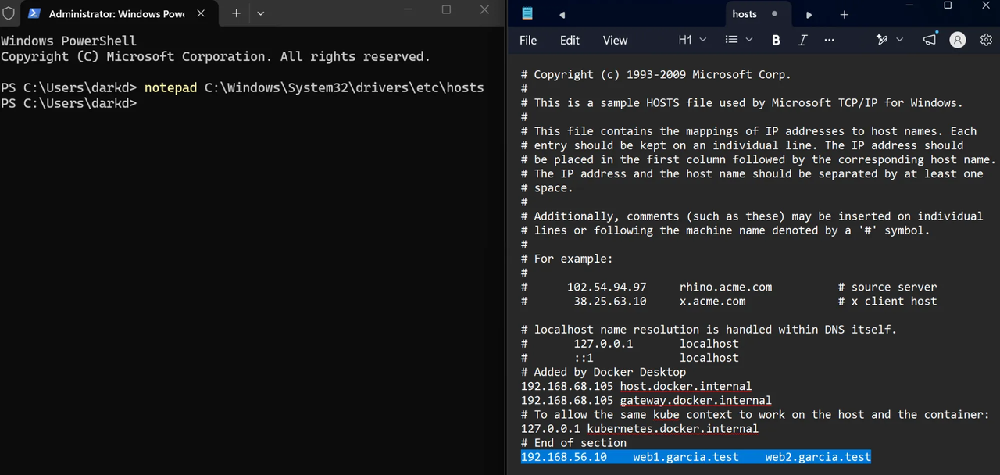
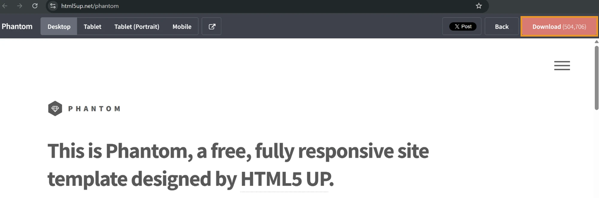
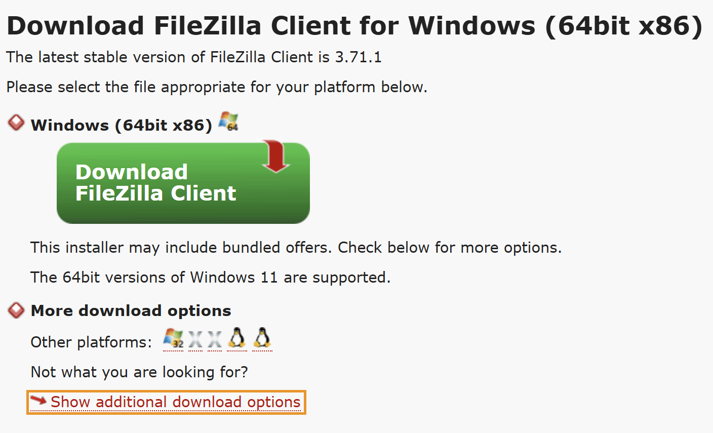
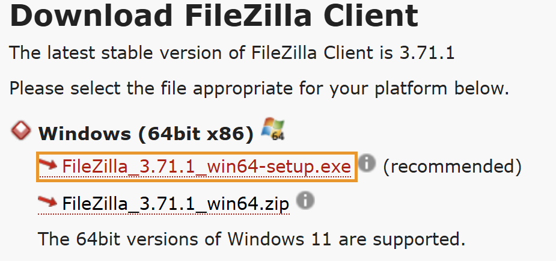
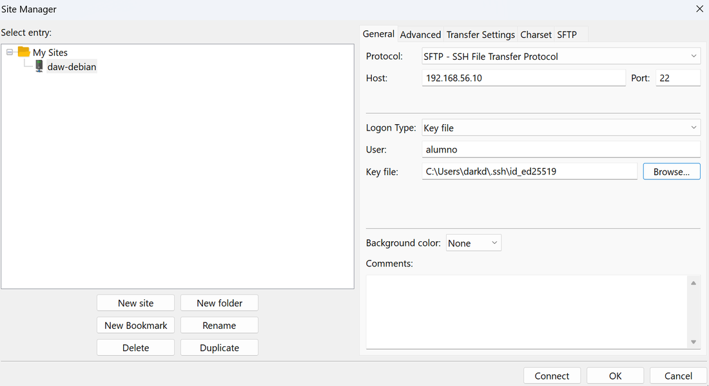
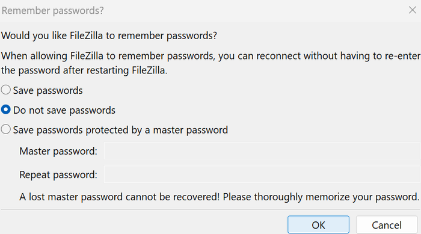
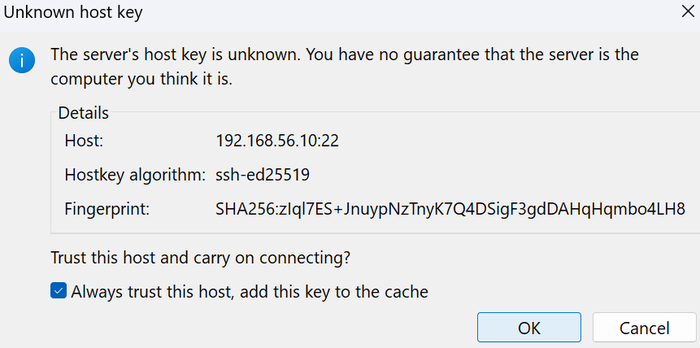
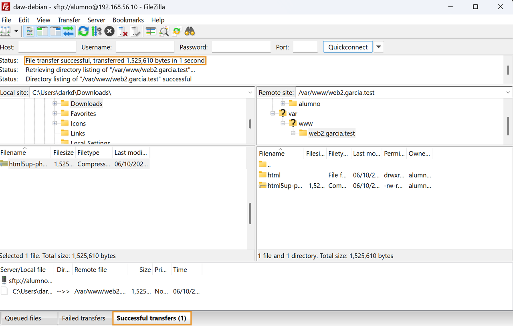
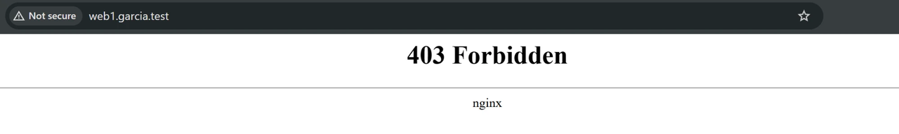
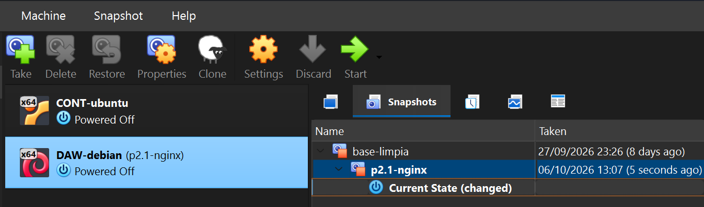

<!--
NOTA PARA EL PROFESOR (no se muestra al alumnado):

Reescrita a partir de P1.1.md del repo original ("Pràctica 2.1"). Cambios respecto al original:
  - Fuera de esta práctica: HTTPS y redirección 80->443. Pasan a la P2.2 (guiada). Orden previsto:
    2.2 HTTPS, 2.3 autenticación (ya sobre HTTPS: la básica manda la contraseña en base64),
    2.4 proxy inverso, 2.5 balanceo. Parten de old.P1.2 a old.P1.5.
  - Fuera las referencias a AWS/EC2 e IP pública. Se trabaja sobre la VM de la P1.1 (Host-only 192.168.56.10).
  - Dominios con TLD .test (reservado por la RFC 6761, nunca existirá en Internet) y con el apellido:
    web1.tuapellido.test y web2.tuapellido.test. Firman la entrega igual que el hostname.
    NO usar .dev (es un TLD real con HSTS precargado: el navegador fuerza HTTPS) ni .local (mDNS).
  - Propietario de /var/www/<sitio>: el usuario del alumno, NO www-data (el original hacía chown www-data
    y chmod -R 755 a todo). Mínimo privilegio, y además así SFTP sube directamente sin sudo.
    Permisos con chmod -R u=rwX,go=rX (carpetas 755, ficheros 644).
  - NUEVO apartado 5: el .git clonado queda expuesto (http://web1.../.git/config devuelve 200 con la URL
    del repo). Es un fallo real y frecuente. Se cierra con location ~ /\.git { deny all; } -> 403.
  - Segundo sitio: plantilla "Phantom" de HTML5 UP (CC BY 3.0), descarga html5up-phantom.zip, con el
    index.html en la raíz del zip (unzip -d html funciona sin mover nada). El original hablaba de un .zip
    "que os he proporcionado" que no estaba en el repo.
  - SFTP: FileZilla (con clave, porque en la P1.1 se desactivó la contraseña) o sftp/scp de OpenSSH.
  - Logs por sitio (web1.access.log...), y diagnóstico guiado de 404 y de 403 por permisos.
  - Añadidos objetivos, cuestiones, entrega 40/60 con mini entrevista, criterios y checklist (como P1.1).

VALIDADA DE PRINCIPIO A FIN el 04/10/2026 en una VM importada de DAW-debian.ova
  (Debian 13.7, kernel 6.12, nginx 1.26.3), desde el Windows anfitrión (curl 8.21, Chrome).
  Hallazgos de la validación:
  - git, unzip y curl NO vienen instalados en la Debian de la P1.1: se instalan en el paso 1.
  - Debian 13 trae umask 002: lo clonado sale 775/664. El chmod u=rwX,go=rX lo deja en 755/644.
  - El usuario no está en el grupo adm: los logs de /var/log/nginx necesitan sudo.
  - Un 404 con try_files NO deja línea en error.log (solo en access.log). Un 403 por permisos sí
    ("Permission denied"). Un 403 por "deny" deja "access forbidden by rule".
  - reload con la configuración rota falla y Nginx sigue sirviendo la anterior (comprobado).
  - Si se borra el enlace "default", por IP responde web1 (primer server cargado).
  - P1.1: "hostnamectl set-hostname" sin tocar /etc/hosts provoca "sudo: unable to resolve host".
    Corregido también en la P1.1 (paso 3 y recuadro de la máquina de respaldo).
  - Justo tras un reload, una petición inmediata puede llegar aún a los workers viejos (milisegundos).

REVISADA POR EL PROFESOR el 06/10/2026 en su VM DAW-debian (capturas reales de navegador, hosts y FileZilla 3.71.1).
  Correcciones de esa revisión: "sudo nginx -v" (/usr/sbin no está en el PATH del usuario), aviso de las dos
  terminales (curl.exe lanzado en la sesión SSH), FileZilla lee claves OpenSSH sin convertir a .ppk pero hay
  que poner el filtro en "All files", "Do not save passwords", "Always trust this host".
  FileZilla sale en el idioma de Windows: la guía da los nombres en español con el inglés entre paréntesis.
  Los nombres en español NO se han visto (Windows del profesor en inglés): revisarlos con un equipo en español.
AULA: editar el hosts de Windows exige ser administrador. Si en los PC del aula no lo son, que lo hagan en
  su portátil, o que usen curl.exe -H "Host: ..." / --resolve (apartado 3.4), que no necesita permisos.
-->

# Práctica 2.1 - Servidor web Nginx: sitios virtuales y transferencia por SFTP

!!! abstract "Objetivos"
    Al terminar esta práctica deberás ser capaz de:

    1. Instalar el servidor web Nginx y comprobar que funciona.
    2. Configurar **dos sitios virtuales** en el mismo servidor, cada uno con su nombre de dominio.
    3. Publicar una web clonándola de un repositorio Git, y otra subiéndola por **SFTP**.
    4. Asignar propietarios y permisos correctos a los ficheros de una web.
    5. Detectar y corregir un fallo de seguridad real: la exposición de la carpeta `.git`.
    6. Diagnosticar problemas con los registros (*logs*) de Nginx.

!!! tip "Cuándo se hace"
    Al terminar el **bloque 2** de la [teoría del Tema 2](T2-arquitectura-web.md): virtual hosts, Apache y Nginx, Nginx por dentro y FTP/SFTP.

!!! info "Antes de empezar"
    - Tienes la **práctica 1.1** terminada: la máquina virtual con IP `192.168.56.10` y acceso por SSH con clave.
    - La máquina tiene **acceso a Internet** (adaptador NAT).
    - En tu ordenador tienes **permisos de administrador**, que harán falta para editar el fichero `hosts` (apartado 4).

    Todos los comandos de la Debian se ejecutan **desde tu sesión SSH**, nunca desde la ventana de VirtualBox.

### Tus nombres de dominio

En esta práctica crearás dos sitios web, y sus nombres llevan tu apellido, igual que el *hostname*:

```
web1.tuapellido.test
web2.tuapellido.test
```

en minúsculas, sin acentos y sin la ñ (por ejemplo, `web1.garcia.test`). En los ejemplos de esta página aparece `garcia`: **tú escribe el tuyo** en todos los comandos y ficheros.

!!! info "¿Por qué `.test`?"
    `.test` es un dominio de primer nivel **reservado** para pruebas ([RFC 6761](https://www.rfc-editor.org/rfc/rfc6761)): nunca existirá en Internet, así que no chocarás con ninguna web real. No uses `.dev`, que sí existe y obliga al navegador a usar HTTPS, ni `.local`, que tiene un uso especial en las redes locales.

---

## 1. Instalar Nginx

Actualiza la lista de paquetes e instala Nginx, junto con tres herramientas que necesitarás y que no vienen en la instalación mínima de Debian:

```sh
sudo apt update
sudo apt install nginx git unzip curl
```

Nginx arranca solo al instalarse y queda habilitado para arrancar con la máquina. Compruébalo:

```sh
systemctl status nginx
```

!!! tip "Para salir, pulsa **q**"
    Cuando la salida no cabe en la pantalla, `systemctl` la muestra en un visor que se queda esperando (abajo verás `lines 1-15/15 (END)`). Puedes moverte con las flechas y salir con la tecla **q**. Si prefieres que no se quede esperando, añade `--no-pager`: `systemctl status nginx --no-pager`.

```
● nginx.service - A high performance web server and a reverse proxy server
     Loaded: loaded (/usr/lib/systemd/system/nginx.service; enabled; preset: enabled)
     Active: active (running) since Tue 2026-10-06 11:36:16 CEST; 17s ago
 Invocation: 2c8e0c8516ad428e93334fab6c2848cb
       Docs: man:nginx(8)
    Process: 1257 ExecStartPre=/usr/sbin/nginx -t -q -g daemon on; master_process on; ...
    Process: 1263 ExecStart=/usr/sbin/nginx -g daemon on; master_process on; (code=exited, ...
   Main PID: 1310 (nginx)
      Tasks: 3 (limit: 2317)
     Memory: 3M (peak: 6.6M)
        CPU: 51ms
     CGroup: /system.slice/nginx.service
             ├─1310 "nginx: master process /usr/sbin/nginx -g daemon on; master_process on;"
             ├─1313 "nginx: worker process"
             └─1314 "nginx: worker process"
```

Debe aparecer `active (running)` y, en la línea `Loaded`, `enabled`. Fíjate también en los procesos: un proceso **maestro**, que lee la configuración, y los **trabajadores** (*worker*), que atienden las peticiones; es lo que viste en el apartado 6 de la teoría.

Comprueba también que escucha en el puerto 80, y la versión instalada:

```sh
sudo ss -tlnp | grep nginx
sudo nginx -v
```

```
LISTEN 0      511          0.0.0.0:80        0.0.0.0:*    users:(("nginx",pid=1314,fd=5),("nginx",pid=1313,fd=5),("nginx",pid=1310,fd=5))
LISTEN 0      511             [::]:80           [::]:*    users:(("nginx",pid=1314,fd=6),("nginx",pid=1313,fd=6),("nginx",pid=1310,fd=6))
nginx version: nginx/1.26.3
```

Los tres `pid` son los mismos procesos que viste en `systemctl status`: el maestro y los dos trabajadores.

!!! info "¿Por qué `sudo nginx -v`?"
    Sin `sudo`, obtendrás `-bash: nginx: command not found`, aunque Nginx esté instalado. El programa está en `/usr/sbin`, la carpeta de los comandos de administración, y en Debian esa carpeta solo está en el `PATH` de `root`. Con `sudo` se encuentra. También funcionaría escribir la ruta completa: `/usr/sbin/nginx -v`.

Por último, abre el navegador de **tu ordenador** y entra en `http://192.168.56.10`. Verás la página de bienvenida de Nginx:


El aviso **No seguro** (*Not secure*) de la barra de direcciones es normal: la página viaja por HTTP, sin cifrar. Lo resolverás en la práctica 2.2, con HTTPS.

!!! question "Comprueba antes de seguir"
    Si el navegador no carga la página, revisa en este orden: que la máquina esté encendida, que respondas al `ping 192.168.56.10` desde PowerShell y que `systemctl status nginx` diga `active`. Es el mismo orden que seguirás siempre que algo no cargue: **¿está la máquina?, ¿está el servicio?, ¿escucha en el puerto?**

## 2. Un vistazo a la configuración

Antes de tocar nada, mira cómo está organizada la configuración (lo tienes explicado en el apartado 6 de la teoría):

```sh
ls /etc/nginx
ls -l /etc/nginx/sites-available/ /etc/nginx/sites-enabled/
```

```
conf.d        fastcgi_params  koi-win            modules-available  nginx.conf    scgi_params      sites-enabled  uwsgi_params
fastcgi.conf  koi-utf         mime.types         modules-enabled    proxy_params  sites-available  snippets       win-utf
/etc/nginx/sites-available/:
total 4
-rw-r--r-- 1 root root 2412 Jun 27 22:25 default

/etc/nginx/sites-enabled/:
total 0
lrwxrwxrwx 1 root root 34 Oct  6 11:36 default -> /etc/nginx/sites-available/default
```

Ahí están el fichero principal, `nginx.conf`, y las carpetas que viste en la teoría. En `sites-available` está el fichero `default`, que es el sitio que acabas de ver en el navegador. En `sites-enabled` hay un **enlace simbólico** que apunta a él (la `l` del principio y la flecha `->`): por eso está activo.

Mira cómo es ese sitio, sin los comentarios:

```sh
grep -vE '^\s*#|^\s*$' /etc/nginx/sites-available/default
```

```nginx
server {
	listen 80 default_server;
	listen [::]:80 default_server;
	root /var/www/html;
	index index.html index.htm index.nginx-debian.html;
	server_name _;
	location / {
		try_files $uri $uri/ =404;
	}
}
```

Fíjate en `default_server`: es el sitio que responde cuando una petición no va dirigida a ningún otro. El fichero que has visto en el navegador es `/var/www/html/index.nginx-debian.html`.

**No vamos a modificar este fichero.** Cada sitio nuevo tendrá su propio fichero de configuración.

## 3. Primer sitio: `web1`, desde un repositorio Git

### 3.1 La carpeta y el contenido

Crea la carpeta del sitio y haz que **tu usuario** sea su propietario:

```sh
sudo mkdir -p /var/www/web1.garcia.test
sudo chown -R $USER:$USER /var/www/web1.garcia.test
```

La opción `-p` (de *parents*) crea también las carpetas intermedias que falten y no da error si la carpeta ya existe, así que puedes repetir el comando sin miedo.

`chown` cambia el propietario. Se escribe `usuario:grupo`, y `$USER` es una variable que contiene tu nombre de usuario, así que no tienes que escribirlo (en Debian, cada usuario tiene además un grupo propio con su mismo nombre). La opción `-R` (recursivo) lo aplica también a todo lo que haya dentro de la carpeta.

Ahora clona dentro, en la subcarpeta `html`, una web de ejemplo. Como la carpeta es tuya, **no necesitas `sudo`**:

```sh
git clone https://github.com/cloudacademy/static-website-example /var/www/web1.garcia.test/html
```

Y deja los permisos bien definidos:

```sh
chmod -R u=rwX,go=rX /var/www/web1.garcia.test
ls -la /var/www/web1.garcia.test/html
```

```
total 64
drwxr-xr-x 6 alumno alumno  4096 Oct  6 11:51 .
drwxr-xr-x 3 alumno alumno  4096 Oct  6 11:51 ..
drwxr-xr-x 6 alumno alumno  4096 Oct  6 11:51 assets
drwxr-xr-x 2 alumno alumno  4096 Oct  6 11:51 error
drwxr-xr-x 8 alumno alumno  4096 Oct  6 11:51 .git
drwxr-xr-x 2 alumno alumno  4096 Oct  6 11:51 images
-rw-r--r-- 1 alumno alumno 14522 Oct  6 11:51 index.html
-rw-r--r-- 1 alumno alumno 17128 Oct  6 11:51 LICENSE.MD
-rw-r--r-- 1 alumno alumno   648 Oct  6 11:51 README.MD
```

Todo es de tu usuario (en el ejemplo, `alumno`), y ahí está el `index.html` que servirá Nginx. Fíjate también en la carpeta `.git`: volverás a ella en el apartado 5.

Ese `chmod` significa: el propietario (`u`) puede leer y escribir; el grupo y el resto (`go`), solo leer. La `X` **mayúscula** da permiso de ejecución **solo a las carpetas**, que lo necesitan para poder entrar en ellas. El resultado son carpetas con `755` (`drwxr-xr-x`) y ficheros con `644` (`-rw-r--r--`).

!!! info "Cómo se leen los permisos: `drwxr-xr-x` y `755`"
    `drwxr-xr-x` es la forma en que `ls -l` muestra los permisos de una **carpeta**. Se lee por trozos:

    | Trozo | A quién afecta | Significa |
    |---|---|---|
    | `d` | — | Es una carpeta (*directory*). Si fuera un fichero, saldría `-`; si fuera un enlace, `l` |
    | `rwx` | El propietario (tú) | Puede leer, escribir y entrar |
    | `r-x` | El grupo | Puede leer y entrar, pero no escribir |
    | `r-x` | El resto (aquí, `www-data`) | Puede leer y entrar, pero no escribir |

    Cada posición es siempre la misma letra: `r` leer, `w` escribir, `x` ejecutar (en una carpeta, **entrar** en ella). Un guion significa que **falta** ese permiso: en `r-x` falta la `w`.

    En resumen, `drwxr-xr-x` dice: "es una carpeta; tú puedes hacer de todo y los demás pueden mirar dentro, pero no cambiar nada". Es justo lo que necesita Nginx, que lee la web pero no debe poder modificarla.

    Los mismos permisos se escriben también con **tres cifras**, una por grupo. Cada permiso vale un número y se suman: **`r` = 4, `w` = 2, `x` = 1**.

    | Letras | Suma | Cifra |
    |---|---|---|
    | `rwx` | 4 + 2 + 1 | **7** |
    | `rw-` | 4 + 2 | **6** |
    | `r-x` | 4 + 1 | **5** |
    | `r--` | 4 | **4** |
    | `---` | 0 | **0** |

    Así, `rwxr-xr-x` es **755** (tú lo haces todo; los demás leen y entran) y `rw-r--r--` es **644** (tú lees y escribes; los demás solo leen). En el apartado 7 usarás `chmod 700`: `rwx------`, solo tú.

!!! warning "¿Por qué no `www-data` como propietario?"
    Muchos tutoriales, y la versión anterior de esta práctica, hacen `chown www-data:www-data` sobre la web. **No lo hagas.** Nginx se ejecuta como `www-data` y solo necesita **leer** los ficheros. Si `www-data` fuera el dueño, también podría modificarlos, y un fallo en el servidor permitiría a un atacante cambiar tu web. El dueño eres tú; `www-data` lee gracias a los permisos del "resto" (`r-x` en las carpetas y `r--` en los ficheros). Es el principio de **mínimo privilegio**.

### 3.2 El fichero de configuración del sitio

Crea el fichero del sitio en `sites-available`. Es costumbre llamarlo igual que el dominio:

```sh
sudo nano /etc/nginx/sites-available/web1.garcia.test
```

Con este contenido (cambia `garcia` en las dos líneas en las que aparece, `server_name` y `root`):

```nginx
server {
    listen 80;
    listen [::]:80;

    server_name web1.garcia.test;

    root /var/www/web1.garcia.test/html;
    index index.html;

    access_log /var/log/nginx/web1.access.log;
    error_log  /var/log/nginx/web1.error.log;

    location / {
        try_files $uri $uri/ =404;
    }
}
```

Guarda y sal de `nano` con **Ctrl+O**, **Enter** y **Ctrl+X**, como en la práctica 1.1.

| Directiva | Qué hace |
|---|---|
| `listen 80;` / `listen [::]:80;` | Escucha en el puerto 80, por IPv4 y por IPv6 |
| `server_name` | El nombre del sitio. Nginx lo compara con la cabecera `Host` de cada petición |
| `root` | La carpeta donde está la web: la que contiene el `index.html` |
| `index` | Qué fichero servir cuando se pide una carpeta, como `/` |
| `access_log` / `error_log` | Registros propios de este sitio, separados de los generales |
| `try_files $uri $uri/ =404;` | Busca un fichero con ese nombre; si no, una carpeta; si no, responde `404` |

!!! tip "Si trabajas con VS Code"
    Con la extensión **Remote - SSH** (la viste en la práctica 1.1) puedes abrir y editar estos ficheros con el editor de VS Code, con colores. Para guardar los que pertenecen a `root`, VS Code te ofrecerá reintentar con `sudo`.

### 3.3 Activar el sitio

Para activarlo, crea el enlace simbólico en `sites-enabled`:

```sh
sudo ln -s /etc/nginx/sites-available/web1.garcia.test /etc/nginx/sites-enabled/
```

Comprueba que la configuración no tiene errores y, solo si está bien, recárgala:

```sh
sudo nginx -t && sudo systemctl reload nginx
```

```
nginx: the configuration file /etc/nginx/nginx.conf syntax is ok
nginx: configuration file /etc/nginx/nginx.conf test is successful
```

!!! danger "`nginx -t` antes de aplicar. Siempre."
    Si te equivocas, `nginx -t` te dice **qué** está mal y **en qué línea**. Por ejemplo, si te dejas el `;` al final de `root`:

    ```
    nginx: [emerg] invalid number of arguments in "root" directive in /etc/nginx/sites-enabled/web1.garcia.test:8
    nginx: configuration file /etc/nginx/nginx.conf test failed
    ```

    Con `reload`, si la configuración es incorrecta, Nginx sigue funcionando con la anterior. Con `restart`, se para y no vuelve a arrancar. Por eso usamos `nginx -t && reload`: el `&&` solo recarga si la comprobación ha ido bien.

### 3.4 Probar el sitio sin DNS

Tu ordenador todavía no sabe que `web1.garcia.test` es `192.168.56.10`. Pero recuerda cómo elige Nginx el sitio: por la cabecera `Host`. Puedes enviarla tú a mano con `curl`. Desde **PowerShell, en tu ordenador**:

!!! warning "Dos terminales: la de la Debian y la de tu ordenador"
    Desde aquí vas a alternar entre dos ventanas. Mira siempre el *prompt* antes de escribir:

    - `alumno@debian-garcia:~$` es tu **sesión SSH**: los comandos se ejecutan en la Debian.
    - `PS C:\Users\...>` es **PowerShell en tu ordenador**: los comandos se ejecutan en Windows.

    Deja abierta la sesión SSH y abre **otra** ventana de PowerShell para los comandos de tu ordenador. Si escribes `curl.exe` en la sesión SSH, obtendrás `-bash: curl.exe: command not found`, porque `curl.exe` y `Select-String` solo existen en Windows.

```powershell
curl.exe -s http://192.168.56.10/ | Select-String "<title>"
curl.exe -s -H "Host: web1.garcia.test" http://192.168.56.10/ | Select-String "<title>"
```

```
PS C:\Users\alumno> curl.exe -s http://192.168.56.10/ | Select-String "<title>"

<title>Welcome to nginx!</title>

PS C:\Users\alumno> curl.exe -s -H "Host: web1.garcia.test" http://192.168.56.10/ | Select-String "<title>"

		<title>Welcome</title>
```

**Misma IP, mismo puerto, respuestas distintas.** Sin la cabecera, `curl` envía `Host: 192.168.56.10`, que no coincide con ningún `server_name`, y responde el sitio por defecto. Con la cabecera, responde tu sitio. Esto es exactamente lo que es un *virtual host*.

!!! info "`curl.exe`, no `curl`"
    Escribe la extensión `.exe`. En Windows PowerShell, `curl` a secas es un alias de `Invoke-WebRequest`, un comando distinto que no entiende estas opciones.

## 4. Resolver los nombres: el fichero `hosts`

Para usar el navegador hace falta que tu ordenador traduzca el nombre a la IP. De eso se encarga el DNS, que montarás en el Tema 4. Mientras tanto, lo haremos **a mano** con el fichero `hosts`, que el sistema consulta **antes** que el DNS.

=== "Windows"

    Editar este fichero requiere permisos de administrador. Pulsa **Win + X** y elige **Terminal (Administrador)** (o **Windows PowerShell (Administrador)**). En esa ventana:

    ```powershell
    notepad C:\Windows\System32\drivers\etc\hosts
    ```

    Al final del fichero, en una línea nueva, añade tus dos nombres:

    ```
    192.168.56.10    web1.garcia.test    web2.garcia.test
    ```

    Las líneas que empiezan por `#` son comentarios y no hacen nada: la tuya **no** debe llevarlo. Si tienes Docker Desktop, verás un bloque que acaba en `# End of section`: pon tu línea **después**, porque Docker reescribe lo que hay dentro de su bloque.

    

    Fíjate en el título de la terminal: **Administrator**.

    Guarda (**Ctrl+S**) y cierra el Bloc de notas. Si al guardar te dice que no tienes permiso, es que no lo abriste desde una terminal de administrador.

=== "Linux / macOS"

    ```sh
    sudo nano /etc/hosts
    ```

    Y añade al final:

    ```
    192.168.56.10    web1.garcia.test    web2.garcia.test
    ```

Ya puedes añadir el segundo nombre aunque todavía no exista el sitio: lo crearás en el apartado 6.

Comprueba que **tu ordenador** resuelve el nombre. Desde PowerShell (cualquier ventana, no hace falta que sea de administrador):

```powershell
ping web1.garcia.test
```

```
Haciendo ping a web1.garcia.test [192.168.56.10] con 32 bytes de datos:
Respuesta desde 192.168.56.10: bytes=32 tiempo<1m TTL=64
```

Ahora abre el navegador y escribe la dirección **completa, con `http://`**:

```
http://web1.garcia.test
```


!!! tip "Si el navegador no te lleva a tu web"
    - **Escribe siempre `http://`.** Sin él, el navegador puede pensar que `web1.garcia.test` es una búsqueda y mandarte a Google.
    - Si te redirige a `https://` y falla, es una función de seguridad del navegador: vuelve a escribir `http://` o prueba en una **ventana de incógnito**.
    - Si ves la página de bienvenida de Nginx en vez de tu web, la petición no coincide con tu `server_name`: revisa que el nombre del fichero `hosts` y el de la configuración sean idénticos.

!!! warning "Si no tienes permisos de administrador"
    Sin ellos no puedes editar el fichero `hosts`. Puedes hacer todas las comprobaciones con `curl.exe -H "Host: ..."` como en el apartado 3.4, pero la evidencia del navegador tendrás que hacerla en un equipo donde sí los tengas (tu portátil, por ejemplo).

## 5. Un fallo de seguridad real: la carpeta `.git`

Has publicado la web clonando un repositorio, y `git clone` no solo descarga la web: también crea la carpeta **`.git`**, con **toda la historia del repositorio**. Y está dentro de `root`, así que… prueba desde PowerShell:

```powershell
curl.exe http://web1.garcia.test/.git/config
```

```
[core]
	repositoryformatversion = 0
	filemode = true
	bare = false
	logallrefupdates = true
[remote "origin"]
	url = https://github.com/cloudacademy/static-website-example
	fetch = +refs/heads/*:refs/remotes/origin/*
[branch "master"]
	remote = origin
	merge = refs/heads/master
```

**Tu servidor está regalando el repositorio.** Con herramientas automáticas, cualquiera puede descargar la carpeta `.git` entera y reconstruir todo el código fuente, incluidas las versiones antiguas. Si alguna vez se subió al repositorio una contraseña o una clave, aunque luego se borrara, sigue en la historia. No es un caso de laboratorio: es uno de los fallos más frecuentes en webs reales, y los robots que rastrean Internet lo buscan a diario.

Ciérralo. Vuelve a tu **sesión SSH** y edita la configuración del sitio:

```sh
sudo nano /etc/nginx/sites-available/web1.garcia.test
```

Y añade este bloque **dentro** del bloque `server`, después del `location /`:

```nginx
    location ~ /\.git {
        deny all;
    }
```

`location ~` indica que lo que sigue es una **expresión regular**: se aplica a cualquier URL que contenga `/.git`. Y `deny all` prohíbe el acceso a todo el mundo.

```sh
sudo nginx -t && sudo systemctl reload nginx
```

Vuelve a probar **desde tu ordenador**, con `curl.exe` en PowerShell y en el navegador. Ahora el servidor responde **`403 Forbidden`**:

```
PS C:\Users\alumno> curl.exe http://web1.garcia.test/.git/config
<html>
<head><title>403 Forbidden</title></head>
<body>
<center><h1>403 Forbidden</h1></center>
<hr><center>nginx</center>
</body>
</html>
```


!!! info "En un despliegue profesional"
    Lo correcto es que la carpeta `.git` ni siquiera llegue al servidor, o que la web publicada esté fuera del repositorio. Lo verás cuando automatices los despliegues en el Tema 7. La regla `deny` es una red de seguridad que conviene tener igualmente.

## 6. Segundo sitio: `web2`, subido por SFTP

En el mundo real no siempre hay un repositorio del que clonar: a veces tienes los ficheros en tu ordenador y hay que subirlos. Lo harás por **SFTP**, que funciona dentro de SSH. No hay que instalar nada en el servidor: tu servidor SSH ya lo incluye.

### 6.1 Preparar la carpeta en el servidor

```sh
sudo mkdir -p /var/www/web2.garcia.test/html
sudo chown -R $USER:$USER /var/www/web2.garcia.test
```

### 6.2 Descargar la web en tu ordenador

Descarga en tu ordenador la plantilla **Phantom** de HTML5 UP desde [https://html5up.net/phantom](https://html5up.net/phantom), con el botón **Download** de arriba a la derecha:



Obtendrás el fichero `html5up-phantom.zip` (unos 1,5 MB), que quedará en tu carpeta **Descargas**. No lo descomprimas: subirás el `.zip` y lo descomprimirás en el servidor.

### 6.3 Subir el fichero

Tienes tres formas de hacerlo, y las tres usan SSH por debajo. **Elige una**:

| Forma | Qué es | ¿Hay que instalar algo? |
|---|---|---|
| **`scp`** | Un solo comando que copia el fichero y termina. La más rápida | No |
| **`sftp`** | Una sesión interactiva en modo texto: te mueves, listas, subes y bajas varios ficheros | No |
| **FileZilla** | Un programa gráfico: arrastras los ficheros de una ventana a otra | Sí |

`scp` y `sftp` vienen con el cliente OpenSSH de Windows, el mismo que te da el comando `ssh`, y usan tu clave igual que él.

=== "scp (la más rápida)"

    Desde PowerShell, colócate en tu carpeta de Descargas y copia el fichero al servidor:

    ```powershell
    cd $env:USERPROFILE\Downloads
    scp html5up-phantom.zip usuario@192.168.56.10:/var/www/web2.garcia.test/
    ```

    ```
    html5up-phantom.zip                                   100% 1490KB  39.3MB/s   00:00
    ```

    El destino se escribe `usuario@servidor:carpeta`: lo que va **detrás de los dos puntos** es la ruta **en el servidor**. Si el fichero ya existía, `scp` lo sobrescribe sin preguntar.

    Para copiar en sentido contrario, del servidor a tu ordenador, se invierte el orden: `scp usuario@192.168.56.10:/ruta/fichero .` (el punto final es "la carpeta en la que estoy").

=== "sftp"

    Desde PowerShell, colócate en tu carpeta de Descargas y abre una sesión SFTP:

    ```powershell
    cd $env:USERPROFILE\Downloads
    sftp usuario@192.168.56.10
    ```

    Dentro de la sesión, el *prompt* cambia a `sftp>`. Los comandos se parecen a los de la terminal: `cd` y `ls` actúan sobre el **servidor**, y `lcd` y `lls` sobre **tu ordenador**:

    ```
    sftp> cd /var/www/web2.garcia.test
    sftp> put html5up-phantom.zip
    sftp> ls -l
    sftp> bye
    ```

    `put` sube un fichero; `get` haría lo contrario, descargarlo.

=== "FileZilla"

    Descarga el **cliente** de FileZilla desde [filezilla-project.org](https://filezilla-project.org/download.php?type=client).

    !!! warning "Cuidado con el instalador"
        El botón verde **Download FileZilla Client** descarga un instalador que puede incluir programas patrocinados (*bundled offers*). **No lo uses.** Pulsa en **Show additional download options**, al final de la página:

        

        Y descarga el que acaba en **`win64-setup.exe`**, el instalador limpio:

        

        El `.zip` de debajo es la versión **portable**: se descomprime y se ejecuta sin instalar nada. Te sirve si en tu equipo no tienes permisos para instalar programas.

    Instálalo con las opciones que vienen marcadas. FileZilla se muestra en el idioma de tu Windows: aquí tienes los nombres en español y, entre paréntesis, en inglés. Al abrirlo por primera vez aparece una ventana de bienvenida; ciérrala con **OK**.

    En la práctica 1.1 desactivaste el acceso por contraseña, así que FileZilla tendrá que usar **tu clave privada**. Abre **Archivo → Gestor de sitios…** (*File → Site Manager…*), pulsa **Nuevo sitio** (*New site*) y escribe un nombre para la conexión. Es libre, pero lo más claro es usar el *hostname* de tu máquina (`debian-garcia`). Elige primero el **protocolo**: al cambiarlo a SFTP desaparece el campo **Cifrado** (*Encryption*), porque SFTP va siempre cifrado dentro de SSH. Después rellena el resto:

    | Campo | Valor |
    |---|---|
    | **Protocolo** (*Protocol*) | `SFTP - SSH File Transfer Protocol` |
    | **Servidor** (*Host*) | `192.168.56.10` |
    | **Puerto** (*Port*) | `22` |
    | **Modo de acceso** (*Logon Type*) | `Archivo de claves` (*Key file*) |
    | **Usuario** (*User*) | tu usuario de la Debian |
    | **Archivo de claves** (*Key file*) | `C:\Users\tuusuario\.ssh\id_ed25519` |

    

    Elige el archivo de claves con **Examinar…** (*Browse…*). Es la clave **privada**, el fichero **sin** `.pub`. Al principio no la verás: el explorador solo muestra ficheros `.ppk`. Cambia el filtro, abajo a la derecha, a **Todos los archivos** (*All files*). Las versiones actuales de FileZilla leen directamente las claves de OpenSSH; si la tuya te pregunta si quieres **convertir** la clave al formato `.ppk` (el de PuTTY), acepta y guarda la copia junto a la original.

    Pulsa **Conectar** (*Connect*). Si te pregunta si quieres que recuerde las contraseñas (*Remember passwords?*), elige **No guardar contraseñas** (*Do not save passwords*): entras con la clave, así que no hay contraseña que guardar.

    

    La primera vez, FileZilla te mostrará la **huella** del servidor (*Fingerprint*) y te preguntará si confías en él:

    

    Es la misma comprobación que hiciste en la práctica 1.1 con `ssh`. **Antes de aceptar**, compárala con la huella real, desde tu sesión SSH:

    ```sh
    ssh-keygen -lf /etc/ssh/ssh_host_ed25519_key.pub
    ```

    Si la cadena `SHA256:…` coincide, marca **Confiar siempre en este servidor** (*Always trust this host, add this key to the cache*) y pulsa **Aceptar** (*OK*). Sin esa casilla, FileZilla te lo volverá a preguntar en cada conexión.

    Una vez conectado, verás tu ordenador a la izquierda y el servidor a la derecha. Al conectar, la parte derecha muestra tu carpeta personal en el servidor (`/home/tuusuario`): hay que cambiar a la carpeta de la web. En el campo **Sitio remoto** (*Remote site*) de la derecha escribe `/var/www/web2.garcia.test` y pulsa Enter. En el campo **Sitio local** (*Local site*) de la izquierda escribe la ruta de tu carpeta de Descargas (`C:\Users\tuusuario\Downloads`) y pulsa Enter. Por último, **arrastra** `html5up-phantom.zip` de la lista de ficheros de la izquierda a la de la derecha.
    Cuando termine, el panel de mensajes de arriba dirá `File transfer successful`, el fichero aparecerá a la derecha junto a la carpeta `html` y la pestaña **Transferencias satisfactorias** (*Successful transfers*) de abajo lo contará:

    

    Para la evidencia 9 de la entrega, haz clic derecho en el panel de mensajes, elige **Copiar al portapapeles** (*Copy to clipboard*) y pega el texto en tu documento.

!!! info "¿Por qué has podido subirlo sin `sudo`?"
    `scp`, `sftp` y FileZilla entran con **tu** usuario y solo puede escribir donde **tú** puedes escribir. Has podido subir el fichero porque eres el propietario de `/var/www/web2.garcia.test`. Si intentas subirlo directamente a `/var/www`, que es de `root`, obtendrás `Permission denied`. Es el comportamiento correcto.

### 6.4 Descomprimir en el servidor

De vuelta en tu sesión SSH:

```sh
cd /var/www/web2.garcia.test
unzip html5up-phantom.zip -d html
rm html5up-phantom.zip
chmod -R u=rwX,go=rX /var/www/web2.garcia.test
ls -la html
```

`unzip` va mostrando cada fichero que extrae (casi cien líneas) y al final verás el contenido de `html`:

```
Archive:  html5up-phantom.zip
  inflating: html/LICENSE.txt
   creating: html/assets/
   creating: html/assets/webfonts/
  ...
  inflating: html/images/pic15.jpg
  inflating: html/elements.html
total 80
drwxr-xr-x 4 alumno alumno  4096 Oct  6 12:47 .
drwxr-xr-x 3 alumno alumno  4096 Oct  6 12:47 ..
drwxr-xr-x 6 alumno alumno  4096 Mar  6  2022 assets
-rw-r--r-- 1 alumno alumno 19131 Mar  6  2022 elements.html
-rw-r--r-- 1 alumno alumno  5408 Mar  6  2022 generic.html
drwxr-xr-x 2 alumno alumno  4096 Mar  6  2022 images
-rw-r--r-- 1 alumno alumno  8654 Mar  6  2022 index.html
-rw-r--r-- 1 alumno alumno 17128 Mar  6  2022 LICENSE.txt
-rw-r--r-- 1 alumno alumno   861 Mar  6  2022 README.txt
```

El `index.html` está directamente dentro de `html`, que es lo que necesita la directiva `root`. Las fechas de 2022 no son un error: `unzip` conserva las fechas originales de los ficheros dentro del `.zip`.

### 6.5 Configurar y activar `web2`

Esta vez **lo haces tú**. Parte de la configuración de `web1` como plantilla:

```sh
sudo cp /etc/nginx/sites-available/web1.garcia.test /etc/nginx/sites-available/web2.garcia.test
sudo nano /etc/nginx/sites-available/web2.garcia.test
```

Cambia lo que haga falta para que sea el sitio `web2` (el nombre, la carpeta y los dos registros), actívalo con su enlace simbólico, comprueba la configuración y recarga. El bloque `location ~ /\.git` puede quedarse: no estorba, y protege el sitio si algún día lo despliegas con Git.

!!! warning "Son **cuatro** líneas: no te olvides de los registros"
    `server_name`, `root`, `access_log` y `error_log`. Si dejas los registros con `web1`, `nginx -t` **no** se quejará, porque la configuración es válida, pero las peticiones de `web2` acabarán mezcladas en los registros de `web1`. Es un error silencioso: compruébalo con `cat` antes de seguir.

Si tu fichero `hosts` ya tiene `web2.garcia.test`, entra en `http://web2.garcia.test`:


Comprueba que **cada nombre muestra su web**, y que `http://192.168.56.10` sigue mostrando la página de bienvenida de Nginx.

## 7. Los registros

Los registros son la herramienta de diagnóstico más importante que tienes. Cuando alguien te diga "la web no funciona", lo primero que miráis juntos es esto.

Los ficheros de `/var/log/nginx` solo los pueden leer `root` y el grupo `adm`, así que necesitas `sudo`. Deja el registro de accesos de `web1` abierto en directo:

```sh
sudo tail -f /var/log/nginx/web1.access.log
```

Recarga `http://web1.garcia.test` en el navegador con **Ctrl+F5** y observa cómo aparece de golpe una línea por cada petición: el HTML, las hojas de estilo, los *scripts*, las imágenes… Pulsa **Ctrl+C** para salir.

!!! tip "Si no aparece nada"
    - **Usa Ctrl+F5**, no F5 a secas. El navegador guarda en caché lo que ya ha descargado y puede no volver a pedirlo, o pedirlo y recibir un `304 Not Modified`. También sirve una **ventana de incógnito**.
    - **Pulsar los botones de la web no genera peticiones.** La web de `web1` es una sola página: INTRO, WORK, ABOUT y CONTACT solo cambian la parte de la URL que va detrás de `#` y muestran contenido que ya estaba cargado. El navegador **nunca** envía al servidor lo que va detrás de `#`.

### 7.1 Un 404

Pide una página que no existe, por ejemplo `http://web1.garcia.test/noexiste.html`:


Busca la petición en el registro de accesos:

```sh
sudo tail -n 5 /var/log/nginx/web1.access.log
```

```
192.168.56.1 - - [06/Oct/2026:12:57:02 +0200] "GET /images/overlay.png HTTP/1.1" 200 4385 "http://web1.garcia.test/assets/css/main.css" "Mozilla/5.0 (...)"
192.168.56.1 - - [06/Oct/2026:12:57:02 +0200] "GET /assets/fonts/fontawesome-webfont.woff2?v=4.6.3 HTTP/1.1" 200 71896 "http://web1.garcia.test/assets/css/font-awesome.min.css" "Mozilla/5.0 (...)"
192.168.56.1 - - [06/Oct/2026:12:57:02 +0200] "GET /images/bg.jpg HTTP/1.1" 200 37864 "http://web1.garcia.test/assets/css/main.css" "Mozilla/5.0 (...)"
192.168.56.1 - - [06/Oct/2026:12:57:02 +0200] "GET /favicon.ico HTTP/1.1" 404 181 "http://web1.garcia.test/" "Mozilla/5.0 (...)"
192.168.56.1 - - [06/Oct/2026:12:58:41 +0200] "GET /noexiste.html HTTP/1.1" 404 181 "-" "Mozilla/5.0 (...)"
```

(El último campo, que aquí aparece abreviado como `Mozilla/5.0 (...)`, es largo: identifica el navegador y el sistema operativo).

Cada línea es una petición. Toma la última y léela por partes:

| Campo | Valor | Qué es |
|---|---|---|
| IP del cliente | `192.168.56.1` | Tu ordenador, visto desde la red Host-only |
| Fecha y hora | `[06/Oct/2026:12:58:41 +0200]` | Cuándo llegó la petición |
| Petición | `"GET /noexiste.html HTTP/1.1"` | Método, ruta y versión de HTTP |
| Código de estado | `404` | La respuesta: no encontrado |
| Tamaño | `181` | Bytes enviados en el cuerpo de la respuesta (la página de error) |
| *Referer* | `"-"` | Desde qué página se llegó. `-` significa que la escribiste a mano |
| *User-Agent* | `"Mozilla/5.0 (...)"` | El navegador del cliente |

Fíjate en dos detalles de las otras líneas:

- El *referer* de `overlay.png` y `bg.jpg` es `main.css`: esas imágenes no las pide el HTML, sino la **hoja de estilos**. El registro te dice quién ha provocado cada petición.
- Hay un `404` que **tú no has pedido**: `/favicon.ico`. Es el icono de la pestaña, y el navegador lo pide por su cuenta a cualquier web. Esta no lo tiene, así que falla. Es inofensivo, y lo verás en los registros de casi todas las webs.

Ahora mira el registro de errores:

```sh
sudo tail -n 5 /var/log/nginx/web1.error.log
```

```
2026/10/06 12:16:08 [error] 1545#1545: *14 access forbidden by rule, client: 192.168.56.1, server: web1.garcia.test, request: "GET /.git/config HTTP/1.1", host: "web1.garcia.test"
2026/10/06 12:16:55 [error] 1545#1545: *16 access forbidden by rule, client: 192.168.56.1, server: web1.garcia.test, request: "GET /.git/config HTTP/1.1", host: "web1.garcia.test"
```

**El `404` no aparece.** Un `404` no es un error del servidor: el cliente ha pedido algo que no existe, y el servidor ha respondido correctamente. Por eso solo deja rastro en el registro de accesos.

Lo que sí aparece son tus pruebas del apartado 5: los `403` de la carpeta `.git`, con el motivo, `access forbidden by rule` (prohibido por una regla: tu `deny all`). El registro de errores no solo dice **que** algo ha fallado, sino **por qué**.

### 7.2 Un 403 por permisos

Ahora provoca tú un fallo. Quita a todos, menos a ti, el permiso para entrar en la carpeta de la web:

```sh
chmod 700 /var/www/web1.garcia.test/html
```

Ahora pide la **página principal**, `http://web1.garcia.test/` (con **Ctrl+F5**). Aparecerá un **403 Forbidden**:



Es la misma página que viste con la carpeta `.git`, pero la causa es otra. Para saber cuál, mira el registro de errores:

```sh
sudo tail -n 3 /var/log/nginx/web1.error.log
```

```
2026/10/06 13:04:34 [error] 1716#1716: *43 "/var/www/web1.garcia.test/html/index.html" is forbidden (13: Permission denied), client: 192.168.56.1, server: web1.garcia.test, request: "GET / HTTP/1.1", host: "web1.garcia.test"
```

El registro te dice exactamente qué ha pasado: el usuario `www-data` no tiene permiso para llegar al fichero (`Permission denied`). Tú sigues pudiendo leerlo, porque eres el propietario, y por eso este error despista tanto.

Compáralo con el `403` de la carpeta `.git`: el navegador mostraba la misma página, pero el registro decía `access forbidden by rule` (una regla `deny`). Aquí dice `Permission denied` (permisos del sistema de ficheros). **Mismo código, causas distintas: el registro es lo que te dice cuál es.**

!!! tip "¿Te sale un 404 en vez de un 403?"
    Es que has recargado otra dirección, por ejemplo `/noexiste.html` del apartado anterior. Nginx intenta comprobar si ese fichero existe, no puede entrar en la carpeta, y `try_files` pasa a su última opción: `=404`. El navegador dice 404, pero el registro de errores cuenta la verdad:

    ```
    2026/10/06 13:02:21 [crit] 1714#1714: *41 stat() "/var/www/web1.garcia.test/html/noexiste.html" failed (13: Permission denied), client: 192.168.56.1, server: web1.garcia.test, request: "GET /noexiste.html HTTP/1.1", host: "web1.garcia.test"
    ```

    Es una buena lección: **el código que ve el navegador no siempre cuenta toda la historia; el registro, sí.**

Restaura los permisos y comprueba que la web vuelve a funcionar:

```sh
chmod 755 /var/www/web1.garcia.test/html
```

!!! tip "Diagnosticar en tres pasos"
    Cuando una web no carga, pregúntate en este orden:

    1. **¿Está el servicio funcionando?** `systemctl status nginx`
    2. **¿Escucha donde debe?** `sudo ss -tlnp | grep nginx`
    3. **¿Qué dicen los registros?** `sudo tail /var/log/nginx/*error.log`, y `journalctl -u nginx` si el servicio no arranca.

    Si el navegador muestra un **403**, piensa en permisos o en una regla `deny`. Si muestra un **404**, revisa la directiva `root`. Si muestra la **página de bienvenida** en lugar de tu web, revisa el `server_name` y el fichero `hosts`.

## 8. Haz una instantánea

Apaga la máquina desde tu sesión SSH:

```sh
sudo poweroff
```

En VirtualBox, en la pestaña **Snapshots**, pulsa **Take** y llama a la instantánea `p2.1-nginx`. Quedará colgando de la instantánea de la práctica 1.1:



La siguiente práctica parte de aquí.

---

## Cuestiones finales

!!! question "Cuestión 1"
    ¿Qué ocurre si creas el fichero de un sitio en `sites-available` pero no haces el enlace simbólico en `sites-enabled`? ¿Qué ventaja tiene este sistema de dos carpetas frente a tener un único directorio de configuración?

!!! question "Cuestión 2"
    En esta práctica, el propietario de las carpetas de las webs eres tú y no `www-data`. Explica por qué. ¿Qué permisos concretos necesita `www-data` sobre las carpetas y sobre los ficheros? ¿Qué ves en el navegador y en qué registro, si le faltan?

!!! question "Cuestión 3"
    Entra en `http://192.168.56.10`. ¿Qué sitio responde, y por qué? Ahora desactiva el sitio `default` (borra **solo el enlace** de `sites-enabled`), recarga Nginx y vuelve a entrar por IP. ¿Qué responde ahora y por qué? Vuelve a activar `default` al terminar.

!!! question "Cuestión 4"
    En el apartado 3.4 viste tu web con `curl.exe -H "Host: ..."` sin haber tocado el fichero `hosts`. ¿Qué demuestra eso sobre cómo elige Nginx el sitio? Y entonces, ¿para qué sirve el fichero `hosts`?

!!! question "Cuestión 5"
    Para subir `web2` no has instalado ningún servidor FTP. ¿Por qué no ha hecho falta? Si hubieras usado FTP sin cifrar desde la wifi del aula, ¿qué podría ver un compañero que estuviera capturando el tráfico?

## Entrega

Como en la práctica 1.1, lo que entregas son **las pruebas** de que tu servidor funciona y está bien
configurado. La entrega tiene dos partes, y las dos son obligatorias.

### Parte 1 — Documento de evidencias (40 %)

Un único **PDF** llamado `P2.1-Apellido-Nombre.pdf` que contenga, en este orden:

1. **Portada** con tu nombre, el grupo, el *hostname* de tu máquina y tus dos dominios.
2. **Las evidencias** de la tabla de abajo.
3. **Las respuestas a las cinco cuestiones finales**, con tus palabras.

!!! danger "Texto, no capturas"
    La salida de los comandos se entrega **copiada como texto**, junto con el comando y el *prompt*
    (`usuario@debian-tuapellido:~$ ...`), dentro de un bloque o con tipografía de ancho fijo.

    Solo hay una excepción, porque ahí sí hace falta ver la pantalla: las dos webs en el navegador.

Evidencias que debe contener el documento:

| # | Qué hay que demostrar | Dónde | Comando cuya salida se pega |
|---|---|---|---|
| 1 | Nginx está instalado y funcionando, en tu máquina | Debian | `hostname`, `sudo nginx -v` y `systemctl status nginx --no-pager` |
| 2 | Hay tres sitios activos | Debian | `ls -l /etc/nginx/sites-enabled/` |
| 3 | La configuración de `web1`, con la regla de `.git` | Debian | `cat /etc/nginx/sites-available/web1.tuapellido.test` |
| 4 | La configuración es correcta | Debian | `sudo nginx -t` |
| 5 | Propietarios y permisos de las webs | Debian | `ls -la /var/www/` y `ls -la /var/www/web2.tuapellido.test/html` |
| 6 | Tu ordenador resuelve los dos nombres | Tu ordenador | `ping -n 1 web1.tuapellido.test` y `ping -n 1 web2.tuapellido.test` |
| 7 | Cada nombre devuelve su web | Tu ordenador | Los dos comandos que hay debajo de esta tabla |
| 8 | La carpeta `.git` está protegida | Tu ordenador | `curl.exe -sI http://web1.tuapellido.test/.git/config` (debe responder `403`) |
| 9 | Has subido `web2` por SSH | Tu ordenador | El comando `scp` con su salida, la sesión de `sftp` completa o, con FileZilla, el texto del panel de mensajes de la transferencia |
| 10 | Los registros muestran tus pruebas | Debian | `sudo tail -n 8 /var/log/nginx/web1.access.log` (con peticiones `200`, `404` y `403`) y `sudo tail -n 3 /var/log/nginx/web1.error.log` (con el `Permission denied`) |
| 11 | Las dos webs, en el navegador | Tu ordenador | **Captura** de cada una con la barra de direcciones visible |

Comandos de la evidencia 7, en PowerShell:

```powershell
curl.exe -s http://web1.tuapellido.test | Select-String "<title>"
curl.exe -s http://web2.tuapellido.test | Select-String "<title>"
```

Cada evidencia debe ir acompañada de **una frase tuya** explicando qué demuestra.
Una tanda de comandos pegados sin explicar no puntúa.

### Parte 2 — Demostración en clase (60 %)

Es una mini entrevista individual. Cuando se te llame, vienes a la mesa del profesor con
**tu ordenador** y la máquina virtual preparada para arrancar. En unos dos o tres minutos:

1. Te conectas por SSH a tu máquina y abres tus dos webs en el navegador, por su nombre.
2. Haces la tarea que se te pida en ese momento. Por ejemplo: desactivar un sitio y volver a activarlo, encontrar en el registro una petición concreta, o diagnosticar un error que se te provoque.
3. Explicas en voz alta **una** de tus decisiones (por qué los ficheros son tuyos y no de `www-data`, para qué sirve el enlace simbólico, por qué hay que proteger `.git`…).

!!! info "Cómo se califica"
    La demostración pesa más que el documento porque es lo que de verdad acredita el
    resultado de aprendizaje. **Una demostración que no funciona no se compensa con un
    documento impecable**: en ese caso la práctica queda pendiente hasta que el servidor
    funcione, y se vuelve a demostrar.

### Criterios de evaluación

| Parte | Criterio | Peso |
|---|---|---|
| Documento | Las once evidencias están completas, en texto (salvo las capturas) y cada una con su frase explicativa | 25 % |
| Documento | Las cinco cuestiones finales están respondidas con corrección y criterio propio | 15 % |
| Demostración | Los dos sitios responden por su nombre desde tu equipo, con `.git` protegido | 20 % |
| Demostración | Realizas la tarea que se te pide y explicas lo que estás haciendo | 20 % |
| Demostración | Explicas una de tus decisiones con tus palabras y respondes a las preguntas sobre ella | 20 % |

Si en la demostración o en el documento aparecen una máquina o unos dominios que no son los tuyos (el *hostname*, el apellido de los dominios), la parte correspondiente cuenta como no superada.

### Antes de entregar, comprueba que…

- ☐ `http://web1.tuapellido.test` y `http://web2.tuapellido.test` muestran **cada uno su web**.
- ☐ `http://192.168.56.10` sigue mostrando la página de bienvenida de Nginx.
- ☐ Las carpetas de las webs son de tu usuario, con carpetas `755` y ficheros `644`.
- ☐ `http://web1.tuapellido.test/.git/config` responde `403`.
- ☐ Cada sitio tiene sus propios registros en `/var/log/nginx/`.
- ☐ `sudo nginx -t` no da errores.
- ☐ Existe la instantánea `p2.1-nginx`.
- ☐ Las once evidencias están en el PDF, en texto y comentadas.
- ☐ Las cinco cuestiones están respondidas.
- ☐ El archivo se llama `P2.1-Apellido-Nombre.pdf`.

## Referencias

- [Documentación de Nginx — Beginner's Guide](https://nginx.org/en/docs/beginners_guide.html)
- [Documentación de Nginx — Nombres de servidor (`server_name`)](https://nginx.org/en/docs/http/server_names.html)
- [Documentación de Nginx — Cómo procesa Nginx una petición](https://nginx.org/en/docs/http/request_processing.html)
- [Debian Wiki — Nginx](https://wiki.debian.org/Nginx)
- [RFC 6761 — Nombres de dominio de uso especial (`.test`)](https://www.rfc-editor.org/rfc/rfc6761)
- [FileZilla](https://filezilla-project.org/) · [WinSCP](https://winscp.net/), una alternativa a FileZilla para Windows
- Webs de ejemplo: [cloudacademy/static-website-example](https://github.com/cloudacademy/static-website-example) y [Phantom, de HTML5 UP](https://html5up.net/phantom) (licencia CC BY 3.0)
