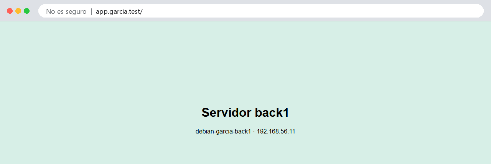

<!--
NOTA PARA EL PROFESOR (no se muestra al alumnado):

Reescrita a partir de old.P1.3.md ("Práctica 2.3 – Proxy inverso con Nginx"). Cambios:
  - ESCENARIO (decidido con el profesor): la máquina principal .10 hace de proxy (no cambia el hosts ni el HTTPS
    de la 2.2) y se clona un servidor de detrás LIGERO: debian-apellido-back1, 192.168.56.11, 512 MB de RAM,
    clon enlazado desde la instantánea base-limpia (sin Nginx ni sitios). El original clonaba la VM entera y
    convertía el clon en proxy, cambiando el hosts.
  - El clon arranca con la IP .10 de la principal: hay que APAGAR la principal antes de arrancarlo.
  - Al clonar se regeneran las claves de host SSH (mismo motivo que la máquina de respaldo en la P1.1).
  - Cabeceras: el original añadía "add_header Host ...", que es un error (Host es una cabecera de PETICIÓN).
    Se sustituye por add_header X-Servidor $hostname en el de detrás y X-Proxy $hostname en el proxy: la
    respuesta lleva las dos y demuestra el recorrido.
  - Añadido: proxy_set_header (Host, X-Real-IP, X-Forwarded-For, X-Forwarded-Proto) y el módulo realip en el de
    detrás, para que su registro muestre la IP del cliente real y no la del proxy.
  - Añadido: el 502 Bad Gateway al parar el de detrás, y cerrar el de detrás para que solo acepte al proxy.
  - HALLAZGO DE LA VALIDACIÓN: con realip activo, "allow 192.168.56.10; deny all;" en back1 rechaza también
    las peticiones del proxy (para Nginx el cliente ya es el real, .1). Se usa
    if ($realip_remote_addr != 192.168.56.10) { return 403; }. Explicado en el apartado 7 y en la cuestión 5.
  - Nginx reenvía al de detrás en HTTP/1.0 (se ve en el registro de back1): comentado en el apartado 5.
  - Justo tras un reload, la primera petición puede llegar aún a la configuración vieja: si un alumno ve la
    página por defecto en app.apellido.test justo después de activarlo, que recargue otra vez.
  - Sitio nuevo app.apellido.test por HTTP (el HTTPS en el proxy llega en la 2.5, con el balanceo).

VALIDADA el 05/10/2026: principal .10 + clon enlazado back1 .11 (512 MB) desde base-limpia, nginx 1.26.3.
PENDIENTE: captura de VirtualBox del diálogo de clonado.
-->

# Práctica 2.4 - Proxy inverso con Nginx

!!! tip "Cuándo se hace"
    En el **bloque 4** de la [teoría del Tema 2](T2-arquitectura-web.md), con la [práctica 2.3](T2-practica-autenticacion.md) terminada.

!!! abstract "Objetivos"
    Al terminar esta práctica deberás ser capaz de:

    1. Crear un segundo servidor clonando tu máquina virtual, sin conflictos de red ni de identidad.
    2. Configurar Nginx como **proxy inverso** delante de otro servidor web.
    3. Pasar al servidor de detrás la información del cliente real con cabeceras.
    4. Diagnosticar un `502 Bad Gateway`.
    5. Hacer que el servidor de detrás solo acepte peticiones del proxy.

---

## 1. Qué es un proxy inverso

Un **proxy** es un intermediario: recibe una petición y la hace por ti. Hay dos tipos, según a quién representa:

| | Proxy (de reenvío) | Proxy inverso |
|---|---|---|
| Está delante de… | Los **clientes** | Los **servidores** |
| Lo instala… | Una empresa o un centro, para la navegación de sus usuarios | Quien publica la web |
| El servidor ve… | La IP del proxy, no la del usuario | — |
| El cliente ve… | — | La IP del proxy, no la de los servidores |
| Ejemplos de uso | Filtrar webs, cachear, salir a Internet por un punto | HTTPS en un solo sitio, balanceo, caché, esconder los servidores de detrás |

Un proxy inverso es la **cara pública** de una web: el cliente solo habla con él, y él reparte el trabajo entre los servidores que tiene detrás, que nadie ve desde fuera. Es justo lo que hará tu máquina principal en esta práctica y en la siguiente.

```
 Tu ordenador            debian-tuapellido               debian-tuapellido-back1
 192.168.56.1  ──────►   192.168.56.10          ──────►  192.168.56.11
                         proxy inverso                    servidor de detrás
                         app.tuapellido.test
```

## 2. Crear el servidor de detrás: un clon ligero

No vas a instalar Debian otra vez: clonarás tu máquina desde la instantánea `base-limpia` de la práctica 1.1, que tiene Debian, tu usuario, SSH con clave y nada más.

### 2.1 Clonar en VirtualBox

1. **Apaga la máquina principal** (`sudo poweroff`). El clon arrancará con la misma IP, `192.168.56.10`, y no pueden estar las dos encendidas a la vez hasta que se la cambies.
2. En VirtualBox, selecciona tu máquina, abre **Snapshots** y selecciona la instantánea **`base-limpia`**.
3. Clic derecho sobre ella → **Clone**.
4. **Name:** `debian-tuapellido-back1`.
5. **MAC Address Policy:** **Generate new MAC addresses for all network adapters**. Sin esto, las dos máquinas tendrían las mismas MAC y la red fallaría.
6. **Clone type:** **Linked Clone**. Un clon enlazado comparte el disco de la original y solo guarda las diferencias: ocupa unos pocos cientos de MB en vez de varios GB.
7. Pulsa **Finish**.
8. Con el clon seleccionado, en **Settings → System**, baja la memoria a **512 MB**. Un servidor sin escritorio con Nginx va sobrado, y así podrás tener tres máquinas encendidas.

<!-- PENDIENTE: captura del diálogo de clonado -->

### 2.2 Darle su propia identidad

Arranca **solo el clon** y conéctate como siempre, porque de momento tiene la IP de la principal:

```powershell
ssh tuusuario@192.168.56.10
```

Fíjate en el *prompt*: dice `debian-tuapellido`, porque es una copia exacta. Vas a cambiarle tres cosas.

**El nombre** (los dos comandos de la práctica 1.1):

```sh
sudo hostnamectl set-hostname debian-tuapellido-back1
sudo sed -i 's/^127\.0\.1\.1.*/127.0.1.1\tdebian-tuapellido-back1/' /etc/hosts
```

**La IP**: en `/etc/network/interfaces`, cambia `192.168.56.10` por `192.168.56.11`:

```sh
sudo nano /etc/network/interfaces
```

**Las claves de host SSH**: el clon tiene las mismas que la principal, así que las dos máquinas tendrían la misma huella y no podrías distinguirlas. Regéneralas:

```sh
sudo rm /etc/ssh/ssh_host_*
sudo dpkg-reconfigure openssh-server
```

Reinicia el clon:

```sh
sudo reboot
```

### 2.3 Conectarte a las dos

Arranca también la principal. Ahora tienes dos servidores:

```powershell
ssh tuusuario@192.168.56.10
ssh tuusuario@192.168.56.11
```

La primera vez que entres en `.11`, SSH te mostrará una huella **nueva**: es la que acabas de generar. Compruébala como en la práctica 1.1 antes de escribir `yes`.

!!! tip "Dos terminales"
    Abre una pestaña de terminal para cada máquina y no las mezcles: mira siempre el *prompt* antes de ejecutar algo.

## 3. Configurar el servidor de detrás

En **`back1`**, instala Nginx y sustituye su página de bienvenida por una que diga quién es:

```sh
sudo apt update
sudo apt install nginx
sudo nano /var/www/html/index.html
```

```html
<!DOCTYPE html>
<html lang="es">
<head><meta charset="utf-8"><title>back1</title></head>
<body style="font-family:sans-serif;background:#d7efe7;text-align:center;padding-top:15%">
<h1>Servidor back1</h1>
<p>debian-tuapellido-back1 · 192.168.56.11</p>
</body>
</html>
```

El sitio por defecto de Nginx sirve `index.html` antes que su propia página de bienvenida, así que no hace falta tocar la configuración. Compruébalo desde tu ordenador entrando en `http://192.168.56.11`.

## 4. Configurar el proxy inverso

En la **principal**, crea un sitio nuevo:

```sh
sudo nano /etc/nginx/sites-available/app.garcia.test
```

```nginx
server {
    listen 80;
    listen [::]:80;
    server_name app.garcia.test;

    access_log /var/log/nginx/app.access.log;
    error_log  /var/log/nginx/app.error.log;

    location / {
        proxy_pass http://192.168.56.11;                                  # (1)!
        proxy_set_header Host              $host;                         # (2)!
        proxy_set_header X-Real-IP         $remote_addr;                  # (3)!
        proxy_set_header X-Forwarded-For   $proxy_add_x_forwarded_for;   # (4)!
        proxy_set_header X-Forwarded-Proto $scheme;                       # (5)!
    }
}
```

1. Adónde reenviar cada petición. No hay `root`: este sitio no sirve ningún fichero, solo hace de intermediario.
2. Pasa al de detrás el nombre que pidió el cliente. Sin esto, el de detrás recibiría `Host: 192.168.56.11`.
3. La IP del cliente real. El de detrás solo ve llegar conexiones del proxy.
4. La cadena de IP por las que ha pasado la petición, por si hay varios proxys.
5. Si el cliente llegó por `http` o por `https`.

Actívalo, comprueba y recarga (como en la práctica 2.1), y añade el nombre a tu fichero `hosts` **apuntando al proxy**, la `.10`:

```
192.168.56.10    web1.garcia.test    web2.garcia.test    app.garcia.test
```

Entra en `http://app.garcia.test`: verás la página de `back1`, aunque tu ordenador solo ha hablado con la `.10`.



!!! tip "Si ves la página por defecto de Nginx"
    Justo después de un `reload`, la primera petición puede atenderla todavía la configuración anterior. Recarga otra vez.

## 5. Seguir la petición

### En los registros

Haz una petición y mira el registro **de las dos** máquinas:

```sh
sudo tail -n 1 /var/log/nginx/app.access.log      # en la principal
sudo tail -n 1 /var/log/nginx/access.log          # en back1
```

```
192.168.56.1 - - [05/Oct/2026:00:10:49 +0200] "GET / HTTP/1.1" 200 264 "-" "curl/8.21.0"     ← principal
192.168.56.10 - - [05/Oct/2026:00:10:49 +0200] "GET / HTTP/1.0" 200 264 "-" "curl/8.21.0"    ← back1
```

La principal ve a tu ordenador (`192.168.56.1`). `back1` ve al **proxy** (`192.168.56.10`): para él, el cliente es el proxy. Si `back1` tuviera que saber quién es el usuario de verdad (para estadísticas, para bloquear una IP…), estaría perdido.

Fíjate también en la versión: tu ordenador habla con el proxy en `HTTP/1.1`, pero el proxy habla con `back1` en `HTTP/1.0`, que es lo que usa Nginx por defecto para reenviar.

### La IP real en el de detrás

Para eso le pasas `X-Real-IP`. En **`back1`**, dile a Nginx que confíe en esa cabecera **solo** si viene del proxy. Edita el sitio por defecto y añade estas dos líneas dentro del bloque `server`:

```sh
sudo nano /etc/nginx/sites-available/default
```

```nginx
    set_real_ip_from 192.168.56.10;
    real_ip_header   X-Real-IP;
```

Recarga Nginx en `back1`, repite la petición y vuelve a mirar su registro: ahora aparece `192.168.56.1`, la IP real.

!!! warning "Solo del proxy"
    `set_real_ip_from` es imprescindible: si `back1` creyera la cabecera venga de quien venga, cualquiera podría mandar `X-Real-IP: 1.2.3.4` y hacerse pasar por otra IP.

### En las cabeceras de la respuesta

Que cada máquina firme la respuesta. En **`back1`**, dentro del `location /` del sitio por defecto:

```nginx
        add_header X-Servidor $hostname;
```

Y en la **principal**, dentro del `location /` de `app.garcia.test`:

```nginx
        add_header X-Proxy $hostname;
```

`$hostname` es el nombre de la máquina. Recarga las dos y pide solo las cabeceras desde tu ordenador:

```powershell
curl.exe -I http://app.garcia.test
```

```
HTTP/1.1 200 OK
Server: nginx
Content-Type: text/html
Content-Length: 264
X-Servidor: debian-garcia-back1
X-Proxy: debian-garcia
```

La respuesta lleva las dos firmas: ha salido de `back1` y ha pasado por el proxy.

## 6. Cuando el de detrás falla: 502

En **`back1`**, para Nginx:

```sh
sudo systemctl stop nginx
```

Recarga `http://app.garcia.test`: el proxy responde **`502 Bad Gateway`**. El proxy funciona, pero no consigue respuesta del servidor de detrás. Mira por qué en la **principal**:

```sh
sudo tail -n 1 /var/log/nginx/app.error.log
```

```
2026/10/05 00:11:11 [error] 949#949: *6 connect() failed (111: Connection refused) while connecting to upstream, client: 192.168.56.1, server: app.garcia.test, request: "HEAD / HTTP/1.1", upstream: "http://192.168.56.11:80/", host: "app.garcia.test"
```

`Connection refused`: `back1` está encendida, pero nadie escucha en su puerto 80. Vuelve a arrancar Nginx en `back1` (`sudo systemctl start nginx`).

!!! info "Lo verás mucho"
    En el Tema 3 pondrás Nginx delante de servidores de aplicaciones. Cuando una aplicación se cae, lo que ve el usuario es este `502`, y lo primero que hay que mirar es el registro de errores del proxy.

## 7. Que nadie se salte el proxy

Ahora mismo `back1` responde a cualquiera: entra en `http://192.168.56.11` desde tu navegador. Un servidor de detrás debería aceptar **solo** al proxy.

Lo primero que se te ocurrirá es lo de la práctica 2.3: `allow 192.168.56.10;` y `deny all;`. **No funciona**, y es interesante ver por qué: con `real_ip_header`, para Nginx el cliente ya no es el proxy sino tu ordenador (`192.168.56.1`), así que `allow` lo rechaza. Le has pedido que se crea la IP que le pasa el proxy, y se la cree para todo.

La IP de quien se conecta de verdad sigue disponible en otra variable, `$realip_remote_addr`. En `back1`, añade dentro del bloque `server`, debajo de las líneas de la IP real:

```nginx
    if ($realip_remote_addr != 192.168.56.10) {
        return 403;
    }
```

Si la conexión no viene del proxy, responde `403` sin mirar nada más. Recarga Nginx en `back1` y prueba las dos rutas desde tu ordenador:

```powershell
curl.exe -s -o NUL -w "%{http_code}
" http://192.168.56.11
curl.exe -s -o NUL -w "%{http_code}
" http://app.garcia.test
```

```
403
200
```

Directamente, `403`. A través del proxy, `200`. Y el registro de `back1` sigue mostrando la IP real en las dos:

```
192.168.56.1 - - [05/Oct/2026:00:11:40 +0200] "GET / HTTP/1.1" 403 146 "-" "curl/8.21.0"
192.168.56.1 - - [05/Oct/2026:00:11:40 +0200] "GET / HTTP/1.0" 200 264 "-" "curl/8.21.0"
```

La primera llegó directa (`HTTP/1.1`) y fue rechazada; la segunda llegó por el proxy (`HTTP/1.0`) y se sirvió.

La configuración completa del sitio por defecto de `back1` queda así (sin comentarios):

```nginx
server {
    listen 80 default_server;
    listen [::]:80 default_server;
    root /var/www/html;
    index index.html index.htm index.nginx-debian.html;
    server_name _;

    set_real_ip_from 192.168.56.10;
    real_ip_header   X-Real-IP;

    if ($realip_remote_addr != 192.168.56.10) {
        return 403;
    }

    location / {
        try_files $uri $uri/ =404;
        add_header X-Servidor $hostname;
    }
}
```

!!! info "En el mundo real"
    Esto se suele resolver un paso antes, con un **cortafuegos** que solo deja llegar al puerto 80 de los servidores de detrás las conexiones del proxy. Así ni siquiera llegan a Nginx.

## 8. Haz las instantáneas

Apaga las dos máquinas y toma una instantánea de cada una: `p2.4-proxy` en la principal y `back1-listo` en `back1`.

---

## Cuestiones finales

!!! question "Cuestión 1"
    ¿Qué diferencia hay entre un proxy de reenvío y un proxy inverso? Pon un ejemplo de cada uno que hayas usado o visto, aunque no lo supieras.

!!! question "Cuestión 2"
    ¿Por qué hay que apagar la máquina principal antes de arrancar el clon por primera vez? ¿Qué tres cosas le has cambiado al clon y por qué cada una?

!!! question "Cuestión 3"
    Sin `set_real_ip_from`, ¿qué IP aparecería en el registro de `back1`? ¿Y si pusieras `real_ip_header` pero no `set_real_ip_from`? ¿Qué riesgo habría?

!!! question "Cuestión 4"
    Explica qué significa un `502 Bad Gateway` y en qué se diferencia de un `404` y de un `503`. ¿En qué máquina buscas la causa?

!!! question "Cuestión 5"
    ¿Por qué conviene que `back1` solo acepte peticiones del proxy? ¿Por qué `allow 192.168.56.10` no sirve cuando usas `real_ip_header`, y qué diferencia hay entre `$remote_addr` y `$realip_remote_addr`?

## Entrega

Igual que en las prácticas anteriores: **documento de evidencias (40 %)** y **demostración en clase (60 %)**.

### Parte 1 — Documento de evidencias (40 %)

Un **PDF** llamado `P2.4-Apellido-Nombre.pdf` con portada, las evidencias (en texto, con comando y *prompt*) y las respuestas a las cuestiones.

| # | Qué hay que demostrar | Dónde | Comando cuya salida se pega |
|---|---|---|---|
| 1 | `back1` tiene su propio nombre e IP | `back1` | `hostnamectl` e `ip -br a` |
| 2 | `back1` tiene sus propias claves de host | `back1` | `ssh-keygen -lf /etc/ssh/ssh_host_ed25519_key.pub`, comparada con la de la principal |
| 3 | La configuración del proxy | Principal | `cat /etc/nginx/sites-available/app.tuapellido.test` |
| 4 | La configuración de `back1` (IP real, cabecera y restricción al proxy) | `back1` | `grep -v '^\s*#' /etc/nginx/sites-available/default` |
| 5 | La respuesta pasa por las dos máquinas | Tu ordenador | `curl.exe -I http://app.tuapellido.test` |
| 6 | Los dos registros de la misma petición | Las dos | La última línea de `app.access.log` (principal) y de `access.log` (`back1`) |
| 7 | El `502` y su causa | Principal | La última línea de `app.error.log` con Nginx parado en `back1` |
| 8 | `back1` solo acepta al proxy | Tu ordenador | Los dos `curl.exe` del apartado 7 |
| 9 | Las máquinas en VirtualBox | Tu ordenador | **Captura** de VirtualBox con las dos máquinas y sus instantáneas |

### Parte 2 — Demostración en clase (60 %)

Mini entrevista individual en la mesa del profesor, con las dos máquinas encendidas: muestras `app.tuapellido.test` en el navegador, haces la tarea que se te pida (por ejemplo, provocar y explicar un `502`) y explicas una decisión o un concepto.

### Criterios de evaluación

| Parte | Criterio | Peso |
|---|---|---|
| Documento | Las nueve evidencias están completas, en texto (salvo la captura) y explicadas | 25 % |
| Documento | Las cinco cuestiones están respondidas con corrección y criterio propio | 15 % |
| Demostración | `app.tuapellido.test` llega a `back1` a través del proxy, y `back1` no acepta conexiones directas | 20 % |
| Demostración | Realizas la tarea que se te pide y explicas lo que haces | 20 % |
| Demostración | Explicas una decisión o un concepto con tus palabras | 20 % |

### Antes de entregar, comprueba que…

- ☐ `back1` se llama `debian-tuapellido-back1`, tiene la IP `.11`, 512 MB y su propia huella SSH.
- ☐ `http://app.tuapellido.test` muestra la página de `back1`, con las cabeceras `X-Servidor` y `X-Proxy`.
- ☐ El registro de `back1` muestra la IP de tu ordenador, no la del proxy.
- ☐ `http://192.168.56.11` devuelve `403` desde tu ordenador.
- ☐ Existen las instantáneas `p2.4-proxy` y `back1-listo`.
- ☐ El archivo se llama `P2.4-Apellido-Nombre.pdf`.

## Referencias

- [Documentación de Nginx — Proxy inverso](https://docs.nginx.com/nginx/admin-guide/web-server/reverse-proxy/)
- [Módulo `ngx_http_proxy_module`](https://nginx.org/en/docs/http/ngx_http_proxy_module.html)
- [Módulo `ngx_http_realip_module`](https://nginx.org/en/docs/http/ngx_http_realip_module.html)
- [Cloudflare — ¿Qué es un proxy inverso?](https://www.cloudflare.com/es-es/learning/cdn/glossary/reverse-proxy/)
